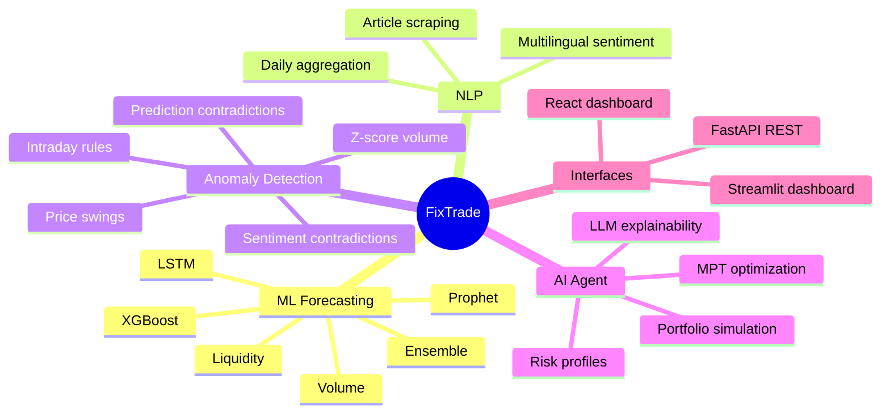
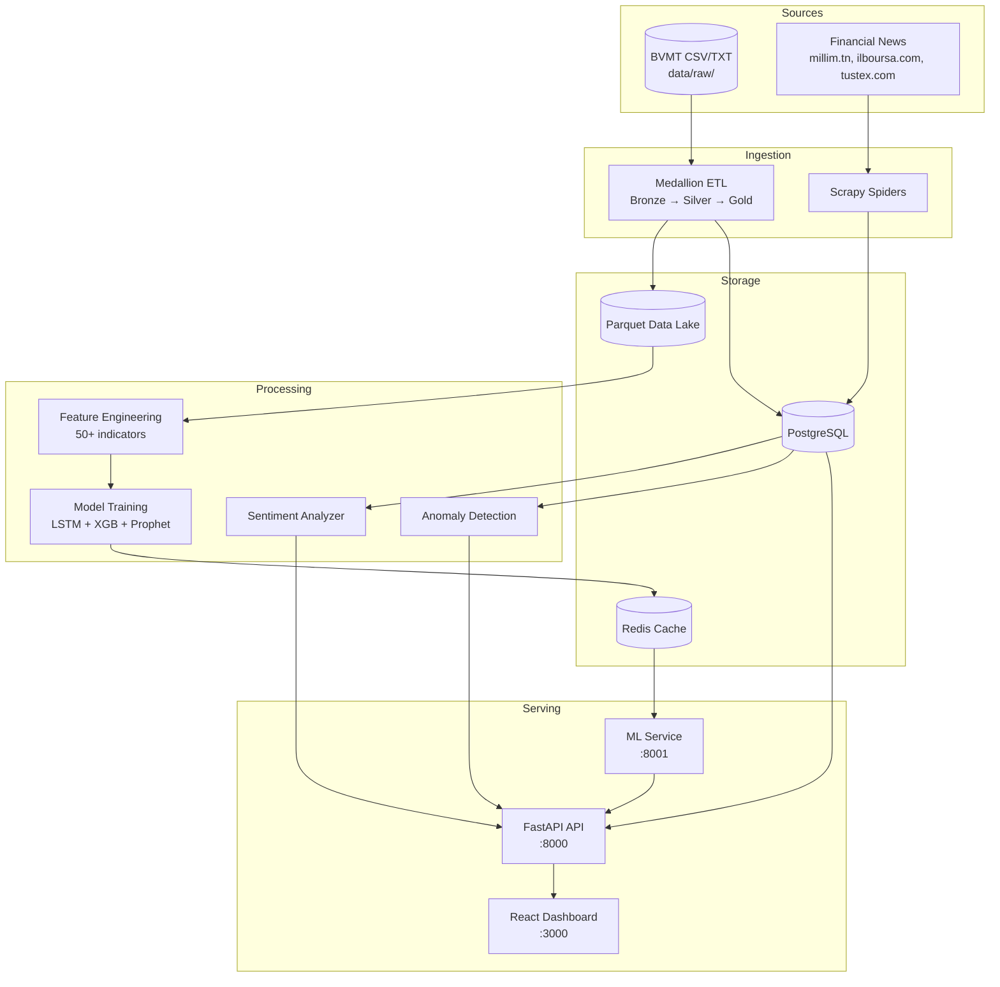
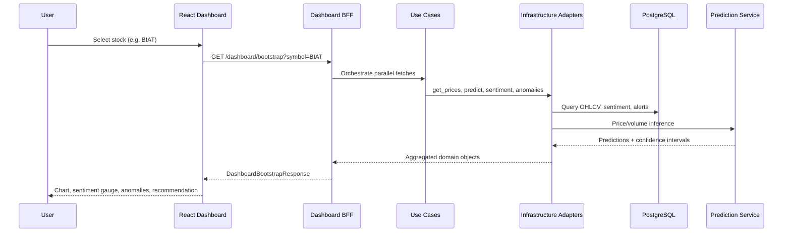

# 01 — Project Overview

## Executive Summary

**FixTrade** is an AI-powered trading intelligence platform targeting the **Bourse des Valeurs Mobilières de Tunis (BVMT)** — the Tunisian stock exchange. The system ingests historical OHLCV market data, scrapes multilingual financial news, runs machine learning forecasts, detects market anomalies, and produces personalized portfolio recommendations through a combination of ensemble models, NLP sentiment analysis, and generative AI explainability.

The platform serves as both a **production-grade software system** and a **research vehicle** for a Master's thesis in software engineering / data science, demonstrating how hexagonal architecture, medallion ETL, and multi-signal decision engines can be composed into a cohesive financial analytics product for an emerging market with limited liquidity and multilingual information sources.

---

## Business Problem

The BVMT presents unique challenges compared to major Western exchanges:

| Challenge | Impact |
|-----------|--------|
| **Limited liquidity** | Many tickers trade fewer than 1,000 shares/day, making standard ML approaches unreliable |
| **Multilingual news** | Financial articles appear in French, Arabic, and English — monolingual NLP fails |
| **Data fragmentation** | Historical data arrives as CSV/TXT archives; real-time feeds are scarce |
| **Retail investor gap** | Individual investors lack institutional-grade analytics, anomaly surveillance, and portfolio tools |
| **Market manipulation risk** | Low liquidity amplifies pump-and-dump and bear-raid patterns |

FixTrade addresses these gaps by providing an integrated platform that combines price forecasting, sentiment analysis, anomaly detection, and AI-assisted portfolio management in a single system.

---

## Objectives

### Primary Objectives

1. **Predict** closing prices, transaction volumes, and liquidity tiers 1–5 trading days ahead for 30+ BVMT securities
2. **Analyze** financial news sentiment in French, Arabic, and English using transformer-based NLP
3. **Detect** market anomalies through statistical analysis and cross-signal validation (predictions vs. prices, sentiment vs. prices)
4. **Recommend** buy/sell/hold actions with confidence scores and natural-language explanations
5. **Simulate** virtual portfolios with risk profiles, stop-loss automation, and performance metrics

### Secondary Objectives

- Demonstrate **hexagonal (ports & adapters) architecture** in a real ML-heavy domain
- Support **modular monolith → microservices** evolution for thesis demonstration
- Provide **reproducible deployment** via Docker Compose
- Track experiments with **MLflow** and maintain **170+ automated tests**

---

## Target Users

| User Segment | Use Case |
|--------------|----------|
| **Retail investors** | Explore predictions, sentiment, and recommendations for BVMT stocks |
| **Portfolio managers (simulated)** | Create virtual portfolios, execute trades, track P&L and Sharpe ratio |
| **Researchers / thesis evaluators** | Study architecture, ML pipeline design, and anomaly detection methodology |
| **Developers** | Extend scrapers, add models, integrate new data sources via port interfaces |

---

## Core Features



| Feature | Description | Primary Module |
|---------|-------------|----------------|
| Price prediction | 1–5 day closing price forecasts with confidence intervals | `prediction/` |
| Volume forecasting | Transaction volume predictions via XGBoost | `prediction/models/volume_predictor.py` |
| Liquidity classification | High/medium/low tier probabilities | `prediction/models/liquidity_classifier.py` |
| Sentiment analysis | Per-article and daily aggregated scores | `app/nlp/sentiment.py` |
| Anomaly detection | 3-layer surveillance (statistical + cross-signal) | `app/domain/trading/anomaly_service.py` |
| Trade recommendations | Multi-signal buy/sell/hold | `app/application/trading/get_recommendation.py` |
| Portfolio management | Virtual trading, stop-loss, performance metrics | `app/ai/` |
| Generative AI | Natural-language trade explanations | `app/ai/llm_explainer.py` |
| Web scraping | Tunisian financial news collection | `scraping/` |
| Authentication | JWT-based user registration and login | `app/application/auth/` |

---

## High-Level Workflow

### End-to-End Data and Decision Flow



### User Request Flow



---

## System Boundaries

| In Scope | Out of Scope (MVP) |
|----------|-------------------|
| BVMT equities (30+ tickers) | Live order execution on real brokerage accounts |
| Virtual portfolio simulation | Regulatory compliance reporting |
| Historical + scraped news data | Real-time tick-by-tick market data feeds |
| REST API + web dashboards | Mobile native applications |
| JWT authentication (partial) | OAuth2 / SSO integration |
| Docker-based deployment | Kubernetes orchestration |

---

## Key Design Decisions (Overview)

| Decision | Rationale |
|----------|-----------|
| **Hexagonal architecture** | Isolates domain logic from FastAPI, SQLAlchemy, and ML frameworks — enables testing without I/O |
| **Medallion ETL** | Immutable bronze layer preserves raw data; silver/gold layers enable reproducible ML training |
| **Liquidity-tiered ensembles** | Low-volume BVMT tickers need simpler models (Prophet-only) to avoid overfitting |
| **Modular monolith + optional microservices** | Single deployable unit for development; split ML/auth/GenAI services for thesis scalability demo |
| **Rule-based + LLM explainability** | Core decisions are deterministic; LLM adds narrative without being a single point of failure |

---

## Repository Map

```
fixtrade/
├── app/           # FastAPI monolith (domain, application, infrastructure, interfaces)
├── prediction/    # ML pipeline (ETL, features, models, inference)
├── scraping/      # Scrapy news crawlers
├── services/      # Standalone auth & GenAI microservices
├── frontend/      # React + Vite dashboard
├── db/            # PostgreSQL schema migrations
├── docker/        # Dockerfiles and nginx config
├── scripts/       # Startup, scraper worker, smoke tests
└── tests/         # 170+ pytest tests
```

---

## Related Documentation

| Document | Topic |
|----------|-------|
| [02-system-architecture.md](02-system-architecture.md) | Architectural style, components, data flows |
| [03-technology-stack.md](03-technology-stack.md) | Dependencies, versions, technology rationale |
| [11-machine-learning-prediction.md](11-machine-learning-prediction.md) | Models, training, evaluation |
| [15-sprint-and-development-process.md](15-sprint-and-development-process.md) | Development methodology and milestones |
