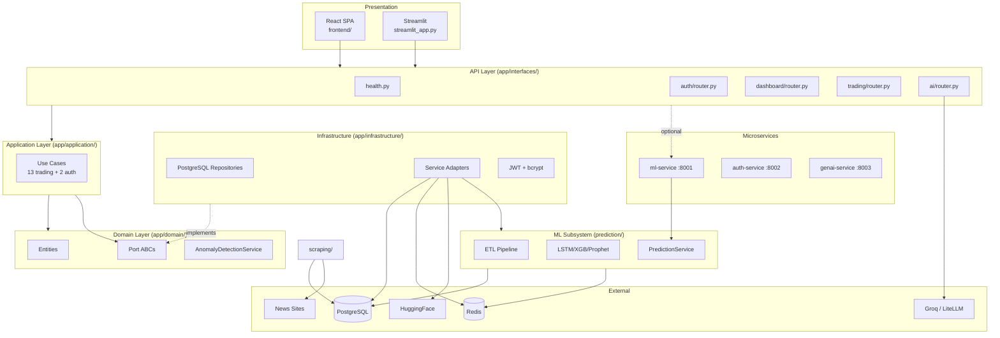
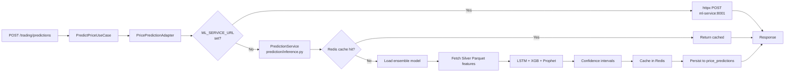
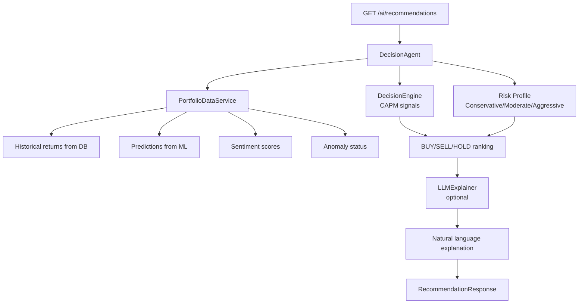

# 02 — System Architecture

## Architectural Style

FixTrade implements a **Modular Monolith** with **Hexagonal Architecture (Ports & Adapters)** and elements of **Layered Architecture** and **Medallion Data Architecture**. It is **not** a full microservices deployment by default, but supports **selective service extraction** for thesis demonstration.

### Classification

| Style | Present? | Evidence |
|-------|----------|----------|
| **Modular monolith** | ✅ Primary | Single `app/` package with bounded contexts (auth, trading, ai); optional split services |
| **Hexagonal / Clean** | ✅ Core pattern | `domain/ports.py` ABCs → `infrastructure/*_adapter.py` implementations |
| **Layered** | ✅ Within monolith | interfaces → application → domain ← infrastructure |
| **Microservices** | ⚠️ Partial / demo | `ml-service`, `auth-service`, `genai-service` on separate ports |
| **Event-driven** | ⚠️ Planned, disabled | WebSocket/SSE realtime pipeline commented out in `app/main.py` |
| **CQRS** | ❌ | Not implemented |
| **Full Clean Architecture** | ⚠️ Partial | Domain is pure; some AI logic lives outside strict domain boundaries in `app/ai/` |

### Why Hexagonal Architecture?

The BVMT domain involves multiple external systems (PostgreSQL, Redis, HuggingFace, Groq, Scrapy, Parquet files). Hexagonal architecture:

1. **Isolates business rules** — anomaly Z-score thresholds live in `AnomalyDetectionService` without SQL or HTTP
2. **Enables unit testing** — use cases tested with mocked ports (see `tests/test_application_trading.py`)
3. **Supports adapter swapping** — `PricePredictionAdapter` can call local `PredictionService` or remote ML microservice via `ML_SERVICE_URL`
4. **Documents intent** — port interfaces (`PricePredictionPort`, `AnomalyDetectionPort`) explicitly define system boundaries

### Dependency Rule (Enforced)

```
interfaces → application → domain ← infrastructure
```

The **domain layer never imports** FastAPI, SQLAlchemy, PyTorch, or Scrapy. Verified in `app/domain/` — only stdlib and domain entities.

---

## Component Breakdown



### Component Responsibilities

| Component | Location | Responsibility | Dependencies |
|-----------|----------|----------------|--------------|
| **React Dashboard** | `frontend/` | Auth gate, stock selection, charts, anomaly display | FastAPI BFF |
| **Streamlit Dashboard** | `streamlit_app.py` | Legacy interactive analytics UI | FastAPI REST |
| **FastAPI Monolith** | `app/main.py` | Composition root, middleware, router mounting | All subsystems |
| **Dashboard BFF** | `app/interfaces/dashboard/` | Single aggregated bootstrap endpoint | Trading use cases |
| **Trading Use Cases** | `app/application/trading/` | Orchestrate predict, sentiment, anomaly, recommend | Domain ports |
| **Domain Services** | `app/domain/trading/` | Pure anomaly/intraday logic | None (pure Python) |
| **Infrastructure Adapters** | `app/infrastructure/trading/` | PostgreSQL, ML, NLP integration | External systems |
| **Prediction Module** | `prediction/` | ETL, training, inference, caching | Parquet, Redis, PG |
| **Scraping** | `scraping/` | News article collection | Scrapy, PostgreSQL |
| **AI Agent** | `app/ai/` | Portfolio, MPT, LLM explainability | SciPy, LiteLLM |
| **ML Service** | `app/ml_service/main.py` | Isolated prediction HTTP API | `prediction.inference` |
| **Auth Service** | `services/auth_service/app.py` | Standalone JWT auth demo | Same auth domain code |
| **GenAI Service** | `services/genai_service/app.py` | Demo explainability stub | Minimal FastAPI |

---

## Communication Flows

### Synchronous REST (Primary)

All client-server communication uses **synchronous HTTP/REST**. FastAPI endpoints are `async`-capable but most use cases execute synchronously (ML inference, DB queries).

| From | To | Protocol | Purpose |
|------|-----|----------|---------|
| React | API `:8000` | HTTP/JSON | Dashboard bootstrap, auth |
| API | ML Service `:8001` | HTTP/JSON | Optional remote predictions (`ML_SERVICE_URL`) |
| API | PostgreSQL | TCP/SQL | Market data, alerts, sentiment |
| API | Redis | TCP | Prediction cache reads (via adapters) |
| Scraper | PostgreSQL | TCP/SQL | Article persistence |
| AI Module | Groq/LiteLLM | HTTPS | LLM explanations |

### Real-Time (Disabled)

The realtime subsystem in `prediction/realtime/` provides:

- `PredictionStreamManager` — WebSocket/SSE broadcasting
- `RealtimeScheduler` — APScheduler-based retraining
- `DataWatcher` — Filesystem polling for new raw data

These are **commented out** in `app/main.py` lifespan (lines 48–85) due to startup stability issues. Endpoints would mount at `/api/v1/realtime/*` when enabled.

---

## Data Flow Diagrams

### Prediction Generation



### Portfolio Recommendation Generation



### Sentiment Pipeline

```mermaid
flowchart LR
    S1["Scrapy spider"] --> S2["scraped_articles"]
    S2 --> S3["LinkArticleSymbolsUseCase"]
    S3 --> S4["article_symbols"]
    S4 --> S5["AnalyzeArticleSentimentUseCase"]
    S5 --> S6["SentimentAnalyzer<br/>HuggingFace"]
    S6 --> S7["article_sentiments"]
    S7 --> S8["AggregateDailySentimentUseCase"]
    S8 --> S9["sentiment_scores"]
    S9 --> S10["Anomaly + Recommendation engines"]
```



---

## Deployment Topologies

### Topology A: Modular Monolith (Development)

```
[Developer Machine]
  ├── uvicorn app.main:app :8000
  ├── postgres :5432
  ├── redis :6379
  └── npm run dev (Vite) :3000
```

### Topology B: Docker Compose (Thesis Demo)

```
docker-compose.yml
  ├── postgres, redis
  ├── api :8000
  ├── ml-service :8001
  ├── auth-service :8002
  ├── genai-service :8003
  ├── frontend (nginx) :3000
  ├── scraper (worker loop)
  └── etl-worker (one-shot)
```

See [13-devops-deployment.md](13-devops-deployment.md) for full service matrix.

---

## Scalability Considerations

| Dimension | Current State | Scaling Path |
|-----------|---------------|--------------|
| **API throughput** | Single uvicorn worker; slowapi rate limiting | Gunicorn multi-worker; horizontal pod scaling |
| **ML inference** | CPU-bound; Redis cache (<50ms hit) | Extract to GPU-enabled ml-service; batch predictions |
| **Database** | Single PostgreSQL instance | Read replicas for analytics; partition `stock_prices` by year |
| **Scraping** | Single Scrapy process, 1s delay | Distributed Scrapy with Redis scheduler |
| **Cache** | Redis 256MB LRU | Increase memory; separate feature vs. prediction namespaces |

---

## Known Architectural Limitations

Documented from source code analysis — not assumptions:

1. **AI portfolios are in-memory** — `app/ai/router.py` stores `DecisionAgent` instances in `_agents: Dict[str, DecisionAgent]`; not persisted to PostgreSQL `portfolios` table
2. **Trading endpoints are unauthenticated** — only `GET /auth/me` requires JWT
3. **DecisionEngineAdapter is a mock** — returns fixed BUY at 0.85 confidence in MVP trading recommendations
4. **Realtime pipeline disabled** — WebSocket features unavailable in current build
5. **Dual UI** — React (new) and Streamlit (legacy) coexist; README historically favored Streamlit

---

## Related Documentation

- [05-backend-architecture.md](05-backend-architecture.md) — API endpoints and service layer
- [08-data-pipeline-etl.md](08-data-pipeline-etl.md) — Medallion ETL details
- [14-design-patterns.md](14-design-patterns.md) — Verified design patterns with code locations
