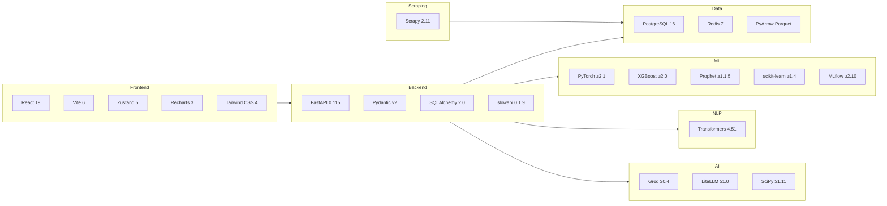

# 03 — Technology Stack

All versions extracted from `requirements.txt`, `requirements-*.txt`, `frontend/package.json`, and `docker-compose.yml` as of the indexed codebase state.

---

## Stack Overview

---

## Dependency Inventory

### Python — Main API (`requirements.txt`)

| Package | Version | Purpose |
|---------|---------|---------|
| fastapi | 0.115.0 | Async REST API framework |
| uvicorn[standard] | 0.30.6 | ASGI server |
| pydantic-settings | 2.5.2 | Environment-based configuration |
| slowapi | 0.1.9 | Rate limiting middleware |
| passlib[bcrypt] | 1.7.4 | Password hashing |
| PyJWT | 2.10.1 | JWT token generation/validation |
| asgiref | 3.8.1 | WSGI/ASGI bridge |
| gunicorn | 23.0.0 | Production multi-worker server |
| SQLAlchemy | 2.0.46 | ORM and database toolkit |
| pg8000 | 1.29.7 | Pure-Python PostgreSQL driver |
| psycopg2-binary | 2.9.11 | C-based PostgreSQL driver |
| asyncpg | ≥0.30.0 | Async PostgreSQL driver |
| transformers | 4.51.3 | HuggingFace NLP pipelines |
| pandas | ≥2.1.0 | DataFrame operations, ETL |
| numpy | ≥1.26.0 | Numerical computing |
| pyarrow | ≥14.0.0 | Parquet columnar I/O |
| scikit-learn | ≥1.4.0 | Preprocessing, metrics |
| xgboost | ≥2.0.0 | Gradient boosted trees |
| prophet | ≥1.1.5 | Time series decomposition |
| torch | ≥2.1.0 | LSTM neural networks |
| redis | ≥5.0.0 | Cache client |
| mlflow | ≥2.10.0 | Experiment tracking |
| APScheduler | ≥3.10.0 | Scheduled retraining |
| websockets | ≥12.0 | Real-time streaming |
| groq | ≥0.4.0 | Groq LLM API client |
| litellm | ≥1.0.0 | Multi-provider LLM abstraction |
| scipy | ≥1.11.0 | Portfolio optimization |
| scrapy | 2.11.2 | Web scraping framework |
| Twisted | 24.11.0 | Scrapy networking engine |
| streamlit | ≥1.31.0 | Legacy dashboard |
| plotly | ≥5.18.0 | Streamlit charts |
| pytest | 8.3.3 | Test runner |
| httpx | 0.27.2 | Async HTTP client |
| pyyaml | ≥6.0.0 | Prompt template loading |
| requests | ≥2.31.0 | HTTP client |
| python-dateutil | 2.8.2 | Date parsing |
| dateparser | 1.1.8 | Multi-locale date parsing |

### Python — Service-Specific Requirements

| File | Packages | Use Case |
|------|----------|----------|
| `requirements-auth.txt` | fastapi, uvicorn, pydantic-settings, slowapi, passlib, PyJWT, SQLAlchemy, pg8000, httpx | Standalone auth microservice |
| `requirements-ml-service.txt` | fastapi, uvicorn, pydantic-settings, httpx | Minimal ML service image |
| `requirements-scraper.txt` | scrapy, Twisted, SQLAlchemy, python-dateutil, psycopg2-binary | Scraper container |
| `requirements-genai.txt` | fastapi, uvicorn, pydantic-settings | GenAI stub service |
| `requirements-demo.txt` | fastapi, uvicorn, passlib, PyJWT, SQLAlchemy, redis, requests | Demo stack |

### Frontend (`frontend/package.json`)

| Package | Version | Purpose |
|---------|---------|---------|
| react | ^19.0.1 | UI framework |
| react-dom | ^19.0.1 | DOM rendering |
| vite | ^6.2.3 | Build tool and dev server |
| @vitejs/plugin-react | ^5.0.4 | React HMR plugin |
| typescript | ~5.8.2 | Static typing |
| zustand | ^5.0.12 | State management |
| recharts | ^3.8.1 | Prediction charts |
| tailwindcss | ^4.1.14 | Utility-first CSS |
| @tailwindcss/vite | ^4.1.14 | Tailwind Vite integration |
| lucide-react | ^0.546.0 | Icons |
| motion | ^12.23.24 | Animations |
| clsx / tailwind-merge | ^2.1.1 / ^3.5.0 | Conditional CSS classes |

### Infrastructure (Docker)

| Technology | Version | Source |
|------------|---------|--------|
| PostgreSQL | 16-alpine | `docker-compose.yml` |
| Redis | 7-alpine | `docker-compose.yml` |
| Python (API/ML) | 3.11-slim | `docker/Dockerfile` |
| Node (frontend build) | 18-alpine | `docker/frontend.Dockerfile` |
| nginx | alpine | `docker-compose.yml` frontend service |

---

## Technology Selection Rationale

### FastAPI over Flask/Django

| Criterion | FastAPI | Alternative |
|-----------|---------|-------------|
| Async support | Native async/await | Flask requires extensions |
| OpenAPI | Auto-generated from Pydantic | Manual or third-party |
| Validation | Pydantic v2 integrated | Marshmallow (Flask) |
| Performance | High (Starlette ASGI) | Django heavier for API-only use |
| Type hints | First-class | Varies |

**Decision:** FastAPI chosen for automatic API documentation (thesis evaluators can explore `/docs`), Pydantic validation aligned with domain DTOs, and async readiness for future WebSocket endpoints.

### PostgreSQL over MongoDB

| Criterion | PostgreSQL | MongoDB |
|-----------|------------|---------|
| Relational market data | Natural fit (symbol + date keys) | Document model adds complexity |
| ACID transactions | Required for portfolio positions | Eventual consistency risk |
| SQL views | `v_latest_prices`, `v_portfolio_value` | Aggregation pipeline equivalent |
| Ecosystem | SQLAlchemy 2.0, pg8000 | Motor/Beanie less mature in codebase |

**Decision:** OHLCV data is inherently tabular with strict uniqueness constraints (`symbol, seance`). PostgreSQL provides indexed time-series queries and schema enforcement via `db/001_init_schema.sql`.

### Redis over In-Memory Only

| Benefit | Detail |
|---------|--------|
| Sub-50ms cache hits | Prediction results cached with TTL (`PREDICTION_CACHE_TTL=3600`) |
| Cross-process sharing | ML service and API share cache when both connect to Redis |
| LRU eviction | 256MB limit configured in docker-compose |
| Graceful fallback | `prediction/utils/cache.py` falls back to in-memory dict if Redis unavailable |

### PyTorch LSTM + XGBoost + Prophet Ensemble

| Model | Strength | BVMT Fit |
|-------|----------|----------|
| **LSTM** | Captures sequential dependencies in price series | High-liquidity tickers (>10k vol/day) |
| **XGBoost** | Feature interactions, handles missing values | Medium-liquidity tickers |
| **Prophet** | Robust to missing data, trend/seasonality | Low-liquidity tickers (Prophet-only tier) |

**Alternative considered:** Single LSTM or ARIMA-only — rejected because BVMT liquidity heterogeneity requires tier-adaptive model selection (`prediction/models/ensemble.py` → `LiquidityTier`).

### HuggingFace Transformers (not spaCy/VADER)

Financial news is **multilingual** (French, Arabic). The deployed model is `nlptown/bert-base-multilingual-uncased-sentiment` (~180MB), mapping 1–5 star ratings to {-1, 0, 1}. Module docstring references `jplu/tf-xlm-roberta-large` as design intent; actual `_MODEL_NAME` constant in `app/nlp/sentiment.py` line 80 uses the nlptown model for faster CPU inference.

### Scrapy over BeautifulSoup-only

| Scrapy Advantage | Detail |
|------------------|--------|
| Built-in politeness | `DOWNLOAD_DELAY=1.0`, `ROBOTSTXT_OBEY=True` |
| Pipeline architecture | `PostgresPipeline` with JSONL fallback |
| Concurrent requests | `CONCURRENT_REQUESTS=8` |
| Spider modularity | Separate spiders per news source |

**Not used:** Selenium, Playwright — static HTML parsing sufficient for target sites.

### LiteLLM + Groq over Direct OpenAI Only

`app/ai/llm_explainer.py` supports multiple providers (Groq default, OpenRouter, OpenAI, Anthropic) via LiteLLM abstraction. Groq selected for fast inference of `llama-3.3-70b-versatile` at low cost for thesis demo.

### React + Vite over Next.js

| Criterion | Vite + React SPA | Next.js |
|-----------|------------------|---------|
| SSR need | None (dashboard is client-only) | Unnecessary complexity |
| API coupling | Proxies to FastAPI backend | Would duplicate BFF |
| Build speed | Vite HMR ~instant | Heavier |
| Deployment | Static `dist/` served by nginx | Node server or static export |

---

## Runtime Requirements

| Requirement | Minimum | Recommended |
|-------------|---------|-------------|
| Python | 3.11+ | 3.11 (Docker images) |
| Node.js | 18+ | 18 (frontend Docker) |
| PostgreSQL | 16+ | 16-alpine (Docker) |
| Redis | 7+ | 7-alpine (Docker) |
| RAM | 8 GB | 16 GB (ML training) |
| Disk | 10 GB | 50 GB (Parquet + models) |

---

## Related Documentation

- [04-frontend-architecture.md](04-frontend-architecture.md) — React stack usage
- [05-backend-architecture.md](05-backend-architecture.md) — FastAPI layer
- [13-devops-deployment.md](13-devops-deployment.md) — Docker images and compose
