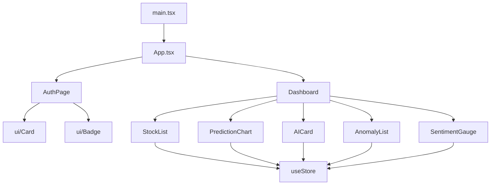

# 04 — Frontend Architecture

## Overview

The FixTrade frontend is a **React 19 Single Page Application (SPA)** built with **Vite 6** and **TypeScript**. It provides authenticated access to a trading dashboard with price charts, sentiment gauges, anomaly alerts, and AI recommendations. The UI communicates exclusively with the FastAPI backend via a **Backend-for-Frontend (BFF)** bootstrap endpoint.

**Location:** `frontend/`

---

## Folder Structure

```
frontend/
├── index.html
├── package.json
├── vite.config.ts
├── tsconfig.json
└── src/
    ├── main.tsx              # React entry point
    ├── App.tsx               # Auth gate + page routing
    ├── index.css             # Global styles (Tailwind)
    ├── lib/utils.ts          # formatCurrency, cn()
    ├── types/trading.ts      # TypeScript interfaces
    ├── services/api.ts       # HTTP client layer
    ├── store/
    │   ├── useAuthStore.ts   # Authentication state
    │   └── useStore.ts       # Dashboard/trading state
    ├── pages/
    │   ├── AuthPage.tsx      # Login / register
    │   └── Dashboard.tsx     # Main trading view
    └── components/
        ├── ui/               # Card, Badge
        └── trading/          # StockList, PredictionChart, AnomalyList, AICard, SentimentGauge
```

---

## Routing Strategy

**No React Router** is used. Navigation is implemented via **conditional rendering** in `App.tsx`:

```tsx
// frontend/src/App.tsx — conceptual flow
if (!isHydrated) return <Loading />;
return user ? <Dashboard /> : <AuthPage />;
```

| State | Rendered Component |
|-------|-------------------|
| `isHydrated === false` | Loading spinner |
| `user === null` | `AuthPage` (login/register) |
| `user !== null` | `Dashboard` |

Dashboard sidebar links (Portfolio, Markets, Screener) are **UI placeholders** — no routes or pages exist behind them.

### Trade-off: Simplicity vs. Scalability

| Approach | Benefit | Limitation |
|----------|---------|------------|
| Conditional rendering (current) | Zero routing dependency; minimal bundle | Cannot deep-link to sub-pages |
| React Router (future) | URL-based navigation, browser history | Additional dependency and config |

For the thesis MVP, a single dashboard view suffices. Multi-page routing is a documented future enhancement.

---

## Component Hierarchy



### Component Responsibilities

| Component | File | Props / Data Source | Purpose |
|-----------|------|---------------------|---------|
| `StockList` | `components/trading/StockList.tsx` | `useStore` watchlist | Symbol selection sidebar |
| `PredictionChart` | `components/trading/PredictionChart.tsx` | `chartData` from store | Recharts ComposedChart (historical + forecast) |
| `SentimentGauge` | `components/trading/SentimentGauge.tsx` | `selectedStock.sentimentScore` | Visual sentiment indicator |
| `AnomalyList` | `components/trading/AnomalyList.tsx` | `anomalies` from store | Severity-sorted alert cards |
| `AICard` | `components/trading/AICard.tsx` | `recommendation` from store | Buy/sell/hold with confidence |
| `Card` | `components/ui/Card.tsx` | children | Reusable container |
| `Badge` | `components/ui/Badge.tsx` | variant, label | Status chips |

---

## State Management

**Zustand 5** with two isolated stores:

### `useAuthStore` — `frontend/src/store/useAuthStore.ts`

| State | Type | Description |
|-------|------|-------------|
| `user` | `User \| null` | Authenticated user profile |
| `token` | `string \| null` | JWT access token |
| `isHydrated` | `boolean` | Whether localStorage was read |
| `error` | `string \| null` | Auth error message |

| Action | Behavior |
|--------|----------|
| `hydrate()` | Read `fixtrade_auth_token` from localStorage; validate via `GET /auth/me` |
| `signIn(email, password)` | `POST /auth/login` → store token + user |
| `signUp(email, password, name)` | `POST /auth/register` → store token + user |
| `signOut()` | Clear token and user from state and localStorage |

### `useStore` — `frontend/src/store/useStore.ts`

| State | Type | Description |
|-------|------|-------------|
| `selectedSymbol` | `string` | Active ticker (default: BIAT) |
| `stocks` | `StockSnapshot[]` | Static watchlist (BIAT, SFBT, BT) |
| `chartData` | `PricePoint[]` | Historical + predicted prices |
| `anomalies` | `AnomalyAlert[]` | Detected anomalies |
| `recommendation` | `AIRecommendation \| null` | Latest trade signal |
| `warnings` | `string[]` | Bootstrap warnings (partial data) |
| `isLoading` | `boolean` | Fetch in progress |

| Action | Behavior |
|--------|----------|
| `fetchStockData(symbol)` | Calls `GET /dashboard/bootstrap?symbol=` and maps response |

---

## Data Fetching

### API Client — `frontend/src/services/api.ts`

**Base URL:** `import.meta.env.VITE_API_BASE_URL || "/api/v1"`

| Function | Method | Endpoint | Auth Header |
|----------|--------|----------|-------------|
| `fetchDashboardBootstrap(symbol)` | GET | `/dashboard/bootstrap?symbol=` | No |
| `fetchPricePredictions(body)` | POST | `/trading/predictions` | No |
| `fetchSentiment(body)` | POST | `/trading/sentiment` | No |
| `fetchAnomalies(body)` | POST | `/trading/anomalies` | No |
| `fetchRecommendation(body)` | POST | `/trading/recommendations` | No |
| `loginUser(body)` | POST | `/auth/login` | No |
| `registerUser(body)` | POST | `/auth/register` | No |
| `fetchCurrentUser(token)` | GET | `/auth/me` | Bearer |

### BFF Pattern

The dashboard uses a **single aggregated endpoint** rather than multiple parallel calls:

```
GET /api/v1/dashboard/bootstrap?symbol=BIAT
```

Returns: historical prices, 5-day predictions, sentiment, anomalies, recommendation, and warnings — implemented in `app/interfaces/dashboard/router.py`.

**Benefits:**
- Reduced client complexity (one request vs. five)
- Server-side orchestration with consistent error handling
- Lower browser connection overhead

### Error Handling

```typescript
// api.ts pattern — fetch wrapper throws on non-2xx
async function apiFetch<T>(path: string, options?: RequestInit): Promise<T> {
  const response = await fetch(`${BASE_URL}${path}`, options);
  if (!response.ok) {
    const body = await response.json().catch(() => ({}));
    throw new Error(body.error || `HTTP ${response.status}`);
  }
  return response.json();
}
```

Dashboard displays `warnings[]` from bootstrap response when partial data is unavailable (e.g., missing sentiment).

### Loading States

- `App.tsx`: Shows "Loading FixTrade..." until `useAuthStore.hydrate()` completes
- `Dashboard.tsx`: Uses `isLoading` from `useStore` during `fetchStockData()`

### Caching

No client-side cache (React Query/SWR not used). Data refetches on symbol change. Server-side Redis handles prediction caching.

---

## Development Proxy

`frontend/vite.config.ts`:

```typescript
server: {
  port: 3000,
  proxy: {
    "/api": {
      target: process.env.VITE_API_PROXY_TARGET || "http://127.0.0.1:8000",
      changeOrigin: true,
    },
  },
},
```

During development, `/api/v1/*` requests proxy to the FastAPI backend on port 8000.

---

## Security

### Token Handling

| Aspect | Implementation |
|--------|----------------|
| Storage | `localStorage` key `fixtrade_auth_token` |
| Transmission | `Authorization: Bearer <token>` on `/auth/me` only |
| Expiry | Server-side JWT expiry (`ACCESS_TOKEN_EXPIRE_MINUTES`, default 60) |
| Logout | Token removed from localStorage |

**Security note:** Dashboard and trading API calls do **not** attach the JWT token. Authentication gates UI access but does not protect API endpoints — see [06-authentication-security.md](06-authentication-security.md).

### Protected Routes

Only the **App-level auth gate** protects the dashboard UI. Unauthenticated users see `AuthPage`. There is no route-level middleware (no React Router guards).

---

## Build and Deployment

| Command | Output |
|---------|--------|
| `npm run dev` | Vite dev server on port 3000 |
| `npm run build` | Static assets in `frontend/dist/` |
| Docker production | nginx serves `dist/` with API proxy (`docker/nginx.conf`) |

### nginx Production Config

- SPA fallback: `try_files $uri $uri/ /index.html`
- API proxy: `/api/` → `host.docker.internal:8000`
- Health probe: `/_probe` → backend `/api/v1/health`

---

## UI Technology Choices

| Library | Purpose | Alternative Considered |
|---------|---------|------------------------|
| Recharts | Prediction charts | Plotly (used in Streamlit instead) |
| Tailwind CSS 4 | Styling | CSS Modules, styled-components |
| Lucide React | Icons | Heroicons |
| Motion | Animations | Framer Motion (motion is its successor) |

---

## Related Documentation

- [05-backend-architecture.md](05-backend-architecture.md) — Dashboard BFF endpoint details
- [06-authentication-security.md](06-authentication-security.md) — JWT implementation
- [13-devops-deployment.md](13-devops-deployment.md) — Frontend Docker/nginx setup
