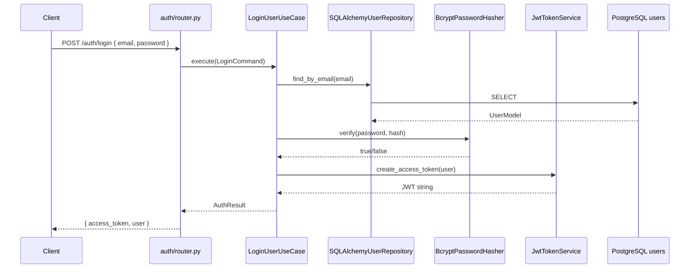

# 06 — Authentication and Security

## Overview

FixTrade implements **JWT-based authentication** with password hashing for user registration and login. Security middleware (rate limiting, security headers, CORS, input validation) protects the API surface. However, **most trading and dashboard endpoints remain publicly accessible** in the current MVP — authentication gates the React UI but not the underlying API.

---

## Authentication Architecture



---

## JWT Implementation

**File:** `app/infrastructure/auth/security.py`

| Parameter | Value | Config Key |
|-----------|-------|------------|
| Algorithm | HS256 | `AUTH_ALGORITHM` |
| Issuer | `"fixtrade"` | Hardcoded in token service |
| Expiry | 60 minutes (default) | `ACCESS_TOKEN_EXPIRE_MINUTES` |
| Secret | Environment variable | `AUTH_SECRET_KEY` |

### Token Claims

```json
{
  "sub": "<user_uuid>",
  "email": "user@example.com",
  "role": "user",
  "type": "access",
  "exp": 1234567890,
  "iat": 1234564290
}
```

### Token Extraction

`app/interfaces/auth/dependencies.py`:

```python
oauth2_scheme = OAuth2PasswordBearer(tokenUrl="/api/v1/auth/login")

async def get_current_user(token: str = Depends(oauth2_scheme)) -> User:
    payload = token_service.decode(token)
    user = user_repository.find_by_id(payload["sub"])
    if not user:
        raise InvalidCredentialsError()
    return user
```

**Protected endpoint:** Only `GET /api/v1/auth/me` uses `Depends(get_current_user)`.

---

## Password Hashing

**Class:** `BcryptPasswordHasher` in `app/infrastructure/auth/security.py`

| Aspect | Implementation |
|--------|----------------|
| Library | Passlib `CryptContext` |
| Primary scheme | `pbkdf2_sha256` |
| Fallback schemes | `bcrypt_sha256`, `bcrypt` |
| Storage | `users.hashed_password` column |

**Why pbkdf2_sha256 primary?** Avoids bcrypt 72-byte password length issues on some platforms while maintaining bcrypt as fallback for migrated hashes.

---

## Authorization

### Role-Based Access Control

| Role | Defined | Enforced |
|------|---------|----------|
| `user` | ✅ In JWT claims and `UserModel` | ❌ No endpoint-level RBAC |
| `admin` | ⚠️ Entity supports role field | ❌ Not checked in routers |

**Current state:** Authorization is **not implemented** beyond authentication for `/auth/me`. All trading, AI, and dashboard endpoints are open.

### Recommended Production RBAC

| Endpoint Group | Suggested Role |
|----------------|----------------|
| `/auth/*` | Public (register/login), Authenticated (/me) |
| `/trading/*` | Authenticated |
| `/ai/portfolio/*/trade` | Authenticated + portfolio owner |
| `/dashboard/*` | Authenticated |

---

## Security Mechanisms

### Input Validation

| Layer | Mechanism |
|-------|-----------|
| HTTP | Pydantic v2 models with `Field()` constraints |
| Symbol validation | Regex `^[A-Z0-9]+$`, length 2–10 |
| Horizon validation | Integer 1–5 |
| Email validation | Pydantic `EmailStr` |

**Example:** `app/interfaces/trading/schemas.py` — `PredictPriceRequest`

### Rate Limiting

**Library:** slowapi  
**File:** `app/shared/security/rate_limiting.py`

| Scope | Limit | Config |
|-------|-------|--------|
| Default | 60/minute | `RATE_LIMIT_DEFAULT` |
| Heavy endpoints | 10/minute | `RATE_LIMIT_HEAVY` |
| Auth register | 5/minute | Hardcoded in router |
| Auth login | 10/minute | Hardcoded in router |

Exceeded limits return **HTTP 429** with JSON error body.

### Security Headers

**File:** `app/shared/security/headers.py` — `SecurityHeadersMiddleware`

| Header | Value |
|--------|-------|
| `X-Content-Type-Options` | `nosniff` |
| `X-Frame-Options` | `DENY` |
| `Referrer-Policy` | `strict-origin-when-cross-origin` |
| `Content-Security-Policy` | `default-src 'self'` |
| `X-XSS-Protection` | `1; mode=block` |

### CORS

**File:** `app/main.py`

```python
allow_origins=[
    "http://localhost:3000",
    "http://127.0.0.1:3000",
    "http://localhost:8501",
    "http://127.0.0.1:8501",
]
allow_credentials=True
allow_methods=["*"]
allow_headers=["*"]
```

Production deployment should restrict origins to the deployed frontend domain.

### SQL Injection Protection

- SQLAlchemy ORM for auth (`UserModel`)
- Parameterized raw SQL in repository adapters (e.g., `%(symbol)s` placeholders)
- No string concatenation of user input into SQL

### CSRF Protection

**Not implemented.** REST API uses JWT Bearer tokens (not cookies) for auth endpoints. CSRF is low risk for Bearer-based APIs but relevant if cookie-based sessions are added.

### Secrets Management

| Secret | Storage | Default (Dev) |
|--------|---------|---------------|
| `AUTH_SECRET_KEY` | `.env` / Docker env | `dev-secret-key-change-in-production` |
| `DATABASE_URL` | `.env` | Compose override |
| `GROQ_API_KEY` | `.env` | Empty (LLM disabled) |
| `POSTGRES_PASSWORD` | `.env` / Compose | `fixtrade` |

**Docker Compose warning:** `AUTH_SECRET_KEY=dev-secret-key-change-in-production` is hardcoded in `docker-compose.yml` — must change for production.

### Error Handling (Information Disclosure)

`app/shared/errors/handlers.py` maps domain exceptions to HTTP responses **without exposing stack traces** or internal paths to clients.

---

## Standalone Auth Microservice

**File:** `services/auth_service/app.py`  
**Port:** 8002

Duplicates the auth router for microservices boundary demonstration. Uses the same domain/application/infrastructure code paths. Not wired into the React frontend proxy — frontend calls main API auth routes on port 8000.

---

## Security Risks and Mitigations

| Risk | Severity | Current Mitigation | Recommended Improvement |
|------|----------|-------------------|------------------------|
| Unauthenticated trading API | High | Rate limiting only | Require JWT on all `/trading/*` and `/ai/*` |
| Dev JWT secret in production | Critical | Documented in compose | Enforce secret rotation; fail startup if default secret in prod |
| Token in localStorage | Medium | Standard SPA pattern | Consider httpOnly cookies + CSRF for XSS resilience |
| No RBAC | Medium | — | Implement role checks on sensitive endpoints |
| LLM prompt injection | Low-Medium | Rule-based fallback explanations | Input sanitization on user-provided context |
| Scraper robots.txt only | Low | `ROBOTSTXT_OBEY=True` | Monitor target site ToS |
| Dependency supply chain | Medium | Pinned versions in requirements.txt | Automated vulnerability scanning (Dependabot) |
| No HTTPS in dev | Low | Expected for local dev | TLS termination at nginx/load balancer in prod |

---

## Authentication Domain Model

```
app/domain/auth/
├── entities.py     # User dataclass
├── ports.py        # UserRepository, PasswordHasher, TokenService ABCs
└── errors.py       # InvalidCredentialsError, UserAlreadyExistsError

app/application/auth/
├── register_user.py
├── login_user.py
└── dtos.py

app/infrastructure/auth/
├── models.py       # UserModel (SQLAlchemy)
├── repository.py   # SQLAlchemyUserRepository
└── security.py     # BcryptPasswordHasher, JwtTokenService
```

---

## Related Documentation

- [04-frontend-architecture.md](04-frontend-architecture.md) — Client token storage
- [05-backend-architecture.md](05-backend-architecture.md) — Auth endpoints
- [13-devops-deployment.md](13-devops-deployment.md) — Environment variables
