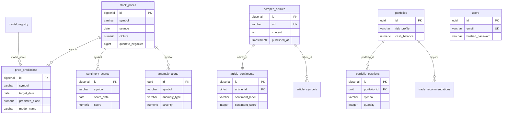

# 07 — Database Design

## Database Technology

**PostgreSQL 16** (Alpine image in Docker Compose)

### Why PostgreSQL?

| Requirement | PostgreSQL Capability |
|-------------|----------------------|
| Relational OHLCV data | Composite unique keys `(symbol, seance)` |
| Time-series queries | B-tree indexes on `(symbol, seance DESC)` |
| JSON metadata | JSONB column on anomaly alerts (planned in README; base schema uses TEXT description) |
| Views for analytics | `v_latest_prices`, `v_latest_predictions`, `v_portfolio_value` |
| UUID primary keys | `uuid-ossp` extension for portfolios and anomaly alerts |
| ACID portfolio trades | Foreign keys with CASCADE on positions |

**Alternatives considered:** TimescaleDB (extension not used — standard PostgreSQL sufficient for thesis scale); MongoDB (rejected — relational constraints critical for financial data).

---

## Schema Overview

**Schema files:**
- `db/001_init_schema.sql` — Core trading tables and views
- `db/002_intraday_known_anomalies.sql` — Intraday ticks and ground-truth labels
- `db/003_article_symbols.sql` — Article-to-symbol linking
- `app/infrastructure/auth/models.py` — SQLAlchemy `users` table (created at startup via `create_tables()`)
- `prediction/db_sink.py` — Creates `volume_predictions`, `liquidity_predictions` at runtime

---

## Table Reference

### `stock_prices`

**Purpose:** Historical OHLCV market data (Bronze-equivalent in DB).

| Column | Type | Constraints | Description |
|--------|------|-------------|-------------|
| `id` | BIGSERIAL | PK | Surrogate key |
| `symbol` | VARCHAR(50) | NOT NULL | BVMT ticker (e.g., BIAT) |
| `code_isin` | VARCHAR(30) | | ISIN code |
| `groupe` | VARCHAR(50) | | Market group |
| `seance` | DATE | NOT NULL | Trading session date |
| `ouverture` | NUMERIC(12,3) | | Open price |
| `cloture` | NUMERIC(12,3) | NOT NULL | Close price |
| `plus_bas` | NUMERIC(12,3) | | Low |
| `plus_haut` | NUMERIC(12,3) | | High |
| `quantite_negociee` | BIGINT | DEFAULT 0 | Volume |
| `nb_transaction` | INTEGER | DEFAULT 0 | Transaction count |
| `capitaux` | NUMERIC(18,3) | DEFAULT 0 | Capital traded |
| `created_at` | TIMESTAMPTZ | DEFAULT NOW() | Insert timestamp |

**Unique:** `(symbol, seance)`

### `price_predictions`

| Column | Type | Description |
|--------|------|-------------|
| `symbol` | VARCHAR(20) | Ticker |
| `target_date` | DATE | Forecast date |
| `predicted_close` | NUMERIC(12,3) | Point forecast |
| `confidence_lower` | NUMERIC(12,3) | Lower bound |
| `confidence_upper` | NUMERIC(12,3) | Upper bound |
| `confidence_score` | NUMERIC(5,4) | Model agreement 0–1 |
| `model_name` | VARCHAR(50) | Default `ensemble` |
| `horizon_days` | INTEGER | 1–5 |

**Unique:** `(symbol, target_date, model_name)`

### `scraped_articles`

| Column | Type | Description |
|--------|------|-------------|
| `url` | VARCHAR(1024) | Unique article URL |
| `title` | VARCHAR(512) | Headline |
| `summary` | TEXT | Short summary |
| `content` | TEXT | Full body |
| `published_at` | TIMESTAMPTZ | Publication date |

### `article_sentiments`

| Column | Type | Constraints |
|--------|------|-------------|
| `article_id` | BIGINT | FK → scraped_articles(id) CASCADE |
| `sentiment_label` | VARCHAR(10) | CHECK IN (positive, negative, neutral) |
| `sentiment_score` | INTEGER | CHECK IN (-1, 0, 1) |
| `confidence` | NUMERIC(5,4) | Model confidence |

### `sentiment_scores`

Daily aggregated sentiment per symbol.

| Column | Type | Description |
|--------|------|-------------|
| `symbol` | VARCHAR(20) | Ticker |
| `score_date` | DATE | Aggregation date |
| `score` | NUMERIC(5,4) | -1.0 to 1.0 |
| `sentiment` | VARCHAR(10) | Dominant label |
| `article_count` | INTEGER | Articles contributing |

**Unique:** `(symbol, score_date)`

### `anomaly_alerts`

| Column | Type | Description |
|--------|------|-------------|
| `id` | UUID | PK (uuid_generate_v4) |
| `symbol` | VARCHAR(20) | Ticker |
| `detected_at` | TIMESTAMPTZ | Detection timestamp |
| `anomaly_type` | VARCHAR(50) | e.g., volume_spike |
| `severity` | NUMERIC(5,4) | 0.0–1.0 |
| `description` | TEXT | Human-readable explanation |
| `resolved` | BOOLEAN | Default FALSE |

### `portfolios` / `portfolio_positions`

Virtual portfolio simulation storage (schema exists; AI module currently uses in-memory state — see architecture docs).

| portfolios | portfolio_positions |
|------------|---------------------|
| `risk_profile` CHECK (conservative, moderate, aggressive) | `quantity` CHECK > 0 |
| `initial_capital`, `cash_balance` | FK to portfolios CASCADE |
| UUID PK | Tracks purchase/sell dates and prices |

### `model_registry`

Tracks trained ML model metadata for reproducibility.

| Column | Purpose |
|--------|---------|
| `mae`, `rmse`, `mape` | Regression metrics |
| `directional_acc` | Direction prediction accuracy |
| `r_squared` | R² score |
| `artifact_path` | Filesystem path to model weights |
| `is_active` | Production flag |

### `etl_watermarks`

Incremental ETL progress tracking.

| Column | Purpose |
|--------|---------|
| `layer` | bronze, silver, or gold |
| `ticker` | Optional per-symbol watermark |
| `last_date` | Last processed date |
| `rows_processed` | Row count |

### `intraday_ticks` / `known_anomalies` (002 migration)

| Table | Purpose |
|-------|---------|
| `intraday_ticks` | 1-minute or tick-level OHLCV for intraday anomaly detection |
| `known_anomalies` | Ground-truth labels for precision/recall evaluation |

### `article_symbols` (003 migration)

Links scraped articles to BVMT ticker symbols via keyword matching.

### `users` (SQLAlchemy — auth)

Created by `app/core/db.py` → `create_tables()` at application startup.

| Column | Type |
|--------|------|
| `id` | UUID PK |
| `email` | VARCHAR UNIQUE |
| `hashed_password` | VARCHAR |
| `full_name` | VARCHAR |
| `role` | VARCHAR (default `user`) |
| `created_at` | TIMESTAMPTZ |

---

## Views

| View | SQL Logic | Use Case |
|------|-----------|----------|
| `v_latest_prices` | `DISTINCT ON (symbol) ORDER BY seance DESC` | Current price lookup |
| `v_latest_predictions` | Latest prediction per symbol | Dashboard display |
| `v_portfolio_value` | Join positions with latest prices | P&L calculation |

---

## Indexing Strategy

| Index | Table | Columns | Query Pattern |
|-------|-------|---------|---------------|
| `idx_stock_prices_symbol` | stock_prices | symbol | Filter by ticker |
| `idx_stock_prices_seance` | stock_prices | seance | Date range scans |
| `idx_stock_prices_symbol_seance` | stock_prices | (symbol, seance DESC) | Latest N days per symbol |
| `idx_predictions_symbol` | price_predictions | symbol | Prediction lookup |
| `idx_predictions_created` | price_predictions | created_at DESC | Recent forecasts |
| `idx_anomalies_symbol` | anomaly_alerts | symbol | Symbol filter |
| `idx_anomalies_detected` | anomaly_alerts | detected_at DESC | Recent alerts |
| `idx_scraped_articles_published` | scraped_articles | published_at DESC | News timeline |

**Primary keys:** Surrogate BIGSERIAL for most tables; UUID for portfolios and anomaly alerts (distributed-friendly IDs).

**Foreign keys:** `article_sentiments.article_id` → `scraped_articles.id` ON DELETE CASCADE; `portfolio_positions.portfolio_id` → `portfolios.id` ON DELETE CASCADE.

---

## Data Loading

| Script | Purpose |
|--------|---------|
| `db/load_data.py` | Bulk load CSV/TXT from `data/raw/` into `stock_prices` |
| `db/load_intraday_and_labels.py` | Load intraday ticks and known anomaly labels |
| `scripts/load_fallback_articles.py` | Load JSONL fallback articles into `scraped_articles` |
| `prediction/db_sink.py` | ETL pipeline writes predictions and watermarks |

Docker Compose mounts `./db` to `/docker-entrypoint-initdb.d` for automatic schema initialization on first PostgreSQL startup.

---

## Related Documentation

- [08-data-pipeline-etl.md](08-data-pipeline-etl.md) — How data flows into tables
- [05-backend-architecture.md](05-backend-architecture.md) — Repository adapters
