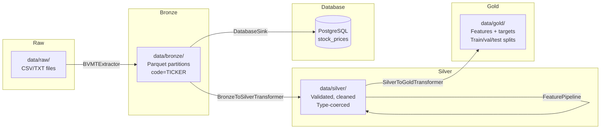
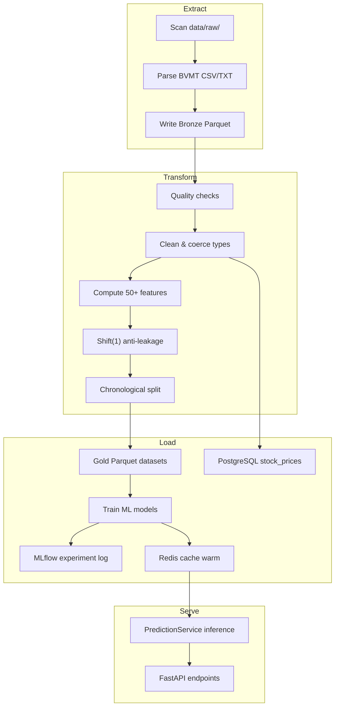

# 08 — Data Pipeline and ETL

## Overview

FixTrade implements a **Medallion Architecture** (Bronze → Silver → Gold) for BVMT market data, orchestrated by the `prediction` module. The pipeline transforms raw CSV/TXT files into ML-ready Parquet datasets with 50+ engineered features, while a parallel path loads data into PostgreSQL for API serving.

---

## Data Sources

| Source | Format | Location | Content |
|--------|--------|----------|---------|
| BVMT historical exports | CSV, TXT | `data/raw/` | OHLCV per trading session |
| Scraped financial news | HTML → DB rows | `scraped_articles` table | Multilingual articles |
| Intraday tick files | CSV | Loaded via `db/load_intraday_and_labels.py` | 1-min bars |
| Fallback articles | JSONL | `scraped_fallback.jsonl` | Offline scrape backup |

**Tracked tickers:** 30 symbols defined in `prediction/config.py` → `PredictionConfig.tracked_tickers` (BIAT, BH, BNA, STB, BT, UBCI, etc.).

---

## Medallion Architecture



---

## Extract Phase

**Module:** `prediction/etl/extract/bvmt_extractor.py`  
**Class:** `BVMTExtractor`

| Step | Description |
|------|-------------|
| 1 | Scan `data/raw/` for CSV and TXT files |
| 2 | Parse BVMT-specific column names (French: `cloture`, `quantite_negociee`, `seance`) |
| 3 | Normalize symbol codes and dates |
| 4 | Write immutable Bronze Parquet partitions keyed by `code={TICKER}` |

**Loader:** `prediction/etl/load/parquet_loader.py` — `ParquetLoader.save_partitioned()`

**Design choice:** Bronze layer is **immutable** — re-runs append new partitions rather than overwriting, preserving audit trail for thesis reproducibility.

---

## Transform Phase — Silver

**Module:** `prediction/etl/transform/bronze_to_silver.py`  
**Class:** `BronzeToSilverTransformer` + `DataQualityChecker`

### Data Quality Rules

| Rule ID | Logic | Catches |
|---------|-------|---------|
| `cloture_positive` | `cloture > 0` | Zero/negative closing prices |
| `high_gte_low` | `plus_haut >= plus_bas` | Swapped high/low |
| `volume_non_negative` | `quantite_negociee >= 0` | Negative volume |
| `no_future_dates` | `seance <= today` | Future-dated rows |

Failed rows are logged and excluded. Silver output is type-coerced (dates, numerics) and deduplicated on `(symbol, seance)`.

---

## Feature Engineering (Silver → Gold)

**Module:** `prediction/features/` — executed before Gold split

| Module | Features | Count |
|--------|----------|-------|
| `technical.py` | SMA, EMA, RSI, MACD, Bollinger, ATR, Stochastic, ROC, OBV | ~27 |
| `temporal.py` | Day-of-week, month, cyclical sin/cos, Tunisian holidays | ~16 |
| `volume.py` | Volume SMAs, VWAP, MFI, A/D line | ~8 |
| `lag.py` | Price lags, returns, momentum, drawdown, z-score | ~15+ |

### Anti-Leakage Guarantee

All lagged and rolling features use `.shift(1)` — value at day *t* computed only from data up to day *t−1*. Gold-layer train/val/test splits are **strictly chronological** (no random shuffling).

Verified in tests: `tests/test_prediction.py` (anti-leakage test cases).

### Feature Configuration

From `prediction/config.py` → `FeatureConfig`:

```python
sma_windows: (5, 10, 20, 50, 200)
lag_days: (1, 2, 3, 5, 10, 20)
prediction_horizons: (1, 2, 3, 5)
```

---

## Load Phase — Gold

**Module:** `prediction/etl/transform/silver_to_gold.py`  
**Class:** `SilverToGoldTransformer`

| Output | Description |
|--------|-------------|
| Feature matrix | 50+ columns per symbol per day |
| Target columns | `target_close_1d`, `target_close_2d`, ... |
| Splits | Chronological train (≤2024), validation (2024), test (2025) |

### Database Load

**Module:** `prediction/db_sink.py` — `DatabaseSink`

| Target Table | Content |
|--------------|---------|
| `stock_prices` | Upsert OHLCV rows |
| `price_predictions` | Inference output persistence |
| `volume_predictions` | Volume forecast rows |
| `liquidity_predictions` | Tier probability rows |
| `etl_watermarks` | Incremental progress |
| `model_registry` | Training run metadata |

---

## Pipeline Orchestration

**Coordinator:** `prediction/pipeline.py` — `ETLPipeline`

```python
class ETLPipeline:
    def run(self) -> None:
        """Full Bronze → Silver → Gold pipeline."""
        
    def run_incremental(self) -> None:
        """Process only data since last watermark."""
```

### CLI Entry Points

```bash
# Full pipeline
python -m prediction etl

# Incremental (watermark-based)
python -m prediction etl --incremental

# Full training pipeline
python run_training.py
python run_training.py --skip-etl
python run_training.py --final-only
```

### Scheduling

| Mechanism | Status | File |
|-----------|--------|------|
| APScheduler | Implemented, disabled at API startup | `prediction/realtime/scheduler.py` |
| File watcher | Implemented, disabled | `prediction/realtime/watcher.py` |
| Docker etl-worker | One-shot fallback article load | `docker-compose.yml` |
| Manual | Primary method for thesis | `run_training.py` |

### Incremental Updates

Watermarks stored in `etl_watermarks` table:

| Field | Purpose |
|-------|---------|
| `layer` | bronze / silver / gold |
| `ticker` | Per-symbol or global |
| `last_date` | Resume point |
| `rows_processed` | Audit count |

---

## Complete Data Flow Diagram



---

## Storage Formats

| Layer | Format | Compression | Rationale |
|-------|--------|-------------|-----------|
| Raw | CSV/TXT | None | Source fidelity |
| Bronze/Silver/Gold | Parquet | ~80% (PyArrow) | Columnar analytics, partition pruning |
| Database | PostgreSQL rows | — | API query latency |
| Cache | Redis strings | — | Sub-50ms prediction hits |

---

## Performance Considerations

| Aspect | Implementation |
|--------|----------------|
| Partitioning | Parquet partitioned by `code={TICKER}` |
| Batch size | LSTM training batch_size=512 |
| Incremental ETL | Watermark avoids full reprocessing |
| Cache TTL | 3600s intraday, 43200s post-market |

---

## Related Documentation

- [07-database-design.md](07-database-design.md) — PostgreSQL schema
- [09-web-scraping-system.md](09-web-scraping-system.md) — News data ingestion
- [11-machine-learning-prediction.md](11-machine-learning-prediction.md) — Training on Gold data
