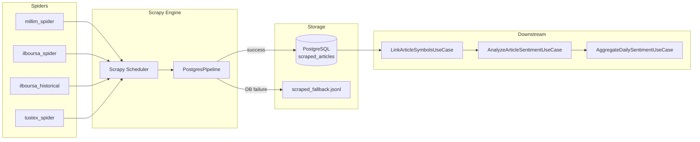
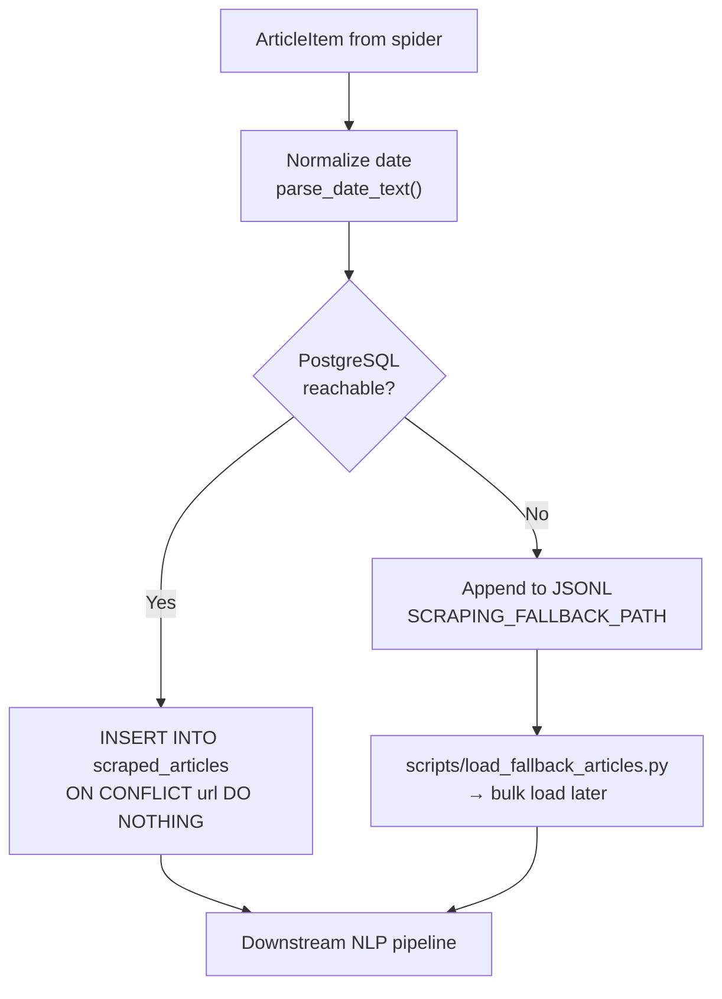

# 09 — Web Scraping System

## Overview

FixTrade collects financial news from Tunisian financial portals using **Scrapy 2.11**. Scraped articles feed the NLP sentiment pipeline, which in turn supports anomaly detection (sentiment contradictions) and trade recommendations.

**Location:** `scraping/`  
**Configuration:** `scrapy.cfg` → `scraping.settings`

---

## Architecture



---

## Spiders

| Spider | File | Source | `name` | Content |
|--------|------|--------|--------|---------|
| **Millim** | `scraping/spiders/millim_spider.py` | [millim.tn](https://www.millim.tn) | `millim` | Financial news (default production spider) |
| **IlBoursa** | `scraping/spiders/ilboursa_spider.py` | [ilboursa.com](https://www.ilboursa.com) | `ilboursa` | Market news, magazine articles |
| **IlBoursa Historical** | `scraping/spiders/ilboursa_historical.py` | ilboursa.com | `ilboursa_historical` | Date-range backfill (`-a start_date`, `-a end_date`) |
| **TUSTEX** | `scraping/spiders/tustex_spider.py` | tustex.com | `tustex` | BVMT/economy sections |
| **Example** | `scraping/spiders/example_spider.py` | example.com | `example` | Template only |

### Collected Fields — `scraping/items.py`

| Field | Type | Description |
|-------|------|-------------|
| `title` | string | Article headline |
| `url` | string | Canonical URL (dedup key) |
| `date` | string/datetime | Publication date |
| `summary` | string | Short excerpt |
| `content` | string | Full article body |

### Frequency

| Mode | Frequency | Command |
|------|-----------|---------|
| Docker worker | Every 3600s (default) | `scripts/scraper_worker.py` |
| Manual | On demand | `scrapy crawl millim` |
| Docker one-shot | Single run | `docker compose run scraper scrapy crawl millim` |

Worker loop (`scripts/scraper_worker.py`):

```python
SCRAPER_INTERVAL_SECONDS = int(os.getenv("SCRAPER_INTERVAL_SECONDS", "3600"))
# Runs: scrapy crawl millim → updates data/last_scrape.txt → sleep
```

Docker healthcheck verifies `last_scrape.txt` timestamp is within 24 hours.

---

## Technologies

| Library | Role | Used? |
|---------|------|-------|
| **Scrapy** | Crawler framework, scheduling, pipelines | ✅ Primary |
| **Twisted** | Scrapy networking engine | ✅ |
| **requests** | — | ❌ Not in scraping module |
| **BeautifulSoup** | — | ❌ Scrapy selectors used instead |
| **Selenium** | — | ❌ Not needed (static HTML) |
| **Playwright** | — | ❌ Not used |
| **dateparser** | Multi-locale date parsing | ✅ `scraping/utils.py` |
| **python-dateutil** | Date fallback parsing | ✅ |

**Rationale:** Target Tunisian financial sites serve server-rendered HTML. Scrapy provides built-in politeness, concurrency control, and pipeline architecture without browser automation overhead.

---

## Scrapy Settings — `scraping/settings.py`

| Setting | Value | Purpose |
|---------|-------|---------|
| `ROBOTSTXT_OBEY` | `True` | Respect robots.txt |
| `DOWNLOAD_DELAY` | `1.0` | 1 second between requests to same domain |
| `CONCURRENT_REQUESTS` | `8` | Max parallel requests |
| `USER_AGENT` | `fixtrade-scraper/1.0` (override via `SCRAPER_USER_AGENT`) |
| `ITEM_PIPELINES` | `scraping.pipelines.PostgresPipeline: 300` | DB persistence |

### Database Connection

```python
# Priority: SCRAPING_POSTGRES_DSN env var → built from POSTGRES_* vars
POSTGRES_DSN = os.getenv("SCRAPING_POSTGRES_DSN") or build_from_components()
```

---

## Anti-Bot Considerations

| Measure | Implementation |
|---------|----------------|
| **Rate limiting** | `DOWNLOAD_DELAY=1.0` seconds |
| **Concurrency cap** | `CONCURRENT_REQUESTS=8` |
| **robots.txt** | Obeyed |
| **User-Agent** | Identifiable `fixtrade-scraper/1.0` (transparent, not spoofing) |
| **Retry** | Scrapy default retry middleware (3 retries on 500/502/503/504) |
| **No JavaScript rendering** | Reduces detection surface vs. headless browsers |

**Trade-off:** Static parsing may miss JavaScript-rendered content. Acceptable for thesis scope; Playwright could be added if target sites migrate to SPA architecture.

---

## Pipeline — `scraping/pipelines.py`

**Class:** `PostgresPipeline`



### Deduplication

Unique constraint on `url` column (`CONSTRAINT uix_url UNIQUE (url)`) prevents duplicate articles.

### Fallback Path

Default: `scraped_fallback.jsonl` (configurable via `SCRAPING_FALLBACK_PATH`).

ETL worker in Docker Compose runs `scripts/load_fallback_articles.py` to import fallback articles into PostgreSQL.

---

## Data Validation

| Check | Where | Action |
|-------|-------|--------|
| URL uniqueness | PostgreSQL constraint | Skip duplicate |
| Date parsing | `scraping/utils.py` | Multi-locale (French, Arabic, English) via dateparser |
| Empty content | Pipeline | Insert with NULL content (downstream NLP skips) |
| DB connectivity | Pipeline init | Fall back to JSONL |

### Date Parsing — `scraping/utils.py`

Handles French month names, Arabic numerals, and relative dates ("hier", "aujourd'hui") using `dateparser` with locale hints.

---

## Downstream Integration

```mermaid
sequenceDiagram
    participant Spider
    participant PG as scraped_articles
    participant Link as LinkArticleSymbolsUseCase
    participant AS as article_symbols
    participant NLP as SentimentAnalyzer
    participant Sent as article_sentiments
    participant Agg as AggregateDailySentimentUseCase
    participant Daily as sentiment_scores

    Spider->>PG: Insert article
    Link->>PG: Read unlinked articles
    Link->>AS: Match keywords → BVMT tickers
    NLP->>PG: Read article content
    NLP->>Sent: Store label + score
    Agg->>Sent: Aggregate by symbol + date
    Agg->>Daily: Daily sentiment score
```

**Symbol matching:** `app/domain/trading/article_symbol_matcher.py` — keyword-based association of article text to BVMT tickers.

---

## Running Scrapers

```bash
# Local
scrapy crawl millim
scrapy crawl ilboursa
scrapy crawl ilboursa_historical -a start_date=2024-01-01 -a end_date=2024-12-31

# Docker long-running worker
docker compose up scraper

# Load fallback JSONL
python scripts/load_fallback_articles.py
```

---

## Related Documentation

- [08-data-pipeline-etl.md](08-data-pipeline-etl.md) — Overall data flow
- [11-machine-learning-prediction.md](11-machine-learning-prediction.md) — NLP sentiment (downstream)
- [10-anomaly-detection.md](10-anomaly-detection.md) — Sentiment contradiction detection
