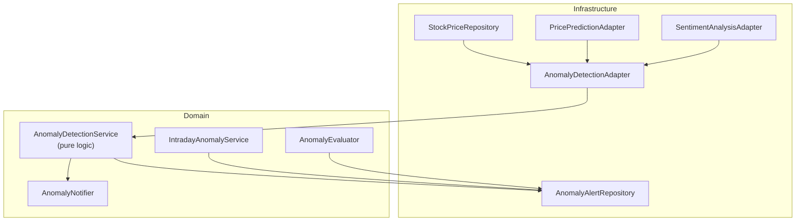
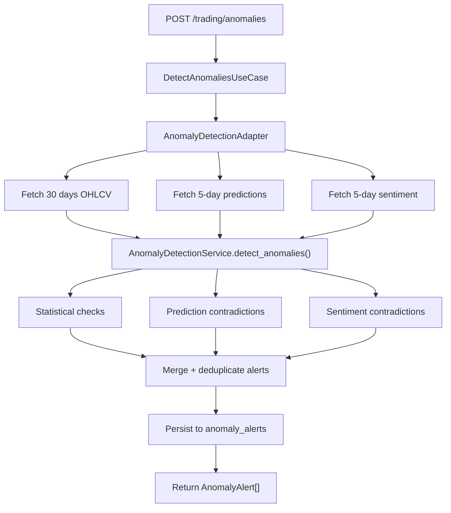

# 10 — Anomaly Detection

## Business Objective

Anomaly detection provides **real-time market surveillance** for the BVMT, identifying suspicious trading patterns that may indicate:

- Market manipulation (pump-and-dump, bear raids)
- Unusual liquidity events (volume spikes, zero-volume days)
- Model reliability issues (prediction contradictions)
- Information asymmetry (sentiment-price mismatches, contrarian signals)

Detected anomalies **reduce recommendation confidence** and flag high-risk trading conditions, protecting simulated portfolio strategies from acting during suspicious market activity.

---

## Architecture



**Key principle:** Detection algorithms live in the **domain layer** (`app/domain/trading/anomaly_service.py`) with zero framework imports. The infrastructure adapter fetches data and persists results.

---

## Detection Layers

### Layer 1: Statistical Anomalies

**Class:** `AnomalyDetectionService`  
**File:** `app/domain/trading/anomaly_service.py`

| Type | Algorithm | Threshold | Default Params |
|------|-----------|-----------|----------------|
| **Volume spike** | Z-score on 20-day rolling volume | Z > 3.0σ | `volume_threshold_std=3.0` |
| **Intraday price swing** | \|high − low\| / open | > 5% | `price_change_threshold=0.05` |
| **Daily price swing** | \|close − open\| / open | > 5% | Same threshold |
| **Zero volume** | volume == 0 | Exact match | — |
| **Price stagnation** | Unchanged close for 3+ days | 3 consecutive days | — |

```python
# Constructor defaults — anomaly_service.py lines 36-41
def __init__(
    self,
    volume_threshold_std: float = 3.0,
    price_change_threshold: Decimal = Decimal("0.05"),
    min_data_points: int = 20,
) -> None:
```

**Minimum data:** 20 trading days required; returns empty list if insufficient.

### Layer 2: Prediction Contradictions

Cross-validates ML price forecasts against actual price movements.

| Scenario | Condition | Severity |
|----------|-----------|----------|
| Strong contradiction | Predicted up, actual down >5% | 0.9 |
| Moderate contradiction | Predicted up, actual down 2–5% | 0.6 |
| Weak contradiction | Predicted up, actual down <2% | 0.4 |
| Confidence interval miss | Actual outside predicted bounds | 0.7 |

**Requires:** `PricePredictionPort` enabled in adapter (`enable_prediction_check=True`).

### Layer 3: Sentiment Contradictions

Detects price-sentiment mismatches suggesting manipulation or delayed market reaction.

| Pattern | Condition | Interpretation |
|---------|-----------|----------------|
| **Pump & dump** | Price up >3% + negative sentiment | Artificial inflation |
| **Bear raid** | Price down >3% + positive sentiment | Short attack / panic |
| **Contrarian (strong)** | Positive news + price drop >2% | Potential undervaluation |
| **Contrarian (weak)** | Negative news + price rise >2% | Potential overvaluation |
| **Sentiment mismatch** | High sentiment + price stagnation | Delayed reaction |

**Date matching:** Exact date alignment between sentiment scores and price data, with 1-day fallback.

**Requires:** `SentimentAnalysisPort` enabled (`enable_sentiment_check=True`).

---

## Intraday Anomaly Detection

**Class:** `IntradayAnomalyService`  
**File:** `app/domain/trading/intraday_anomaly_service.py`

| Type | Detection Method |
|------|------------------|
| Hourly price move | >3% change in 1-hour sliding window |
| Minute volume burst | Z-score > 4 on minute volume |
| Flash crash/rally | >2% move in 5 minutes |
| Price oscillation | Rapid alternating direction changes |
| Opening auction gap | Large gap between previous close and open |

**Endpoint:** `POST /api/v1/trading/anomalies/intraday`  
**Data source:** `intraday_ticks` table (`db/002_intraday_known_anomalies.sql`)

---

## Severity Scoring

All anomalies receive a **severity score** from 0.0 to 1.0:

| Range | Category | Recommended Action |
|-------|----------|-------------------|
| 0.8 – 1.0 | Critical | Immediate investigation; block recommendations |
| 0.6 – 0.79 | High | Monitor closely; reduce position size |
| 0.4 – 0.59 | Medium | Flag for review |
| 0.0 – 0.39 | Low | Informational |

Severity factors:
- Magnitude of statistical deviation
- Cross-signal consistency (prediction + sentiment alignment)
- Historical anomaly frequency for the symbol

---

## Evaluation Pipeline

**Class:** `AnomalyEvaluator`  
**File:** `app/domain/trading/anomaly_evaluator.py`

Compares detected anomalies against ground-truth labels in `known_anomalies` table:

| Metric | Description |
|--------|-------------|
| Precision | TP / (TP + FP) |
| Recall | TP / (TP + FN) |
| F1 | Harmonic mean |
| Date tolerance | Configurable window for matching |

**Endpoint:** `POST /api/v1/trading/anomalies/evaluate`

---

## Notification System

**Class:** `AnomalyNotifier`  
**File:** `app/domain/trading/anomaly_notifier.py`

| Channel | Protocol |
|---------|----------|
| WebSocket | Broadcast to connected clients |
| Webhook | HTTP POST via httpx |
| Callback | Python callable registration |

---

## Detection Pipeline Flow



---

## Integration with Recommendations

Anomalies feed into the decision engine with confidence penalties:

```python
# Conceptual integration — decision engines check severity
if any(a.severity > 0.8 for a in anomalies):
    recommendation.confidence *= 0.5
    recommendation.reasoning += " [High-risk anomaly detected]"
```

AI module configuration: `ANOMALY_SEVERITY_THRESHOLD=0.75` (from `app/core/config.py` / AI settings).

---

## API Usage

```bash
# Detect anomalies
curl -X POST http://localhost:8000/api/v1/trading/anomalies \
  -H "Content-Type: application/json" \
  -d '{"symbol": "BIAT"}'

# Recent anomalies
curl "http://localhost:8000/api/v1/trading/anomalies/recent?symbol=BIAT&limit=10"
```

---

## Performance

| Metric | Value |
|--------|-------|
| Statistical-only latency | <100ms |
| All layers (prediction + sentiment) | <500ms |
| Throughput | 100+ symbols/sec (with connection pooling) |
| Caching | None (real-time detection required) |

---

## Algorithms NOT Used

The following were considered in design docs but **not implemented** in source code:

- Isolation Forest
- Local Outlier Factor (LOF)
- Autoencoders
- IQR-based outlier detection (Z-score used instead)

All detection is **rule-based and statistical** — verified by reading `anomaly_service.py` and `intraday_anomaly_service.py`.

---

## Related Documentation

- [05-backend-architecture.md](05-backend-architecture.md) — Anomaly API endpoints
- [11-machine-learning-prediction.md](11-machine-learning-prediction.md) — Prediction contradiction layer
- [12-generative-ai.md](12-generative-ai.md) — Anomaly context in LLM prompts
