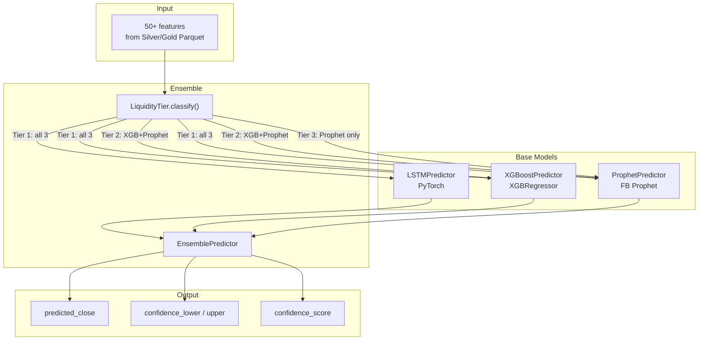
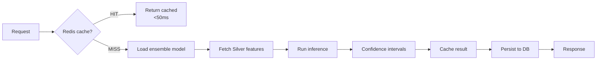

# 11 — Machine Learning and Prediction

## Overview

The FixTrade prediction subsystem (`prediction/`) implements a **multi-model ensemble** for BVMT stock forecasting, combining deep learning (LSTM), gradient boosting (XGBoost), and time series decomposition (Prophet). Models are selected dynamically based on **liquidity tiers** to handle the heterogeneous trading volumes of Tunisian equities.

---

## Prediction Objectives

| Model | Target | Horizon | Output |
|-------|--------|---------|--------|
| **Ensemble (price)** | Closing price (`cloture`) | 1–5 trading days | Point forecast + confidence interval |
| **VolumePredictor** | Transaction volume (`quantite_negociee`) | 1–5 days | Expected volume |
| **LiquidityClassifier** | Liquidity tier | 1–5 days | P(low), P(medium), P(high) |

---

## Model Architecture



---

## Base Models

### LSTM — `prediction/models/lstm.py`

| Parameter | Value | Source |
|-----------|-------|--------|
| Sequence length | 30 | `ModelConfig.lstm_sequence_length` |
| Hidden size | 64 | `ModelConfig.lstm_hidden_size` |
| Layers | 2 | `ModelConfig.lstm_num_layers` |
| Dropout | 0.3 | `ModelConfig.lstm_dropout` |
| Learning rate | 0.002 | `ModelConfig.lstm_learning_rate` |
| Epochs | 50 | `ModelConfig.lstm_epochs` |
| Batch size | 512 | `ModelConfig.lstm_batch_size` |
| Early stopping patience | 8 | `ModelConfig.lstm_patience` |

**Preprocessing:** MinMaxScaler on feature matrix.  
**Strength:** Captures temporal dependencies in high-liquidity price series.

### XGBoost — `prediction/models/xgboost_model.py`

| Parameter | Value |
|-----------|-------|
| n_estimators | 400 |
| max_depth | 7 |
| learning_rate | 0.03 |
| subsample | 0.85 |
| colsample_bytree | 0.75 |
| early_stopping_rounds | 20 |

**Strength:** Feature interactions, robust to missing values, fast training on tabular features.

### Prophet — `prediction/models/prophet_model.py`

| Parameter | Value |
|-----------|-------|
| changepoint_prior_scale | 0.1 |
| seasonality_prior_scale | 5.0 |
| yearly_seasonality | True |
| weekly_seasonality | True |

**Strength:** Handles low-liquidity tickers with sparse data; decomposes trend and seasonality.

### Ensemble — `prediction/models/ensemble.py`

**Default weights (Phase 1 MVP):**

| Model | Weight |
|-------|--------|
| LSTM | 0.45 |
| XGBoost | 0.35 |
| Prophet | 0.20 |

**Liquidity-tiered selection** — `LiquidityTier.classify(avg_daily_volume)`:

| Tier | Volume Threshold | Models Used |
|------|------------------|-------------|
| Tier 1 (High) | ≥ 10,000 daily avg | LSTM + XGBoost + Prophet |
| Tier 2 (Medium) | 1,000 – 9,999 | XGBoost + Prophet |
| Tier 3 (Low) | < 1,000 | Prophet only |

Thresholds from `prediction/config.py` → `LiquidityTierConfig`.

**Future phases (documented in code comments):**
- Phase 2: Dynamic weighting based on market conditions
- Phase 3: Stacking with Ridge regression meta-learner

### Volume Predictor — `prediction/models/volume_predictor.py`

XGBoost regressor on log-transformed volume with separate hyperparameters (`vol_xgb_*` in ModelConfig).

### Liquidity Classifier — `prediction/models/liquidity_classifier.py`

XGBoost multi-class classifier predicting low/medium/high liquidity tier probabilities.

---

## Feature Engineering

See [08-data-pipeline-etl.md](08-data-pipeline-etl.md) for full feature list.

**Total:** 50+ features per stock per day across four groups:
- Technical indicators (27)
- Temporal/calendar (16)
- Volume profile (8)
- Lag/momentum (15+)

**Anti-leakage:** All features shifted by 1 day. Chronological splits only.

---

## Training Pipeline

**Module:** `prediction/training.py`  
**Entry:** `python run_training.py` or `python -m prediction train`

### Walk-Forward Cross-Validation

| Split | Train Period | Validation | Test |
|-------|-------------|------------|------|
| Split 1 | ≤ 2022 | 2023 | 2024 |
| Split 2 | ≤ 2023 | 2024 | 2025 |
| Split 3 | ≤ 2024 | 2025 | — |

Configuration from `ModelConfig`:
- `train_test_split_year: 2025`
- `validation_year: 2024`
- `min_training_samples: 252` (~1 trading year)

### MLflow Experiment Tracking

| Logged Item | Detail |
|-------------|--------|
| Parameters | Hyperparameters, feature count, CV split config |
| Metrics | MAE, RMSE, MAPE, Directional Accuracy, R² per split |
| Artifacts | Model weights, ensemble configuration JSON |

**Config:** `MLFLOW_TRACKING_URI`, `MLFLOW_EXPERIMENT_NAME` (default: `fixtrade-prediction`)

### Training Commands

```bash
python run_training.py                    # Full: ETL → CV → final model
python run_training.py --skip-etl         # Use existing Silver data
python run_training.py --final-only       # Skip CV, train production model
python -m prediction train --symbol BIAT  # Single ticker
python -m prediction train --top-n 10     # Top 10 liquid tickers
```

---

## Evaluation Metrics

Metrics computed during training and stored in `model_registry`:

| Metric | Formula / Meaning | Use |
|--------|-------------------|-----|
| **MAE** | Mean Absolute Error | Primary regression metric |
| **RMSE** | Root Mean Squared Error | Penalizes large errors |
| **MAPE** | Mean Absolute Percentage Error | Scale-independent comparison |
| **Directional Accuracy** | % correct up/down direction | Trading signal quality |
| **R²** | Coefficient of determination | Explained variance |

### Model Monitoring

**Class:** `ModelMonitor` in `prediction/utils/metrics.py`

Alerts triggered when:
- RMSE exceeds 1.5× baseline threshold
- Directional accuracy drops below 50%
- Prediction drift detected over 30-day rolling window

*Note: Specific metric values per ticker are stored in `model_registry` and MLflow runs — run `python -m prediction mlflow-ui` to inspect experiment results for your deployment.*

---

## Inference Pipeline

**Module:** `prediction/inference.py` — `PredictionService`



### Caching Strategy — `prediction/utils/cache.py`

| Key Pattern | TTL | Condition |
|-------------|-----|-----------|
| `pred:{ticker}:{model}` | 3600s (1 hour) | Intraday |
| `pred:{ticker}:{model}` | 43200s (12 hours) | Post-market |
| `feat:{ticker}:{date}` | 90 days | Feature store |

Redis: 256MB LRU (`docker-compose.yml`). Falls back to in-memory dict if Redis unavailable.

### Cache Warming

```bash
python -m prediction warm-cache  # Pre-compute top 30 tickers
```

---

## ML Service (Microservice)

**Entry:** `app/ml_service/main.py` — port 8001

When `ML_SERVICE_URL` is set, `PricePredictionAdapter` delegates to the remote service via httpx. Falls back to local `PredictionService` or `DemoPredictionService` if models unavailable.

---

## Base Model Interface

**File:** `prediction/models/base.py`

```python
class BasePredictionModel(ABC):
    @abstractmethod
    def fit(self, X_train, y_train, X_val=None, y_val=None): ...
    
    @abstractmethod
    def predict(self, X) -> np.ndarray: ...
    
    @abstractmethod
    def evaluate(self, X_test, y_test) -> ModelMetrics: ...
```

Strategy pattern enables liquidity-tier model selection and ensemble composition.

---

## Model Selection Rationale

| Decision | Rationale | Alternative Rejected |
|----------|-----------|---------------------|
| Ensemble over single model | Different models excel at different liquidity tiers | Single ARIMA — poor on low-volume tickers |
| LSTM for high-liquidity | Sequence patterns in active stocks | GRU — similar performance, LSTM more documented |
| XGBoost over Random Forest | Better regularization, early stopping | LightGBM — comparable; XGBoost better ecosystem fit |
| Prophet for low-liquidity | Robust to missing data and short series | LSTM — overfits on sparse data |
| Walk-forward CV | Prevents look-ahead bias in time series | K-fold shuffle — leaks future into past |
| Parquet feature store | 80% compression, column pruning | CSV — slow for 50+ columns × 30 tickers |

---

## Related Documentation

- [08-data-pipeline-etl.md](08-data-pipeline-etl.md) — Feature engineering and Gold datasets
- [10-anomaly-detection.md](10-anomaly-detection.md) — Prediction contradiction layer
- [13-devops-deployment.md](13-devops-deployment.md) — ML service Docker setup
