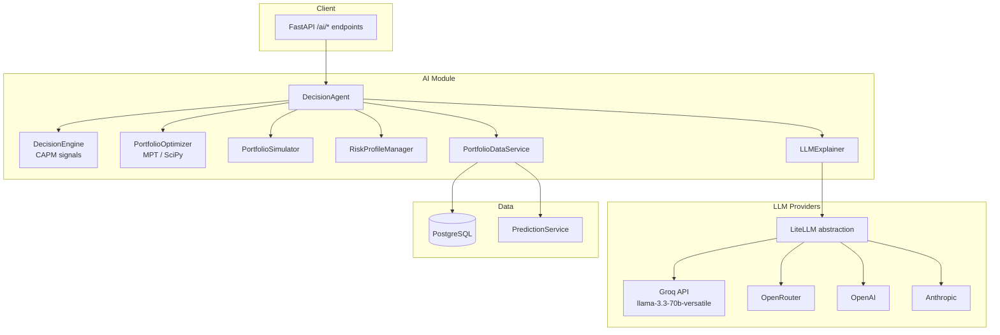
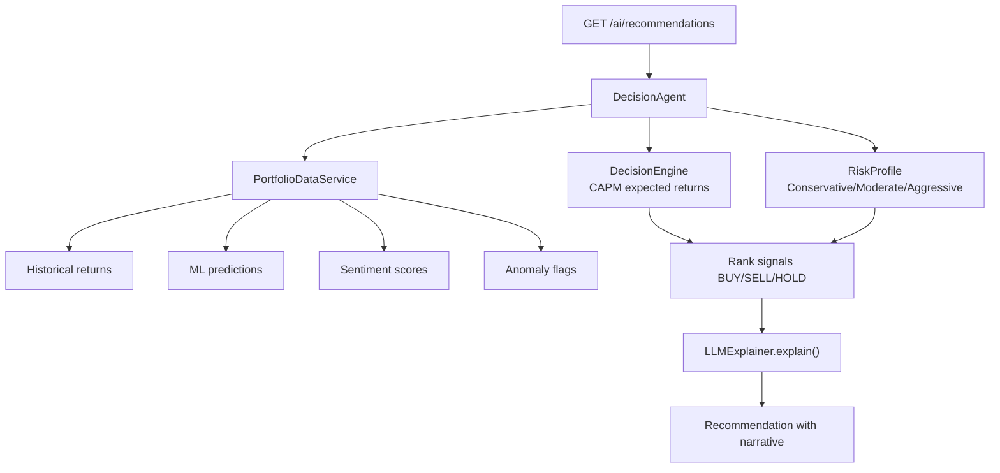

# 12 — Generative AI Module

## Overview

The Generative AI module provides **natural-language explainability** for trading decisions and portfolio recommendations. Core trading logic remains **deterministic** (rule-based decision engine, CAPM signals, MPT optimization); LLMs add narrative explanations without being the sole decision authority.

**Location:** `app/ai/`  
**Standalone demo service:** `services/genai_service/app.py` (port 8003)

---

## Objectives

| Objective | Implementation |
|-----------|----------------|
| Explain BUY/SELL/HOLD signals | `LLMExplainer` with YAML prompts |
| Narrate portfolio performance | Performance explain endpoint |
| Justify MPT allocation changes | Portfolio optimization prompts |
| Assess risk profile fit | Questionnaire → profile recommendation |
| Fallback when LLM unavailable | Rule-based explanations in `app/ai/rules.py` |

---

## Architecture



---

## LLM Provider Integration

**File:** `app/ai/llm_explainer.py`

| Provider | Config | Default |
|----------|--------|---------|
| **Groq** | `GROQ_API_KEY`, `GROQ_MODEL` | ✅ Default (`llama-3.3-70b-versatile`) |
| OpenRouter | `OPENROUTER_API_KEY` | Optional |
| OpenAI | `OPENAI_API_KEY` | Optional |
| Anthropic | `ANTHROPIC_API_KEY` | Optional |

**Abstraction:** LiteLLM (`litellm` package) provides unified API across providers.

| Parameter | Default | Config Key |
|-----------|---------|------------|
| Max tokens | 1024 | `GROQ_MAX_TOKENS` |
| Temperature | 0.7 | `GROQ_TEMPERATURE` |

### Graceful Degradation

When `GROQ_API_KEY` is empty or LLM call fails:
1. `LLMExplainer` catches exception
2. Falls back to rule-based explanation from `app/ai/rules.py`
3. API returns explanation with `"source": "rule_based"` indicator

---

## Portfolio Recommendation System

### Decision Flow



### Risk Profiles — `app/ai/profile.py`

| Profile | Max Position | Equity Limit | Stop-Loss | Min Hold |
|---------|-------------|--------------|-----------|----------|
| Conservative | 10% | 50% | 5% | 7 days |
| Moderate | 15% | 70% | 8% | 3 days |
| Aggressive | 25% | 90% | 12% | 1 day |

Config via environment: `CONSERVATIVE_MAX_POSITION_SIZE`, `MODERATE_MAX_POSITION_SIZE`, `AGGRESSIVE_MAX_POSITION_SIZE`.

### Portfolio Optimization — `app/ai/optimization.py`

| Algorithm | Method | Library |
|-----------|--------|---------|
| Minimum variance | Quadratic optimization | SciPy `minimize` |
| Maximum Sharpe | Risk-adjusted return maximization | SciPy |
| Efficient frontier | Multi-point optimization sweep | SciPy |
| CAPM expected returns | Beta × market premium + risk-free rate | `CAPMCalculator` |

**Endpoints:** `POST /ai/portfolio/optimize`, `/efficient-frontier`, `/simulate`

### Portfolio Simulation — `app/ai/simulator.py`

Backtests allocation strategies with:
- Transaction cost modeling
- Rebalancing logic
- Performance metrics: Sharpe, Sortino, max drawdown, win rate, profit factor

---

## Prompt Design

**File:** `app/ai/prompts.yaml`

Prompts loaded by `app/ai/llm_explainer.py` via YAML parser.

### Prompt Categories

| Key | Purpose |
|-----|---------|
| `buy_signal` | Explain BUY decisions with expected return, beta, weights |
| `sell_signal` | Justify SELL with underperformance metrics |
| `hold_signal` | Explain neutral stance |
| `portfolio_overview` | Summarize portfolio allocation |
| `performance_review` | Narrate ROI, Sharpe, drawdown |
| `risk_assessment` | Explain risk profile alignment |

### Example Prompt Structure — `buy_signal`

```yaml
buy_signal:
  system: |
    You are a top-tier Wall Street portfolio manager...
    Your explanations are direct, data-driven, under 2 sentences.
  user_template: |
    Symbol: {symbol}
    Expected Return: {expected_return:.1f}%
    Beta: {beta:.2f}
    Risk Profile: {risk_profile}
    Anomaly Detected: {anomaly_status}
```

**Design choices:**
- System prompts enforce concise, authoritative tone (thesis demo quality)
- User templates inject structured financial data (not free-form user input)
- Anomaly status included to ground explanations in surveillance data

---

## Safety Controls

| Control | Implementation |
|---------|----------------|
| **Structured inputs** | Prompts populated from typed dataclasses, not raw user text |
| **Token limits** | `GROQ_MAX_TOKENS=1024` caps response length |
| **Temperature** | 0.7 — balanced creativity vs. consistency |
| **Rule-based fallback** | Deterministic explanations when LLM fails |
| **No autonomous trading** | LLM explains decisions; `DecisionEngine` makes them |
| **Anomaly gating** | High-severity anomalies included in prompt context |
| **Min confidence threshold** | `MIN_CONFIDENCE_SCORE=0.65` filters weak signals |

### Hallucination Mitigation

1. All numeric values in prompts come from database/ML pipeline (not LLM-generated)
2. LLM only generates narrative text around provided facts
3. Fallback rules produce template explanations without LLM involvement
4. GenAI microservice (`services/genai_service/app.py`) is a **demo stub** returning static text — not used in production decision path

### Validation

- Pydantic schemas validate all API inputs before reaching AI module
- `DecisionAgent` validates portfolio state before trade execution
- Stop-loss checks run independently of LLM output

---

## Key Classes

| Class | File | Role |
|-------|------|------|
| `DecisionAgent` | `app/ai/agent.py` | Orchestrates all AI subsystems |
| `DecisionEngine` | `app/ai/decision_engine.py` | CAPM-based BUY/SELL/HOLD |
| `PortfolioOptimizer` | `app/ai/optimization.py` | MPT optimization |
| `PortfolioSimulator` | `app/ai/simulator.py` | Backtesting |
| `LLMExplainer` | `app/ai/llm_explainer.py` | LLM narrative generation |
| `PortfolioDataService` | `app/ai/data_service.py` | DB queries for returns, anomalies |
| `RiskProfileManager` | `app/ai/profile.py` | Profile CRUD and validation |
| `PerformanceMetrics` | `app/ai/metrics.py` | Sharpe, ROI, drawdown calculations |

---

## API Endpoints Summary

See [05-backend-architecture.md](05-backend-architecture.md) for full endpoint table.

**Notable limitation:** AI portfolios stored in-memory (`_agents: Dict[str, DecisionAgent]` in `app/ai/router.py`) — not persisted to PostgreSQL `portfolios` table in current MVP.

---

## Standalone GenAI Service

**File:** `services/genai_service/app.py`  
**Port:** 8003

| Endpoint | Purpose |
|----------|---------|
| `GET /api/v1/health` | Health check |
| `POST /api/v1/explain` | Demo explanation with static template |

Demonstrates microservice boundary for thesis — main API uses embedded `LLMExplainer` directly.

---

## Related Documentation

- [05-backend-architecture.md](05-backend-architecture.md) — AI API endpoints
- [10-anomaly-detection.md](10-anomaly-detection.md) — Anomaly context in recommendations
- [14-design-patterns.md](14-design-patterns.md) — Strategy and adapter patterns in AI module
