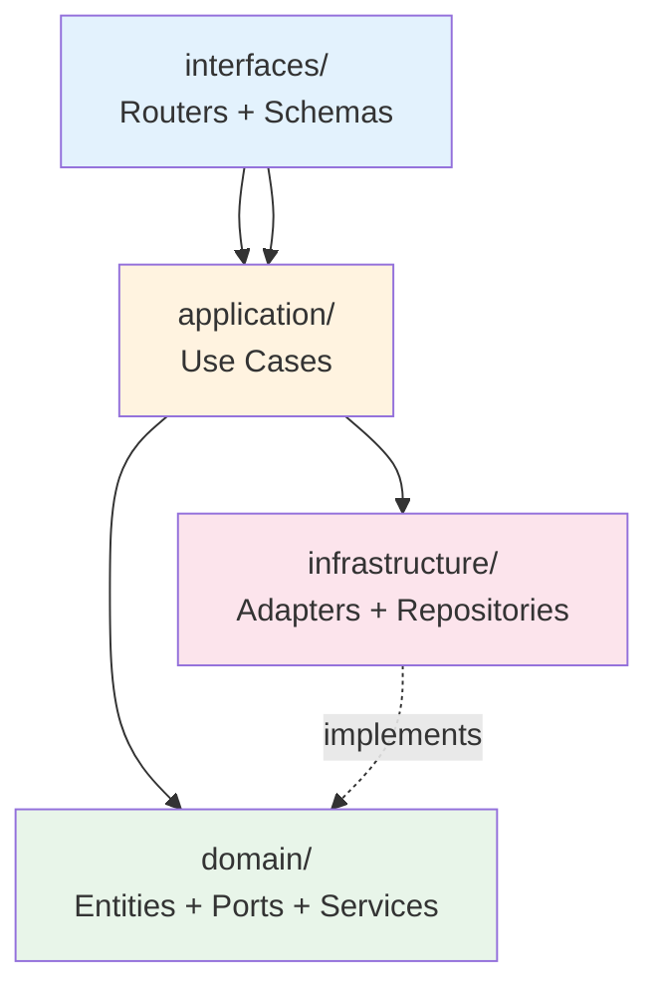

# 14 — Design Patterns

All patterns listed below are **verified in source code** with file locations. Patterns not found in the codebase are explicitly noted.

---

## Pattern Summary

| Pattern | Location | Purpose |
|---------|----------|---------|
| Hexagonal (Ports & Adapters) | `app/domain/trading/ports.py` → `app/infrastructure/trading/*` | Isolate domain from infrastructure |
| Use Case / Application Service | `app/application/trading/*.py` | One class per business operation |
| Repository | `app/infrastructure/trading/*_repository.py` | Abstract data access |
| Dependency Injection | `app/interfaces/trading/dependencies.py` | Wire adapters into use cases |
| Adapter | `app/infrastructure/trading/*_adapter.py` | Wrap external systems behind ports |
| Strategy | `prediction/models/base.py`, `ensemble.py` | Swappable ML models by liquidity tier |
| Factory / Composition Root | `app/main.py` → `create_app()` | Assemble application components |
| BFF (Backend for Frontend) | `app/interfaces/dashboard/router.py` | Aggregate API for React dashboard |
| Medallion Architecture | `prediction/pipeline.py` | Bronze → Silver → Gold data layers |
| Observer / Notification | `app/domain/trading/anomaly_notifier.py` | Multi-channel anomaly alerts |
| DTO | `app/application/trading/dtos.py` | Transfer data across layer boundaries |
| Singleton (Config) | `prediction/config.py` → `config = PredictionConfig()` | Shared configuration instance |
| Graceful Degradation | Multiple locations | Fallback when dependencies unavailable |
| Template Method | `prediction/models/base.py` | Common fit/predict/evaluate interface |

---

## Hexagonal Architecture (Ports & Adapters)

### Ports — `app/domain/trading/ports.py`

Abstract base classes define what the domain needs without specifying how:

```python
class PricePredictionPort(ABC):
    @abstractmethod
    def predict(self, symbol: str, horizon_days: int) -> list[PricePrediction]: ...

class AnomalyDetectionPort(ABC):
    @abstractmethod
    def detect(self, symbol: str) -> list[AnomalyAlert]: ...
```

12 port interfaces total: repositories, prediction ports, sentiment, anomaly, decision engine.

### Adapters — `app/infrastructure/trading/`

Concrete implementations:

| Port | Adapter | External System |
|------|---------|-----------------|
| `PricePredictionPort` | `PricePredictionAdapter` | `prediction.inference` or HTTP ml-service |
| `AnomalyDetectionPort` | `AnomalyDetectionAdapter` | Domain service + PostgreSQL |
| `SentimentAnalysisPort` | `SentimentAnalysisAdapter` | `app.nlp.SentimentAnalyzer` |
| `StockPriceRepository` | `StockPriceRepositoryAdapter` | PostgreSQL raw SQL |
| `DecisionEnginePort` | `DecisionEngineAdapter` | MVP mock (fixed BUY signal) |

**Benefits:**
- Domain tests run without database or ML models
- ML service extraction requires only adapter change (`ML_SERVICE_URL`)
- New data sources implement existing port interfaces

---

## Use Case Pattern

Each business operation is a single class with one entry point:

```python
# app/application/trading/predict_price.py — conceptual
class PredictPriceUseCase:
    def __init__(self, prediction_port: PricePredictionPort, price_repo: StockPriceRepository):
        self._prediction_port = prediction_port
        self._price_repo = price_repo

    def execute(self, command: PredictPriceCommand) -> PredictPriceResult:
        # Validate → call port → map to result DTO
```

| Principle | Enforcement |
|-----------|-------------|
| One use case per class | 13 trading + 2 auth use cases |
| No HTTP knowledge | Use cases receive DTOs, not FastAPI Request |
| No direct DB access | All IO through port interfaces |

---

## Repository Pattern

Data access abstracted behind repository interfaces:

| Repository Port | Implementation | Table(s) |
|-----------------|----------------|----------|
| `StockPriceRepository` | `StockPriceRepositoryAdapter` | `stock_prices` |
| `AnomalyAlertRepository` | `AnomalyAlertRepositoryAdapter` | `anomaly_alerts` |
| `SentimentScoreRepository` | `SentimentScoreRepositoryAdapter` | `sentiment_scores` |
| `ScrapedArticleRepository` | `ScrapedArticleRepositoryAdapter` | `scraped_articles` |
| `UserRepository` | `SQLAlchemyUserRepository` | `users` |

**Benefit:** Use cases depend on `StockPriceRepository` ABC, not SQL syntax. Tests inject in-memory fakes.

---

## Dependency Injection

FastAPI `Depends()` acts as the DI container:

```python
# app/interfaces/trading/dependencies.py — conceptual
def get_detect_anomalies_use_case(
    adapter: AnomalyDetectionAdapter = Depends(get_anomaly_adapter),
) -> DetectAnomaliesUseCase:
    return DetectAnomaliesUseCase(anomaly_port=adapter)
```

Router handlers receive fully wired use cases:

```python
@router.post("/anomalies")
def detect_anomalies(
    request: DetectAnomaliesRequest,
    use_case: DetectAnomaliesUseCase = Depends(get_detect_anomalies_use_case),
):
    return use_case.execute(...)
```

**Composition root:** `app/main.py` → `create_app()` registers routers; dependencies resolved per-request.

---

## Strategy Pattern — ML Models

**Base interface:** `prediction/models/base.py` → `BasePredictionModel`

```python
class BasePredictionModel(ABC):
    @abstractmethod
    def fit(self, X_train, y_train, X_val=None, y_val=None): ...
    @abstractmethod
    def predict(self, X) -> np.ndarray: ...
```

**Strategy selection:** `prediction/models/ensemble.py` → `LiquidityTier.classify()`

```python
class LiquidityTier:
    @staticmethod
    def classify(avg_daily_volume: float) -> str:
        if avg_daily_volume >= 10_000: return "high"    # All 3 models
        elif avg_daily_volume >= 1_000: return "medium"  # XGB + Prophet
        else: return "low"                               # Prophet only
```

Different algorithms selected at runtime based on market context — classic Strategy pattern.

---

## Backend for Frontend (BFF)

**File:** `app/interfaces/dashboard/router.py`

Instead of the React client making 5+ parallel API calls, a single bootstrap endpoint aggregates:

- Historical prices
- 5-day predictions
- Sentiment score
- Recent anomalies
- Trade recommendation
- Partial-data warnings

**Benefit:** Reduced client complexity, consistent server-side error handling, optimized query batching.

---

## Medallion Architecture

**File:** `prediction/pipeline.py`

| Layer | Immutability | Quality |
|-------|-------------|---------|
| Bronze | Immutable append | Raw, as-extracted |
| Silver | Transformed | Validated, cleaned |
| Gold | ML-ready | Features + targets + splits |

Not a GoF design pattern but a **data architecture pattern** consistently applied across the ETL pipeline.

---

## Observer Pattern — Anomaly Notification

**File:** `app/domain/trading/anomaly_notifier.py`

```python
class AnomalyNotifier:
    def register_websocket(self, callback): ...
    def register_webhook(self, url: str): ...
    def notify(self, alert: AnomalyAlert): ...
        # Dispatches to all registered observers
```

Multiple notification channels (WebSocket, webhook, callback) subscribe to anomaly events.

---

## Graceful Degradation

Multiple fallback chains verified in code:

| Component | Primary | Fallback |
|-----------|---------|----------|
| Prediction | `PredictionService` | `DemoPredictionService` |
| Redis cache | Redis server | In-memory dict |
| Scraping pipeline | PostgreSQL insert | JSONL file append |
| LLM explanations | Groq API | Rule-based templates |
| Anomaly detection | All 3 layers | Statistical-only if prediction/sentiment unavailable |
| Realtime pipeline | WebSocket/scheduler | Disabled silently at startup |

---

## Factory Pattern — Composition Root

**File:** `app/main.py`

```python
def create_app() -> FastAPI:
    configure_logging(...)
    app = FastAPI(...)
    app.add_middleware(CORSMiddleware, ...)
    app.add_middleware(SecurityHeadersMiddleware)
    register_error_handlers(app)
    app.include_router(health_router, prefix="/api/v1")
    app.include_router(auth_router, prefix="/api/v1")
    # ... more routers
    return app
```

`create_app()` is the single factory that produces a fully configured application instance.

---

## Patterns NOT Found

The following patterns were searched for but **not implemented**:

| Pattern | Status |
|---------|--------|
| Singleton (services) | Only config singleton; no service singletons |
| Command Pattern (explicit) | Use cases serve similar role but no Command interface |
| Event Sourcing | Not used |
| CQRS | Not used |
| Circuit Breaker | Not implemented (httpx calls have no circuit breaker) |
| Saga / Distributed Transaction | Not needed in monolith MVP |

---

## Layer Dependency Diagram



---

## Related Documentation

- [02-system-architecture.md](02-system-architecture.md) — Architectural style overview
- [05-backend-architecture.md](05-backend-architecture.md) — Use cases and adapters in context
- [11-machine-learning-prediction.md](11-machine-learning-prediction.md) — Strategy pattern in ML models
