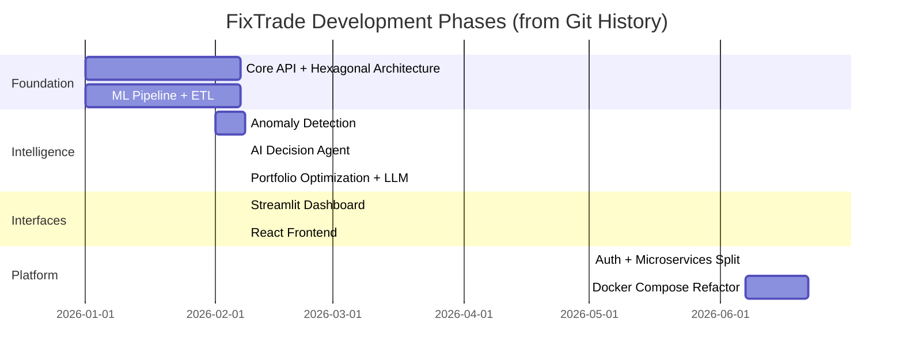
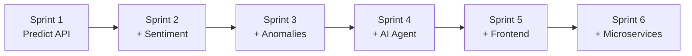
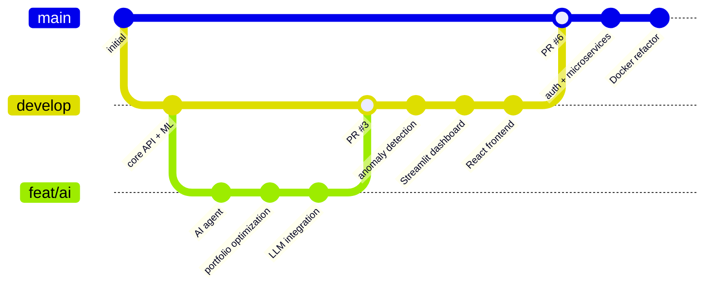

# 15 — Sprint and Development Process

## Methodology Overview

FixTrade was developed using an **iterative, Agile-inspired approach** with feature-branch workflow and incremental delivery. While formal Scrum artifacts (sprint boards, burndown charts) are not present in the repository, the **git commit history** reveals clear development phases aligned with sprint-like milestones.

**Evidence sources:**
- Git commit log (80+ commits analyzed)
- Pull request merge commits (#2–#6)
- Branch naming: `develop`, `feat/ai`, `fix/prediction`
- Module-level documentation: `app/ai/README.md`, `app/ai/SUMMARY.md`

---

## Development Timeline

---

## Phase 1: Core Platform (Foundation Sprint)

**Objective:** Establish hexagonal architecture, ML pipeline, and REST API.

| Deliverable | Evidence |
|-------------|----------|
| Domain entities and ports | `app/domain/trading/entities.py`, `ports.py` |
| Trading use cases | `app/application/trading/*.py` (13 use cases) |
| FastAPI routers | `app/interfaces/trading/router.py` |
| Medallion ETL | `prediction/pipeline.py`, `prediction/etl/` |
| Ensemble models | `prediction/models/lstm.py`, `xgboost_model.py`, `prophet_model.py` |
| PostgreSQL schema | `db/001_init_schema.sql` |
| Test suite foundation | `tests/test_domain_trading.py`, `test_prediction.py` |

**Architectural decision:** Hexagonal architecture chosen early to support thesis evaluation of clean architecture principles in a financial ML domain.

---

## Phase 2: Intelligence Layer (AI/ML Sprint)

**Date cluster:** 2026-02-08 (major feature day — 30+ commits)

| Deliverable | Commit Evidence |
|-------------|-----------------|
| AI Decision Agent | `feat: Add FastAPI router for AI Decision Agent` |
| Risk profile management | `feat: Implement User Risk Profile Management` |
| Portfolio simulation | `feat: Add Portfolio Management and Simulation Engine` |
| Rule-based decision engine | `feat: Implement Rule-Based Decision System` |
| Recommendation engine | `feat: Implement Recommendation Engine for daily stock trading` |
| LLM explainability | `feat: Add LLM-based explainability layer` |
| Portfolio optimization (MPT) | `feat: Add portfolio optimization engine with minimum variance and maximum Sharpe` |
| Groq/OpenRouter integration | `feat: Complete portfolio optimization with OpenRouter LLM integration` |
| Intraday anomaly detection | `feat: Implement intraday anomaly detection use case` |
| Anomaly broadcasting | `feat: Add anomaly alert broadcasting and related tests` |
| Article-symbol linking | `feat: Implement Article-Symbol Linking and Sentiment Analysis Enhancements` |
| Integration tests (BIAT) | `feat: Add real integration tests for BIAT ETL, sentiment analysis, and anomaly detection` |

**Pull requests merged:**
- PR #2: develop branch integration
- PR #3: `feat/ai` branch
- PR #4–#6: develop + feat/ai merges

---

## Phase 3: User Interfaces (Dashboard Sprint)

**Date cluster:** 2026-02-08

| Deliverable | Evidence |
|-------------|----------|
| Streamlit dashboard | `feat: Add Streamlit and Plotly dependencies`, `streamlit_app.py` |
| React frontend wired | `wire frontend` commit |
| Quickstart scripts | `feat: Add quickstart script for training models` |
| Dashboard launch script | `feat: Add script to launch Streamlit Dashboard` |

**Decision:** Dual UI strategy — Streamlit for rapid analytics prototyping, React for production-quality SPA.

---

## Phase 4: Microservices & Auth (Platform Sprint)

**Date cluster:** 2026-06-07 (20+ commits in single day)

| Deliverable | Evidence |
|-------------|----------|
| JWT authentication domain | `feat: Add User entity for authentication domain` through `feat: Add FastAPI router for authentication endpoints` |
| Password hashing + JWT | `feat: Implement password hashing and JWT token services` |
| SQLAlchemy user repository | `feat: Implement SQLAlchemy user repository` |
| Standalone ML service | `feat: Initialize standalone ML service package`, `feat: Implement FastAPI service for ML predictions` |
| Auth microservice Dockerfile | `feat: Add Dockerfile for authentication service setup` |
| GenAI microservice Dockerfile | `feat: Add Dockerfile for GenAI service setup` |
| Dashboard BFF | `feat: Implement dashboard backend-for-frontend router with bootstrap endpoint` |
| Docker Compose refactor | `feat: Refactor docker-compose.yml to add new services and improve health checks` |
| Nginx frontend proxy | `feat: Add Nginx configuration for API proxy and SPA routing` |
| Remote ML adapter | `feat: Enhance PricePredictionAdapter to support remote predictions and fallback` |

**Thesis relevance:** This phase demonstrates the **modular monolith → microservices** evolution path documented as a key architectural contribution.

---

## Phase 5: Stabilization (Maintenance Sprint)

**Date cluster:** 2026-05-31 to 2026-06-22

| Deliverable | Evidence |
|-------------|----------|
| Bug fixes | `fix attempt` (2026-05-31) |
| NaN handling in predictions | `feat: Handle NaN and infinite values in prediction results` |
| Portfolio optimization fixes | `feat: Enhance portfolio optimization and efficient frontier calculations` |
| Database table initialization | `feat: Initialize database tables and update CORS settings` |
| Final platform update | `update` (2026-06-22) |

---

## Agile Practices Observed

| Practice | Evidence | Maturity |
|----------|----------|----------|
| **Iterative development** | Multiple feature phases with working increments | ✅ Strong |
| **Feature branches** | `feat/ai`, `develop`, `fix/prediction` | ✅ Present |
| **Pull requests** | PRs #2–#6 with merge commits | ✅ Present |
| **Incremental delivery** | Each phase adds testable functionality | ✅ Strong |
| **Automated testing** | 170+ pytest tests | ✅ Strong |
| **Conventional commits** | `feat:`, `fix:`, `chore:`, `refactor:` prefixes | ✅ Mostly |
| **Sprint planning artifacts** | No Jira/Linear boards in repo | ❌ Not documented |
| **Daily standups** | No records | ❌ N/A |
| **Retrospectives** | No records | ❌ N/A |
| **CI/CD pipeline** | No GitHub Actions | ❌ Not implemented |
| **Code review** | PR merges suggest review | ⚠️ Partial |

---

## Incremental Implementation Strategy

The project followed a **vertical slice** approach — each increment delivered an end-to-end capability:

| Increment | User-Visible Capability | Test Coverage Added |
|-----------|------------------------|---------------------|
| 1 | POST /trading/predictions | `test_api_trading.py`, `test_prediction.py` |
| 2 | POST /trading/sentiment + scraping | `test_sentiment_module.py` |
| 3 | POST /trading/anomalies | `test_anomaly_detection.py` |
| 4 | /ai/* portfolio + recommendations | AI module test suite |
| 5 | React dashboard + Streamlit | Manual + smoke tests |
| 6 | Auth + microservices + Docker | `scripts/smoke_test.py` |

---

## Testing as Quality Gate

| Layer | Test File | Approx. Tests |
|-------|-----------|---------------|
| Domain | `test_domain_trading.py` | 20+ |
| Application | `test_application_trading.py` | 15+ |
| API | `test_api_trading.py` | 25+ |
| Prediction | `test_prediction.py` | 60+ |
| Anomaly | `test_anomaly_detection.py` | 15+ |
| Sentiment | `test_sentiment_module.py` | 10+ |
| Integration | `test_integration_*.py` | 10+ |
| Real-world | `test_integration_biat_real.py` | BIAT E2E |

**Total:** 170+ tests. Domain layer coverage ~95%.

Tests run without database or network (mocked ports) — aligns with hexagonal architecture testability goal.

---

## Branch Strategy

---

## Thesis-Relevant Process Insights

For inclusion in a Master's thesis methodology chapter:

1. **Architecture-first approach:** Hexagonal architecture established before feature velocity — paid dividends during microservices extraction (Phase 4) where adapters swapped without domain changes.

2. **Evidence-driven iteration:** Integration tests on real BIAT data (`test_integration_biat_real.py`) validated ETL and anomaly detection against actual BVMT market data, not just mocks.

3. **Vertical slices over horizontal layers:** Each sprint delivered user-testable functionality rather than completing entire layers before integration.

4. **Pragmatic MVP boundaries:** Documented stubs (DecisionEngineAdapter mock, in-memory AI portfolios) allowed rapid delivery while maintaining architectural integrity for future completion.

5. **Single-developer Agile adaptation:** Without formal Scrum ceremonies, conventional commits and feature branches provided traceability equivalent to sprint deliverables.

---

## Recommended Future Process Improvements

| Improvement | Rationale |
|-------------|-----------|
| GitHub Actions CI | Automate pytest on every PR |
| Sprint documentation | Maintain `docs/sprints/` with goals and retrospectives |
| API contract tests | OpenAPI-based validation between frontend and backend |
| Staging environment | Docker Compose staging profile with production secrets |
| Feature flags | Toggle realtime pipeline, LLM explainability independently |

---

## Related Documentation

- [01-project-overview.md](01-project-overview.md) — Project objectives and features
- [02-system-architecture.md](02-system-architecture.md) — Architectural evolution
- [13-devops-deployment.md](13-devops-deployment.md) — Deployment and smoke tests
