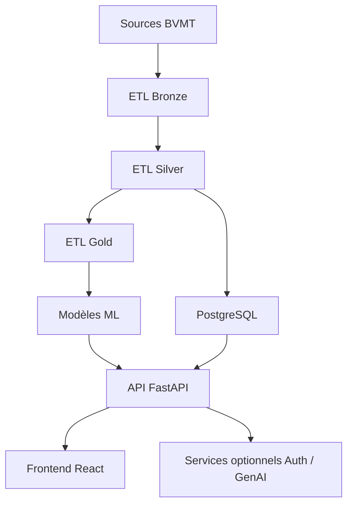
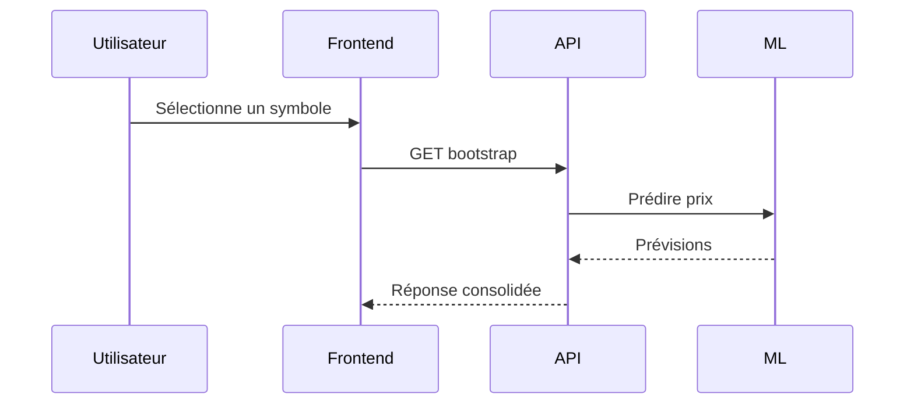

# 01. Introduction générale

## 1. Introduction contextuelle

FixTrade est une plateforme d’intelligence de marché dédiée à la BVMT, structurée autour d’un noyau FastAPI, d’un frontend React/Vite, d’un pipeline d’ETL médallion et d’un ensemble de composants analytiques pour la prédiction, le sentiment, la détection d’anomalies et l’aide à la décision. La documentation de cette thèse décrit un système qui ne se limite pas à exposer une API: il organise une chaîne complète de valeur allant de la collecte de données brutes jusqu’à la production de recommandations interprétables.

L’intérêt académique du projet tient à son assemblage de plusieurs paradigmes d’architecture. D’un côté, le backend suit une architecture hexagonale avec séparation stricte entre domaine, application, infrastructure et interfaces. De l’autre, les tâches de données et de machine learning suivent une logique de pipeline reproductible avec gestion des couches Bronze, Silver et Gold. Enfin, le produit exposé à l’utilisateur combine une interface web à faible latence et des services spécialisés, ce qui soulève des arbitrages classiques entre cohérence, scalabilité, simplicité de déploiement et observabilité.

Cette section d’introduction fixe le cadre méthodologique de l’ensemble des chapitres suivants. L’analyse porte sur les choix techniques effectivement présents dans le dépôt: FastAPI comme point d’entrée, PostgreSQL comme base transactionnelle et analytique, Redis pour le cache et les états temporaires, Scrapy pour l’extraction, PyTorch/XGBoost/Prophet pour l’inférence, et React/Zustand pour l’affichage et la gestion d’état.

## 2. Analyse du problème

Le problème traité par FixTrade n’est pas uniquement un problème de prévision de série temporelle. Il s’agit d’un problème de décision dans un environnement financier incomplet et bruité. Trois difficultés structurent le système.

Premièrement, les données de marché BVMT ne sont pas uniformes. Les séries historiques peuvent provenir de fichiers CSV ou TXT hétérogènes, avec variations de format, colonnes optionnelles, valeurs manquantes et désalignement temporel. Cela impose un ETL robuste, capable de normaliser les schémas sans perdre l’historique.

Deuxièmement, les signaux utiles sont multi-sources. Une prédiction de prix isolée n’a qu’une valeur limitée si elle n’est pas confrontée au volume, à la liquidité, au sentiment éditorial et aux anomalies de marché. Le système doit donc produire des vues consolidées, puis expliciter la manière dont chaque signal influence la décision finale.

Troisièmement, la production d’une recommandation exploitable exige de l’interprétabilité. Un agent qui recommande “BUY” sans justification ni contexte de risque n’est pas suffisant dans un cadre de thèse. Le projet intègre donc un moteur de décision explicable, capable de transformer plusieurs sorties modèles en argumentaire lisible par un utilisateur humain.

## 3. Contraintes techniques et métier

Les contraintes métier sont dominées par le contexte BVMT: liquidité inégale selon les titres, faible fréquence de certains événements, et forte sensibilité aux ruptures structurelles. Les contraintes techniques découlent de ce contexte:

- Les horizons de prédiction sont courts, typiquement 1 à 5 jours.
- Les signaux doivent être exploitables même lorsque certaines sous-chaînes sont indisponibles.
- La latence doit rester acceptable pour l’usage interactif, en particulier pour le dashboard.
- Le système doit tolérer les défaillances partielles, par exemple une base temporairement inaccessible ou un modèle absent.

Une conséquence importante est le choix d’une architecture modulaire monolithique augmentée de services optionnels. Ce compromis évite d’imposer la complexité opérationnelle d’une constellation de microservices là où elle n’est pas indispensable, tout en conservant des frontières claires pour une éventuelle dissociation future.

## 4. Justification des choix techniques

FastAPI est utilisé parce qu’il offre un bon compromis entre performance, typage, validation Pydantic et support ASGI. La validation structurée réduit les erreurs d’entrée sur les symboles, les horizons et les identifiants de portefeuille.

PostgreSQL est choisi pour la persistance principale parce que le système a besoin de contraintes, de transactions, de vues matérialisables logiquement et d’un écosystème SQL mature. Redis complète PostgreSQL pour le cache de prédiction et le feature store à faible latence.

React avec Zustand est utilisé côté interface parce que le produit a besoin d’un état global simple, de rafraîchissements réactifs et d’une séparation claire entre interface de présentation et orchestration des requêtes.

En ML, l’assemblage LSTM + XGBoost + Prophet répond à une contrainte de robustesse. Chaque modèle capte une partie différente du problème: séquences, interactions non linéaires tabulaires, tendances et saisonnalités. Le système peut ensuite agréger ces sorties dans un ensemble pondéré.

## 5. Alternatives possibles et rejetées

Plusieurs alternatives auraient pu être adoptées:

- Un monolithe Django classique. Rejeté car moins adapté à un découplage ports/adapters et à des services ML séparés.
- Un front en SSR pur. Rejeté car le dashboard est fortement interactif, centré sur des états de marché mis à jour côté client.
- Un stockage uniquement en fichiers Parquet. Rejeté car la couche transactionnelle, les utilisateurs et les alertes nécessitent SQL.
- Un unique modèle de prédiction. Rejeté car il augmenterait le risque de surapprentissage et réduirait la couverture de phénomènes hétérogènes.

Ces rejets ne signifient pas que les alternatives sont mauvaises en soi; elles sont simplement moins cohérentes avec la nature hybride du problème.

## 6. Implémentation détaillée

Le point d’entrée applicatif est `app/main.py`, qui enregistre les routeurs, les middlewares de sécurité, les gestionnaires d’erreur et les limites de requêtes. Le démarrage crée aussi les tables de base.

```python
from fastapi import FastAPI
from app.interfaces.trading.router import router as trading_router

def create_app() -> FastAPI:
    app = FastAPI(title=settings.project_name, version=settings.version)
    app.include_router(trading_router, prefix="/api/v1")
    return app
```

L’autre axe d’implémentation majeur est la séparation en couches:

```python
class PredictPriceUseCase:
    def __init__(self, prediction_port):
        self._prediction_port = prediction_port

    def execute(self, command):
        if not (1 <= command.horizon_days <= 5):
            raise InvalidHorizonError(command.horizon_days)
        return self._prediction_port.predict(command.symbol, command.horizon_days)
```

Cette structure impose que les cas d’utilisation ne connaissent ni FastAPI, ni SQLAlchemy, ni les modèles concrets.

## 7. Exemples de code réels

Extrait réel du routeur de trading:

```python
@router.post("/predictions", response_model=PredictPriceResponse)
def predict_price(request: PredictPriceRequest, use_case=Depends(get_predict_price_use_case)):
    command = PredictPriceCommand(symbol=request.symbol, horizon_days=request.horizon_days)
    results = use_case.execute(command)
    return PredictPriceResponse(predictions=[...])
```

Extrait réel du bootstrap dashboard:

```python
historical_prices = price_repo.get_history(symbol=symbol, start=start_date, end=end_date)
predictions = predict_use_case.execute(PredictPriceCommand(symbol=symbol, horizon_days=5))
```

## 8. Diagrammes Mermaid obligatoires





## 9. Analyse des risques / échecs

Le principal risque architectural est la divergence entre les frontières logiques et les frontières physiques. Une architecture hexagonale mal tenue finit souvent par réintroduire de la logique métier dans les routeurs ou dans les adaptateurs SQL.

Un second risque est la fragilité des dépendances externes: absence de modèle entraîné, cache non disponible, données partielles, ou format d’extraction modifié. Le système répond partiellement à ce problème par des mécanismes de repli et de tolérance aux pannes, mais une vraie gouvernance d’observabilité demeure essentielle.

## 10. Optimisations possibles

Les optimisations réalistes portent sur:

- la mise en cache de certains agrégats dashboard;
- l’indexation plus fine des séries temporelles;
- la parallélisation contrôlée des inférences indépendantes;
- la séparation physique des lectures analytiques et transactionnelles.

## 11. Conclusion technique

FixTrade n’est pas un projet centré sur une seule brique mais un système de décision distribué dans le sens fonctionnel. Sa valeur repose sur l’assemblage correct des couches de données, de prédiction, de sécurité et d’interface. Cette introduction établit le fil conducteur: chaque chapitre suivant doit expliquer non seulement ce que fait un composant, mais pourquoi il a été conçu ainsi et quels compromis il assume.

