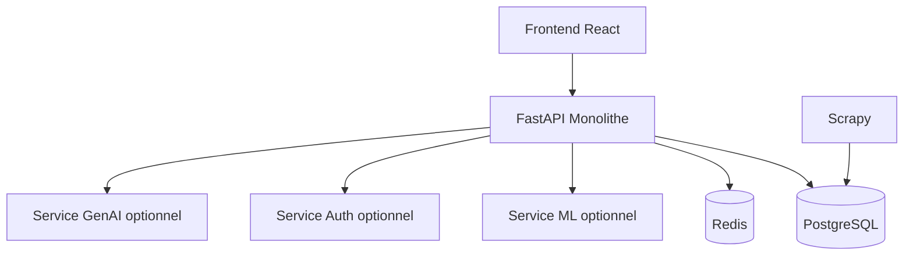
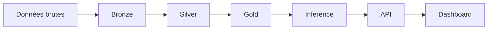

# 02. Architecture du système

## 1. Introduction contextuelle

L’architecture de FixTrade est volontairement hybride. Le cœur applicatif est un monolithe modulaire hexagonal, mais plusieurs services satellites peuvent être déployés indépendamment: authentification, inférence ML, génération d’explications. Ce choix évite de contraindre le développement quotidien à une complexité microservices totale, tout en maintenant des axes de découplage suffisamment nets pour une évolution incrémentale.

La cohérence de cette architecture dépend de trois mécanismes: la séparation des responsabilités, la standardisation des contrats HTTP/DTO, et la persistance d’un état commun dans PostgreSQL et Redis. La documentation doit donc couvrir non seulement la topologie logique, mais aussi les raisons qui rendent cette topologie préférable à des alternatives plus “pures” sur le papier.

## 2. Analyse du problème

Le système doit exécuter des tâches de natures différentes:

- ingestion de données par scraping;
- transformation et enrichissement de séries temporelles;
- entraînement et inférence de modèles;
- exposition d’une interface temps réel;
- authentification et suivi d’utilisateur;
- génération d’explications textuelles.

Ces tâches n’ont ni les mêmes cycles de vie ni les mêmes contraintes de latence. Un scraper peut être asynchrone et tolérant à la latence réseau; un endpoint de dashboard doit répondre rapidement; un entraînement ML peut durer plusieurs minutes. Une architecture unique rigide serait donc coûteuse à maintenir.

## 3. Contraintes techniques et métier

La contrainte la plus forte est l’interopérabilité. Le dashboard doit pouvoir consommer un bootstrap agrégé sans multiplier les allers-retours. Les cas d’utilisation métier doivent, eux, rester testables sans dépendre d’une base ou d’un serveur HTTP.

Les contraintes d’exploitation sont également importantes:

- démarrage local simple via Docker Compose;
- capacité à désactiver des sous-systèmes fragiles sans bloquer l’ensemble;
- séparation des ports réseau pour les services optionnels;
- gestion de la dégradation partielle des fonctionnalités.

## 4. Justification des choix techniques

Le projet privilégie un monolithe modulaire parce que le coût de coordination interservices serait disproportionné au regard de l’équipe et de la taille des flux. Cependant, il expose des frontières internes compatibles avec une extraction future vers des services indépendants.

Cette stratégie limite:

- le coût opérationnel;
- la complexité de déploiement;
- la fragmentation des logs et des données.

Elle conserve:

- un domaine central unifié;
- des ports explicites;
- des adaptateurs remplaçables;
- un modèle de dépendances orienté inversion.

## 5. Alternatives possibles et rejetées

Une architecture microservices généralisée aurait mieux isolé chaque capacité, mais elle aurait imposé:

- un bus de messages;
- un observabilité distribuée plus avancée;
- des contrats versionnés plus stricts;
- un coût de maintenance supérieur.

Un monolithe “plat” aurait simplifié le démarrage, mais il aurait rapidement produit un couplage transversal entre routes, SQL, prédiction et règles métier.

La solution retenue est donc intermédiaire: un monolithe bien découpé, avec quelques services aux frontières naturelles.

## 6. Implémentation détaillée

Le cœur du système est créé dans `app/main.py`, où les routeurs sont attachés et les middlewares de sécurité enregistrés. Les dépendances sont injectées via des fonctions de composition dans `app/interfaces/.../dependencies.py`.

```python
app.include_router(health_router, prefix="/api/v1")
app.include_router(auth_router, prefix="/api/v1")
app.include_router(trading_router, prefix="/api/v1")
app.include_router(ai_router, prefix="/api/v1")
```

Le second niveau d’implémentation se trouve dans la couche d’application. Chaque use case coordonne un port métier, mais ne sait rien de l’implémentation concrète.

```python
class GetRecommendationUseCase:
    def execute(self, query):
        portfolio = self._portfolio_repo.get_by_id(query.portfolio_id)
        if portfolio is None:
            raise PortfolioNotFoundError(str(query.portfolio_id))
        return self._decision_port.recommend(query.symbol, query.portfolio_id)
```

La couche infrastructure implémente les adaptateurs SQLAlchemy, le service de prédiction, le repo d’anomalies et le service NLP.

## 7. Exemples de code réels

Extrait réel de composition root:

```python
def get_predict_price_use_case() -> PredictPriceUseCase:
    return PredictPriceUseCase(prediction_port=PricePredictionAdapter())
```

Extrait réel de déploiement multi-services:

```yaml
services:
  api:
    build:
      context: .
      dockerfile: docker/api.Dockerfile
  ml:
    build:
      context: .
      dockerfile: docker/ml_service.Dockerfile
```

## 8. Diagrammes Mermaid obligatoires





## 9. Analyse des risques / échecs

Le risque structurel est le glissement progressif vers un “distributed monolith”: plusieurs services physiques, mais un couplage logique fort. Pour l’éviter, il faut conserver des contrats stables, une séparation des données et des points de défaillance clairement identifiés.

Un second risque est le démarrage partiel. Le code montre déjà que certains composants temps réel sont désactivés pour stabilité, ce qui illustre un choix pragmatique: mieux vaut un système complet mais partiellement fonctionnel qu’un système théoriquement plus ambitieux mais instable au boot.

## 10. Optimisations possibles

Les évolutions les plus pertinentes seraient:

- extraction du service d’inférence vers une API stricte;
- ajout d’un broker asynchrone pour les tâches longues;
- séparation lecture/écriture sur PostgreSQL;
- instrumentation OpenTelemetry.

## 11. Conclusion technique

L’architecture de FixTrade illustre un compromis réaliste entre discipline logicielle et contraintes de livraison. Elle évite l’illusion de pureté des microservices tout en empêchant la dérive d’un monolithe confus. C’est ce compromis, plus que la technologie isolée, qui rend le système défendable dans un cadre académique.

