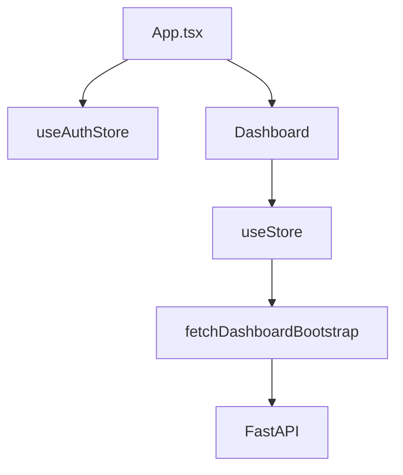
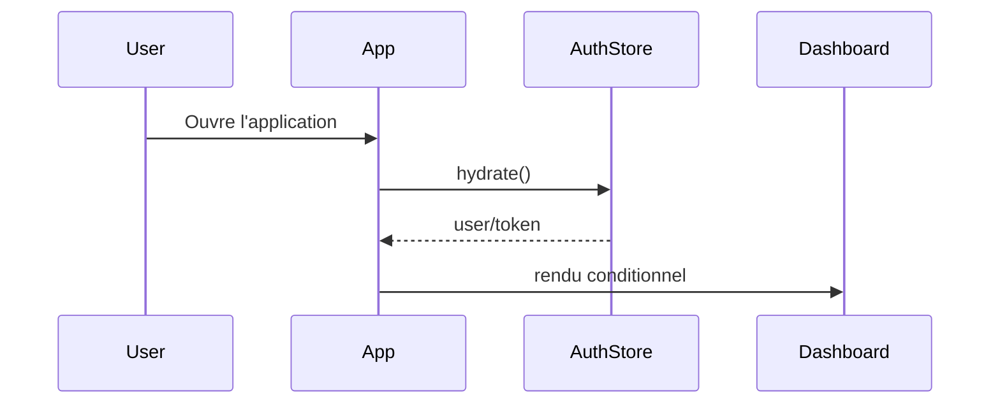

# 03. Architecture Frontend

## 1. Introduction contextuelle

Le frontend FixTrade est une application React/Vite orientée tableau de bord. Son rôle n’est pas décoratif: il agrège des signaux financiers, orchestre l’authentification, et présente des prévisions avec une lisibilité suffisante pour un usage décisionnel. Le choix d’un frontend SPA est cohérent avec cette mission, mais il impose des compromis sur le chargement initial, l’hydratation et la gestion de l’état.

Le code du dépôt montre un usage de Zustand pour l’état global, de composants UI légers et d’un client API centralisé. L’architecture front ne doit donc pas être lue comme une simple collection de composants visuels, mais comme une couche de consolidation de données en provenance du backend.

## 2. Analyse du problème

Le problème du frontend est double. D’une part, il doit rendre immédiatement une vue lisible d’un marché, avec indicateurs, graphiques, recommandations et anomalies. D’autre part, il doit maintenir une cohérence de session et éviter les incohérences d’état lors du changement de symbole ou du rafraîchissement de la page.

Le dashboard consomme une réponse agrégée (`/dashboard/bootstrap`) plutôt qu’une constellation de requêtes fragmentées. Ce choix réduit les problèmes de “waterfall” réseau, mais impose que la réponse backend soit stable et riche.

## 3. Contraintes techniques et métier

Les contraintes UI sont les suivantes:

- latence perçue faible;
- lisibilité des signaux contradictoires;
- support d’une navigation transactionnelle simple;
- compatibilité avec le mode authentifié/non authentifié;
- affichage correct sur desktop et mobile.

Les contraintes métier imposent aussi une narration claire: la prévision, le sentiment et les anomalies ne doivent pas être montrés comme des chiffres bruts, mais comme des signaux à pondérer.

## 4. Justification des choix techniques

React est utilisé pour sa maturité et son écosystème. Vite réduit le temps de build et améliore l’expérience de développement.

Zustand a été retenu au lieu d’un gestionnaire plus lourd car le besoin principal est un état global de dashboard, pas un graphe complexe de mutations réparties. Le store central consolide:

- stock sélectionné;
- données de courbe;
- anomalies;
- recommandation;
- état de chargement et d’erreur.

Cette approche évite le surcoût conceptuel d’une solution plus lourde comme Redux Toolkit lorsque la structure métier reste relativement directe.

## 5. Alternatives possibles et rejetées

Le SSR complet a été rejeté parce que l’application dépend fortement d’interactions de tableau de bord et de rafraîchissements de données côté client. Le coût de SSR/hydratation n’apporterait pas un gain proportionnel ici.

Un état local par composant aurait fragmenté la logique et rendu plus difficile le partage de données entre la liste, le graphique et les panneaux latéraux.

Une architecture micro-frontend aurait été injustifiée au regard du périmètre fonctionnel.

## 6. Implémentation détaillée

L’entrée `frontend/src/App.tsx` hydrate l’authentification avant d’afficher le dashboard ou la page de connexion.

```tsx
export default function App() {
  const { user, isHydrated, hydrate } = useAuthStore();
  useEffect(() => { void hydrate(); }, [hydrate]);
  return user ? <Dashboard /> : <AuthPage />;
}
```

Le store de données appelle ensuite le backend agrégé.

```ts
const data = await fetchDashboardBootstrap(symbol);
const historicalSeries = (data.historical_prices || []).map((p) => ({
  date: p.date,
  historicalPrice: Number(p.close),
}));
```

Cette logique fusionne les historiques et les prévisions par date, puis construit une série chronologique exploitable par le composant graphique.

## 7. Exemples de code réels

Client API réel:

```ts
export async function fetchDashboardBootstrap(symbol: string) {
  return apiFetch(`/dashboard/bootstrap?symbol=${encodeURIComponent(symbol)}`);
}
```

Store d’authentification réel:

```ts
const response = await loginUser({ email, password });
saveSession(response.access_token);
set({ user: response.user, token: response.access_token });
```

## 8. Diagrammes Mermaid obligatoires





## 9. Analyse des risques / échecs

Le premier risque est la dérive entre l’état local et l’état serveur. Si le backend ne garantit pas une structure de réponse stable, la fusion des séries peut produire des incohérences de courbe ou de recommandation.

Le second risque est la surchargabilité du dashboard. Un écran qui montre trop de métriques sans hiérarchie visuelle dégrade la décision au lieu de l’aider.

## 10. Optimisations possibles

Les améliorations les plus utiles seraient:

- virtualisation si la liste de symboles s’allonge;
- suspense et chargements partiels;
- préchargement des symboles les plus consultés;
- extraction de sous-états plus ciblés pour réduire les rerenders.

## 11. Conclusion technique

Le frontend suit une logique de présentation orientée signal. Son intérêt architectural est moins dans la sophistication technique que dans la manière dont il transforme une réponse backend agrégée en expérience de décision cohérente. C’est cette cohérence qui doit rester la priorité lors des futures évolutions.

