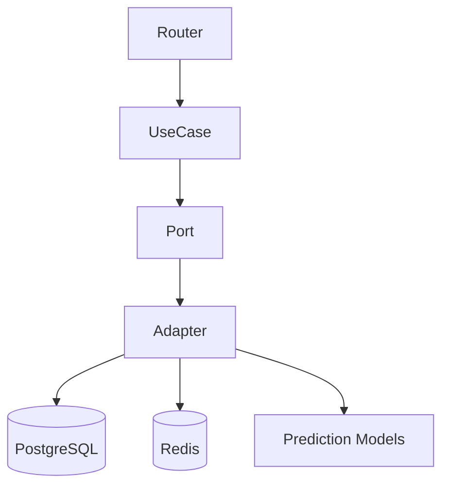
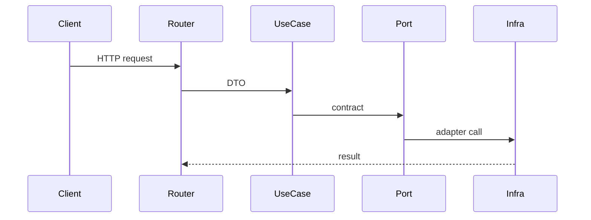

# 04. Architecture Backend

## 1. Introduction contextuelle

Le backend FixTrade implémente un monolithe modulaire en FastAPI, structuré autour de domaines métier explicites: auth, trading, dashboard, IA, ML service. Le design repose sur le principe que le transport HTTP ne doit pas contaminer le cœur métier. Les routeurs restent minces, les use cases concentrent la coordination, et les adaptateurs encapsulent les effets de bord.

Cette architecture est importante parce que la plateforme ne traite pas seulement des requêtes CRUD. Elle doit agréger plusieurs sources, invoquer des modèles, persister des résultats et produire des réponses consolidées. La couche backend est donc l’endroit où les compromis entre cohérence transactionnelle et latence se matérialisent.

## 2. Analyse du problème

Le backend doit répondre à des cas d’usage variés:

- login / register / me;
- prédiction de prix, volume, liquidité;
- sentiment agrégé;
- détection et évaluation d’anomalies;
- bootstrap du dashboard;
- recommandations de portefeuille;
- exposition de services optionnels.

Le problème de conception n’est pas d’exposer rapidement des routes, mais de maintenir un modèle mental stable. Cela nécessite une hiérarchie claire entre entités de domaine, ports, cas d’utilisation, schémas et routeurs.

## 3. Contraintes techniques et métier

Le backend opère dans un contexte de données incomplètes. Certaines requêtes doivent retourner une réponse partielle plutôt qu’un échec global. Le dashboard le montre explicitement en accumulant des `warnings` quand une sous-source est indisponible.

La structure doit aussi être testable. Les use cases ne doivent pas exiger FastAPI, et les adaptateurs doivent pouvoir être remplacés par des doubles de test.

## 4. Justification des choix techniques

Le découpage en couches évite plusieurs formes de dette:

- l’entrelacement des DTO HTTP et des entités métier;
- le couplage direct à SQLAlchemy dans les routes;
- la duplication de logique de validation;
- la propagation d’erreurs techniques jusqu’au client.

L’usage de dépendances FastAPI permet de composer les implémentations concrètes au bord du système. Les conteneurs d’injection jouent ici le rôle de composition root.

## 5. Alternatives possibles et rejetées

Un style “services everywhere” avec logique dans les routeurs aurait été plus rapide à écrire mais plus difficile à faire évoluer.

Une architecture CQRS complète aurait pu apporter davantage de séparation entre lecture et écriture, mais elle serait disproportionnée au regard de la taille du périmètre fonctionnel.

Un backend GraphQL aurait réduit certaines allers-retours, mais au prix d’une complexité de schéma et de cache qui n’est pas nécessaire ici.

## 6. Implémentation détaillée

Le routeur de trading agit comme un convertisseur de contrats. Exemple:

```python
@router.post("/sentiment", response_model=SentimentResponse)
def get_sentiment(request: GetSentimentRequest, use_case=Depends(get_sentiment_use_case)):
    query = GetSentimentQuery(symbol=request.symbol, target_date=request.target_date)
    result = use_case.execute(query)
    return SentimentResponse(...)
```

Les use cases, eux, orchestrent les ports.

```python
class GetSentimentUseCase:
    def execute(self, query):
        score = self._sentiment_port.get_sentiment(query.symbol, query.target_date)
        return SentimentResult(...)
```

La composition des dépendances se fait dans `app/interfaces/trading/dependencies.py`, où chaque cas d’usage reçoit l’adaptateur approprié.

## 7. Exemples de code réels

Extrait du point d’entrée:

```python
app.add_middleware(SecurityHeadersMiddleware)
app.add_exception_handler(RateLimitExceeded, _rate_limit_exceeded_handler)
```

Extrait du bootstrap:

```python
try:
    historical_prices = price_repo.get_history(...)
except Exception:
    warnings.append("Historical price data temporarily unavailable")
```

## 8. Diagrammes Mermaid obligatoires





## 9. Analyse des risques / échecs

Les principaux risques backend sont:

- la dérive de couche, quand un routeur contient trop de logique;
- l’explosion du nombre de dépendances dans la composition root;
- les erreurs silencieuses masquées par des réponses partielles;
- les problèmes de cohérence entre schémas Pydantic et entités.

Il faut aussi surveiller les coûts de création d’un engine SQL à chaque requête dans certains chemins de dépendance, car cela peut devenir un point de friction à l’échelle.

## 10. Optimisations possibles

Les optimisations pertinentes seraient:

- mutualisation plus stricte des engines DB;
- instrumentation des temps d’appel par use case;
- cache applicatif sur les agrégats relativement stables;
- séparation des endpoints de lecture lourds en services spécialisés.

## 11. Conclusion technique

Le backend remplit correctement son rôle de médiation entre le monde HTTP et le domaine. Sa valeur principale est la discipline de découpage. Dans un projet multi-signaux comme FixTrade, cette discipline est plus importante qu’une optimisation isolée, car elle conditionne la lisibilité, la testabilité et la capacité à faire évoluer le produit sans réécriture.

