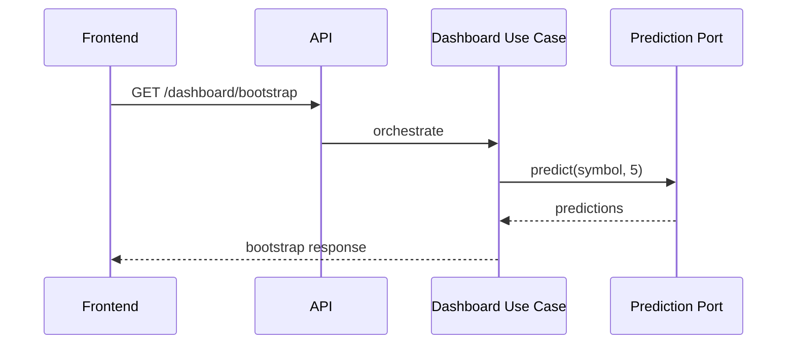

# 05. Conception de l’API

## 1. Introduction contextuelle

L’API de FixTrade sert de contrat entre le frontend, les services spécialisés et les scripts d’automatisation. Elle n’est pas pensée comme une simple surface REST, mais comme un ensemble de endpoints orientés cas d’usage. Les ressources ne sont pas exposées pour elles-mêmes; elles sont publiées parce qu’elles correspondent à un besoin métier précis.

## 2. Analyse du problème

Concevoir l’API dans FixTrade consiste à équilibrer trois exigences:

- simplicité de consommation côté React;
- découplage suffisant pour l’évolution interne;
- stabilité des schémas pour le test et l’intégration.

La décision la plus structurante est l’existence d’un endpoint de bootstrap dashboard qui consolide plusieurs signaux. Sans cela, le client devrait orchestrer lui-même de multiples appels et gérer des échecs partiels de manière plus complexe.

## 3. Contraintes techniques et métier

Les contraintes métier se traduisent par des règles de validation explicites:

- symboles BVMT en majuscules, longueur bornée;
- horizon de prédiction limité à 1..5;
- identifiant de portefeuille au format UUID;
- réponses typées avec montants, scores et dates.

Les contraintes techniques imposent de distinguer les erreurs de validation des erreurs métier et des erreurs d’infrastructure.

## 4. Justification des choix techniques

Le style REST a été retenu pour sa compatibilité avec le frontend et sa simplicité de débogage. FastAPI apporte la documentation OpenAPI automatique et la validation Pydantic.

Le découpage par domaine (`/auth`, `/trading`, `/dashboard`, `/ai`) reflète la structure du code. Ce n’est pas un simple choix esthétique: il permet de faire correspondre les routes à des bounded contexts.

## 5. Alternatives possibles et rejetées

Un routeur unique par “type de donnée” aurait mélangé des usages différents. Un endpoint générique `/predict` avec des paramètres arbitraires aurait été plus abstrait, mais moins lisible et plus fragile.

L’usage de RPC ou gRPC aurait pu réduire un peu l’overhead, mais la lisibilité des contrats et l’intégration frontend auraient été moins directes.

## 6. Implémentation détaillée

Le routeur de trading convertit les requests en commandes ou queries. Exemple:

```python
@router.post("/predictions")
def predict_price(request: PredictPriceRequest, use_case=Depends(get_predict_price_use_case)):
    command = PredictPriceCommand(symbol=request.symbol, horizon_days=request.horizon_days)
    results = use_case.execute(command)
```

Le routeur dashboard agrège plusieurs réponses avec stratégie de tolérance aux pannes:

```python
try:
    recommendation_result = recommendation_use_case.execute(...)
except PortfolioNotFoundError:
    warnings.append("Default portfolio not found; recommendation unavailable")
```

## 7. Exemples de code réels

Exemple de schéma:

```python
class PredictPriceRequest(BaseModel):
    symbol: str = Field(..., min_length=2, max_length=10, pattern=r"^[A-Z0-9]+$")
    horizon_days: int = Field(..., ge=1, le=5)
```

Exemple de réponse:

```python
class RecommendationResponse(BaseModel):
    symbol: str
    action: str
    confidence: Decimal
    reasoning: str
```

## 8. Diagrammes Mermaid obligatoires

```mermaid
graph TD
    Client --> API[FastAPI]
    API --> Auth[/auth]
    API --> Trading[/trading]
    API --> Dashboard[/dashboard]
    API --> AI[/ai]
```



## 9. Analyse des risques / échecs

Le principal risque d’API est l’instabilité de contrat. Si une réponse change de forme, le frontend casse immédiatement. C’est pourquoi le typage Pydantic et les tests d’intégration sont essentiels.

Un autre risque est l’expansion incontrôlée du bootstrap. Plus une réponse agrégée contient de champs, plus elle devient coûteuse à maintenir. Il faut donc surveiller le ratio entre utilité et surcharge.

## 10. Optimisations possibles

- versionnement explicite des routes;
- pagination là où la cardinalité peut croître;
- normalisation des erreurs;
- compression HTTP et cache pour les endpoints peu volatils.

## 11. Conclusion technique

L’API de FixTrade est structurée pour servir de contrat stable plutôt que de simple tuyauterie HTTP. Les endpoints reflètent des actions métier cohérentes, et non des abstractions génériques. C’est la bonne stratégie pour un système d’aide à la décision où la lisibilité du contrat compte autant que la performance brute.

