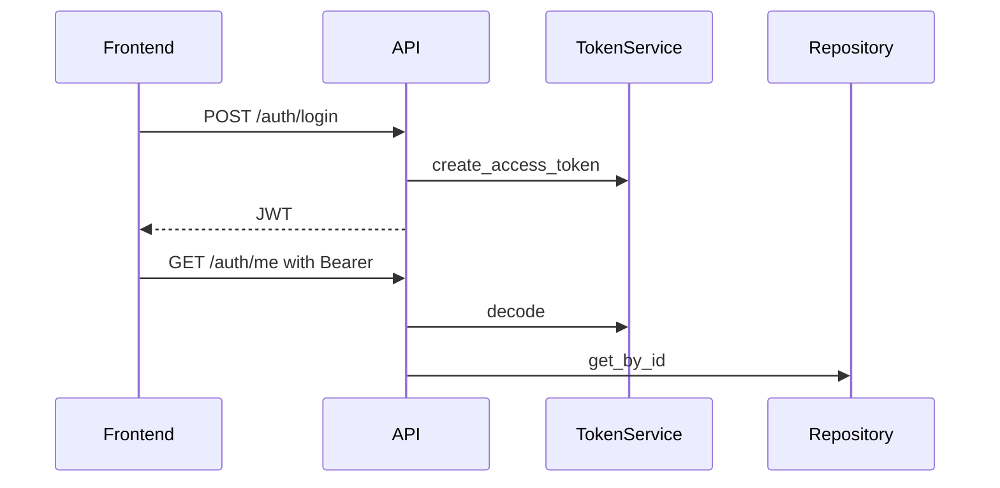

# 06. Authentification et sécurité

## 1. Introduction contextuelle

Le sous-système de sécurité de FixTrade couvre l’authentification utilisateur, la protection des routes, la limitation de débit et les headers HTTP de sécurité. Le projet ne traite pas de sécurité de conformité bancaire complète, mais il implémente les protections de base attendues pour une application web exposant des données de marché et des recommandations.

## 2. Analyse du problème

Le problème à résoudre est classique mais sensible: garantir qu’un utilisateur authentifié puisse récupérer son identité et accéder à ses fonctions sans exposer ses mots de passe, sans garder les secrets côté client, et sans permettre un abus massif d’API.

La difficulté spécifique ici est que le frontend stocke un jeton localement pour réhydrater la session. Cela simplifie l’expérience utilisateur, mais suppose une bonne discipline de validation côté serveur et une politique de durée de vie de token raisonnable.

## 3. Contraintes techniques et métier

Les contraintes observables dans le code sont:

- création de compte et login;
- validation de token Bearer;
- limitation de requêtes sur certaines routes;
- header de sécurité à chaque réponse;
- séparation claire entre entité utilisateur et modèle persistant.

## 4. Justification des choix techniques

JWT a été retenu parce qu’il permet une vérification sans état côté serveur pour les appels authentifiés simples. Cela convient à un frontend SPA. Le mot de passe est haché avec Passlib et une stratégie résistante aux limites de longueur.

La limitation de débit est importante pour réduire l’impact d’attaques triviales et protéger les endpoints coûteux.

## 5. Alternatives possibles et rejetées

Les sessions serveur classiques auraient simplifié la révocation mais ajouté un état serveur plus lourd à gérer. OAuth2 complet avec fournisseur externe n’était pas nécessaire pour le périmètre actuel. Une politique de tokens très longs aurait simplifié les reconnexions mais augmenté le risque en cas de fuite.

## 6. Implémentation détaillée

Le service de sécurité est défini dans `app/infrastructure/auth/security.py`.

```python
class BcryptPasswordHasher(PasswordHasher):
    def hash(self, password: str) -> str:
        return self._context.hash(password)
```

Le service JWT encode les revendications minimales:

```python
payload = {
    "sub": user.id,
    "email": user.email,
    "role": user.role,
    "type": "access",
    "exp": expire_at,
    "iss": "fixtrade",
}
```

Le contrôle d’accès s’effectue dans la dépendance `get_current_user`:

```python
payload = token_service.decode_access_token(token)
user_id = payload.get("sub")
user = user_repo.get_by_id(user_id)
```

## 7. Exemples de code réels

Route login:

```python
@router.post("/login")
@limiter.limit("10/minute")
def login(request: Request, payload: LoginRequest, use_case=Depends(get_login_user_use_case)):
    ...
```

Middleware:

```python
response.headers["X-Frame-Options"] = "DENY"
response.headers["Content-Security-Policy"] = "default-src 'self'"
```

## 8. Diagrammes Mermaid obligatoires

```mermaid
graph TD
    Client --> Login[/auth/login]
    Login --> Token[JWT Access Token]
    Token --> Me[/auth/me]
    Me --> UserRepo[(User table)]
```



## 9. Analyse des risques / échecs

La sécurité réelle dépend de la qualité du secret JWT, du TLS en production et du durcissement des politiques de CORS. Un token compromis reste valide jusqu’à expiration si aucune stratégie de révocation n’existe.

Le stockage local du token côté navigateur expose le système à l’impact d’un XSS si la surface front n’est pas bien protégée. Les headers de sécurité réduisent ce risque, mais ne le suppriment pas.

## 10. Optimisations possibles

- rotation et révocation de tokens;
- refresh token séparé;
- audit de login;
- politique CSP plus fine par environnement;
- nettoyage des tokens en sortie de session.

## 11. Conclusion technique

Le sous-système de sécurité est pragmatique et cohérent avec la taille du projet. Il protège les surfaces essentielles sans imposer une usine à gaz. La principale limite reste la gestion de révocation et de durcissement avancé, qui devra être enrichie si le projet se rapproche d’un usage de production sensible.

