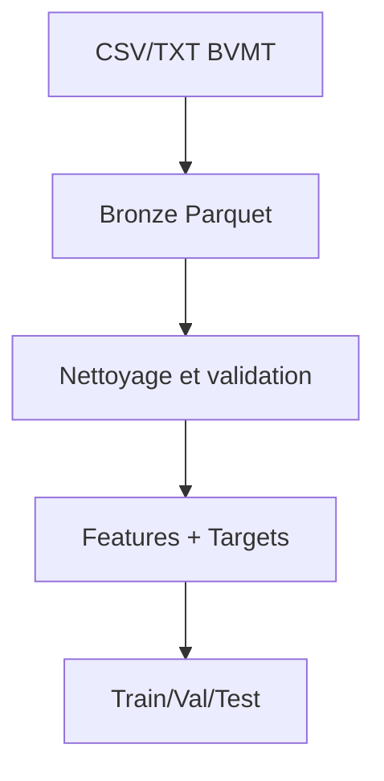
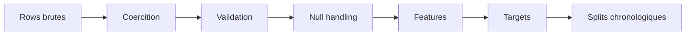

# 07. Pipeline de données et ETL

## 1. Introduction contextuelle

Le pipeline de données de FixTrade est l’un de ses éléments les plus structurants. Il transforme des fichiers BVMT hétérogènes en jeux de données propres, enrichis et exploitables par les modèles. L’architecture médallion utilisée ici n’est pas décorative: elle répond au besoin d’isoler les données brutes, de normaliser les séries et de produire des cibles sans fuite d’information.

## 2. Analyse du problème

Le problème de l’ETL est triple:

- ingérer des formats variables;
- nettoyer sans perdre le signal;
- préparer des features et cibles cohérentes dans le temps.

Les séries financières sont sensibles aux fuites temporelles. Un simple mauvais alignement dans un `shift` ou une jointure peut invalider les résultats du modèle. Le pipeline doit donc être chronologique, déterministe et idempotent autant que possible.

## 3. Contraintes techniques et métier

Les contraintes identifiées dans le code sont:

- sources CSV et TXT avec schémas variables;
- données manquantes ou mal typées;
- séries longues et partitionnement par code;
- respect strict de l’ordre temporel;
- production de features techniques et cibles futures.

## 4. Justification des choix techniques

Le choix Bronze/Silver/Gold est justifié par la clarté de gouvernance:

- Bronze: immutabilité des données brutes;
- Silver: nettoyage, validation, coercition;
- Gold: dataset ML-ready avec cibles.

Cette séparation facilite aussi la reprise sur incident: si la couche Gold est corrompue, on peut la régénérer à partir d’une Silver saine.

## 5. Alternatives possibles et rejetées

Une base unique “propre” sans couches aurait été plus simple à court terme, mais elle mélangerait extraction, nettoyage et apprentissage. Une approche stream-first pure aurait été inutile ici car le volume et la fréquence ne justifient pas tout le coût de complexité.

## 6. Implémentation détaillée

L’extracteur BVMT supporte plusieurs formats et standardise les colonnes.

```python
df = self._read_single_csv(data_file)
df = self._standardize_columns(df)
combined = pd.concat(frames, ignore_index=True)
```

Le transformeur Bronze→Silver applique coercition, validation et gestion des valeurs nulles.

```python
df["seance"] = pd.to_datetime(df["seance"], dayfirst=True, format="mixed", errors="coerce")
valid_df, _ = self._checker.validate(coerced_df)
silver_df = silver_df.sort_values(["code", "seance"]).reset_index(drop=True)
```

Le transformeur Silver→Gold ajoute les cibles futures sans fuite.

```python
df[col_name] = df.groupby("code")["cloture"].shift(-h)
next_vol = df.groupby("code")[vol_col].shift(-1)
df["liquidity_label"] = self._volume_to_liquidity_label(next_vol)
```

## 7. Exemples de code réels

Règle de qualité:

```python
VALIDATION_RULES = {
    "cloture_positive": lambda df: df["cloture"] > 0,
    "high_gte_low": lambda df: df["plus_haut"] >= df["plus_bas"],
}
```

Sauvegarde Gold:

```python
out.to_parquet(out_path, index=False, engine="pyarrow")
```

## 8. Diagrammes Mermaid obligatoires





## 9. Analyse des risques / échecs

Les risques principaux sont:

- formats sources qui changent;
- dates mal interprétées;
- NaN propagés dans les features;
- fuite de données via mauvaise fenêtre de décalage;
- doublons après réingestion.

L’ETL répond partiellement à ces risques, mais les tests doivent confirmer l’absence de dérives de schéma.

## 10. Optimisations possibles

- validation de schéma déclarative plus stricte;
- journalisation de la qualité de données;
- partitionnement plus fin des lots;
- comparaison de versions de features;
- réconciliation automatisée des partitions manquantes.

## 11. Conclusion technique

Le pipeline ETL constitue le socle de crédibilité du système. Sans données nettoyées et sans cibles bien construites, les composants ML et décisionnels perdent leur valeur. La qualité du système dépend donc fortement de la qualité de cette chaîne de transformation.

