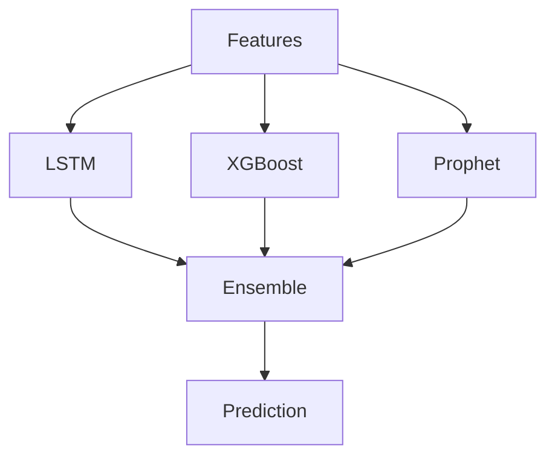
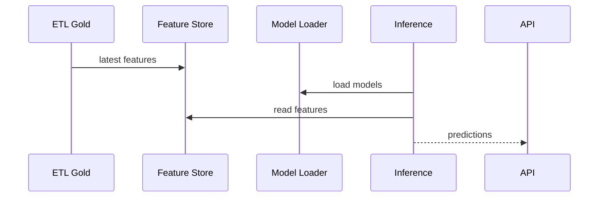

# 08. Composants machine learning

## 1. Introduction contextuelle

Le sous-système ML de FixTrade combine plusieurs familles de modèles afin de couvrir des dimensions distinctes du marché: dynamique séquentielle, interactions tabulaires, tendance, volume et liquidité. Le but n’est pas de produire un modèle “sophistiqué” au sens abstrait, mais un ensemble exploitable qui conserve une robustesse acceptable lorsque certaines hypothèses échouent.

## 2. Analyse du problème

La prédiction d’actifs BVMT pose plusieurs difficultés:

- séries non stationnaires;
- historique parfois fragmenté;
- bruit élevé sur des titres peu liquides;
- rareté relative de certains signaux.

Un seul algorithme ne capte généralement pas tous ces phénomènes avec le même niveau de fiabilité. D’où le recours à un ensemble pondéré.

## 3. Contraintes techniques et métier

Les contraintes concrètes sont:

- horizon court, 1 à 5 jours;
- besoin de fournir aussi bien des prix que du volume et de la liquidité;
- compatibilité avec un cache et un store de features;
- entraînement reproductible;
- capacité de fallback lorsque les modèles ne sont pas chargés.

## 4. Justification des choix techniques

LSTM a été retenu pour la dépendance temporelle locale, XGBoost pour sa capacité à gérer des features hétérogènes et des interactions non linéaires, et Prophet pour ses composantes de tendance et saisonnalité.

Le choix d’un ensemble pondéré est justifié par la théorie et la pratique: si un modèle se dégrade sur un régime particulier, les autres peuvent atténuer la dérive. Le système évite ainsi un point de défaillance unique.

## 5. Alternatives possibles et rejetées

Un modèle profond unique aurait pu sembler plus moderne, mais il aurait été plus coûteux à entraîner, plus fragile à expliquer et plus sensible aux jeux de données incomplets. À l’inverse, un modèle linéaire simple aurait sous-ajusté la complexité du marché.

## 6. Implémentation détaillée

La configuration des modèles est centralisée dans `prediction/config.py`.

```python
class ModelConfig:
    lstm_sequence_length: int = 30
    xgb_n_estimators: int = 400
    prophet_weekly_seasonality: bool = True
```

L’inférence assemble ensuite les prédicteurs.

```python
self._ensemble = EnsemblePredictor(models={
    "LSTM": LSTMPredictor(),
    "XGBoost": XGBoostPredictor(),
    "Prophet": ProphetPredictor(),
})
```

Le service d’inférence orchestre cache, features, modèles et persistance.

## 7. Exemples de code réels

Chargement du modèle:

```python
if ensemble_path.exists() and (ensemble_path / "ensemble_weights.json").exists():
    self._ensemble.load_model(ensemble_path)
```

Fabrication du résultat:

```python
results.append(PredictionResult(
    symbol=symbol,
    target_date=target_date,
    predicted_close=ens_pred.predicted_value,
))
```

## 8. Diagrammes Mermaid obligatoires





## 9. Analyse des risques / échecs

Les risques majeurs sont:

- drift des paramètres de marché;
- décalage entre features d’entraînement et features de production;
- surcharge mémoire à cause des séquences longues;
- mauvaise calibration des intervalles de confiance.

L’ensemble réduit ces risques, mais ne les supprime pas. Une surveillance régulière des métriques est indispensable.

## 10. Optimisations possibles

- calibration post-entraînement;
- sélection dynamique de poids;
- entraînement spécifique par ticker;
- benchmark contre des modèles naïfs;
- gestion plus fine des régimes de marché.

## 11. Conclusion technique

Le design ML de FixTrade est raisonnablement conservateur. Il mise sur l’assemblage de modèles complémentaires plutôt que sur une sophistication unique. Dans un environnement financier hétérogène, ce choix est souvent plus robuste qu’une approche monolithique de prédiction.

