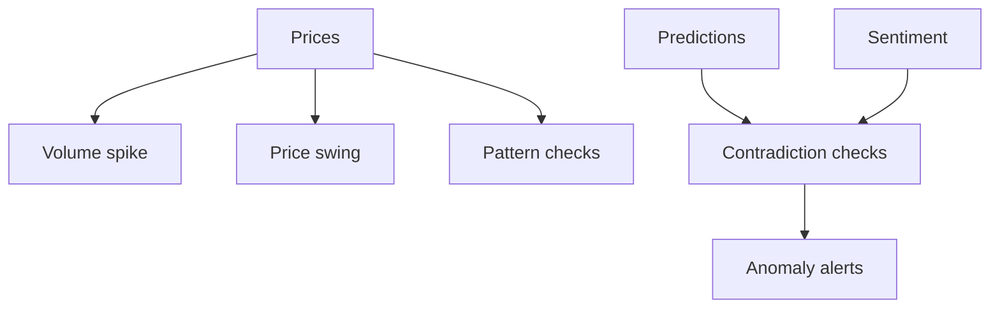
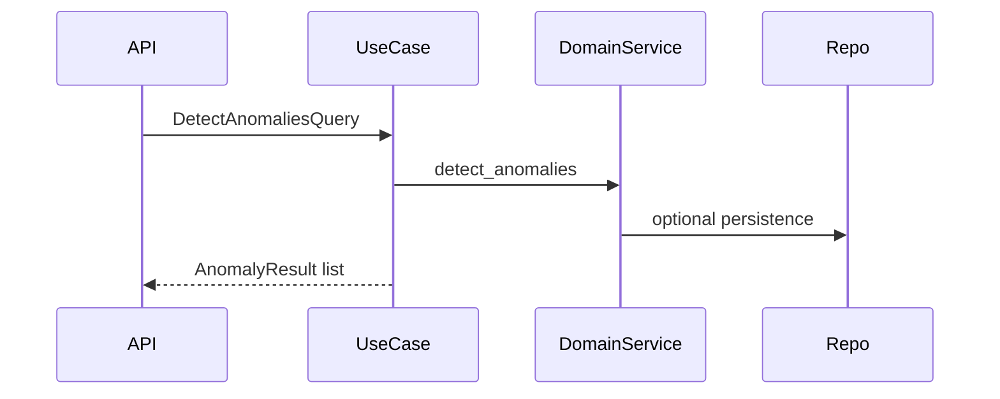

# 09. Détection d’anomalies

## 1. Introduction contextuelle

La détection d’anomalies occupe une place centrale dans FixTrade car elle constitue le pont entre la prédiction et la prudence décisionnelle. Une hausse de prix peut être positive en apparence, mais suspecte si elle contredit les signaux de sentiment ou si elle accompagne une rupture de volume. L’objectif n’est donc pas seulement d’alerter, mais de contextualiser les anomalies.

## 2. Analyse du problème

Le problème d’anomalie est multi-couches:

- statistiques de volume;
- variations de prix intrajournalières et journalières;
- motifs suspects sur plusieurs jours;
- contradiction avec des prédictions de prix;
- contradiction avec le sentiment de marché.

Cette approche composite est supérieure à une simple règle unique parce qu’elle prend en compte plusieurs axes d’incohérence.

## 3. Contraintes techniques et métier

Les contraintes sont:

- besoin d’au moins un historique minimal;
- robustesse aux données incomplètes;
- scores de sévérité normalisés;
- persistance des alertes;
- récupération des anomalies récentes pour l’interface.

## 4. Justification des choix techniques

Le service de domaine `AnomalyDetectionService` est purement fonctionnel: il prend des entrées structurées et retourne des alertes. Cette pureté facilite les tests et la réutilisation.

Le choix de combiner volume, swing et pattern est justifié par la diversité des anomalies financières. Un seul critère z-score ne suffit pas à capturer la complexité du marché.

## 5. Alternatives possibles et rejetées

Une détection totalement supervisée exige des labels nombreux et fiables, rarement disponibles. Une approche purement statistique aurait été trop simpliste. Les méthodes de type isolation forest ou autoencodeur auraient pu être ajoutées, mais elles seraient plus difficiles à interpréter dans le cadre pédagogique du projet.

## 6. Implémentation détaillée

La détection de volume s’appuie sur moyenne et écart-type:

```python
avg_volume = mean(volumes)
std_volume = stdev(volumes)
z_score = (latest_volume - avg_volume) / std_volume
```

Les swings de prix analysent à la fois la variation intraday et la variation jour-sur-jour.

```python
intraday_change = (latest.high - latest.low) / latest.low
daily_change = abs(latest.close - previous.close) / previous.close
```

La logique métier agrège ensuite les anomalies et peut croiser prédiction et sentiment.

## 7. Exemples de code réels

Extrait de logique:

```python
if z_score > self._volume_threshold_std:
    alerts.append(AnomalyAlert(...))
```

Injection du port:

```python
return DetectAnomaliesUseCase(
    anomaly_port=AnomalyDetectionAdapter(...),
)
```

## 8. Diagrammes Mermaid obligatoires





## 9. Analyse des risques / échecs

Le risque principal est le faux positif. Sur une série peu liquide, une variation ordinaire peut ressembler à une anomalie. Inversement, un événement réel peut être raté si les seuils sont trop conservateurs.

Un autre risque est le mélange des signaux historiques et prédictifs sans documentation suffisante de leur poids respectif.

## 10. Optimisations possibles

- seuils adaptatifs par ticker;
- prise en compte de fenêtres intraday plus fines;
- scoring de confiance plus explicite;
- enrichissement par volume relatif et volatilité locale.

## 11. Conclusion technique

Le module d’anomalie est utile parce qu’il injecte de la prudence dans un système prédictif. Il aide à éviter l’illusion de certitude qui accompagne souvent les sorties de modèles. C’est une brique indispensable pour un système de décision crédible.

