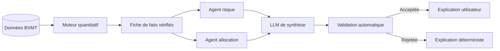
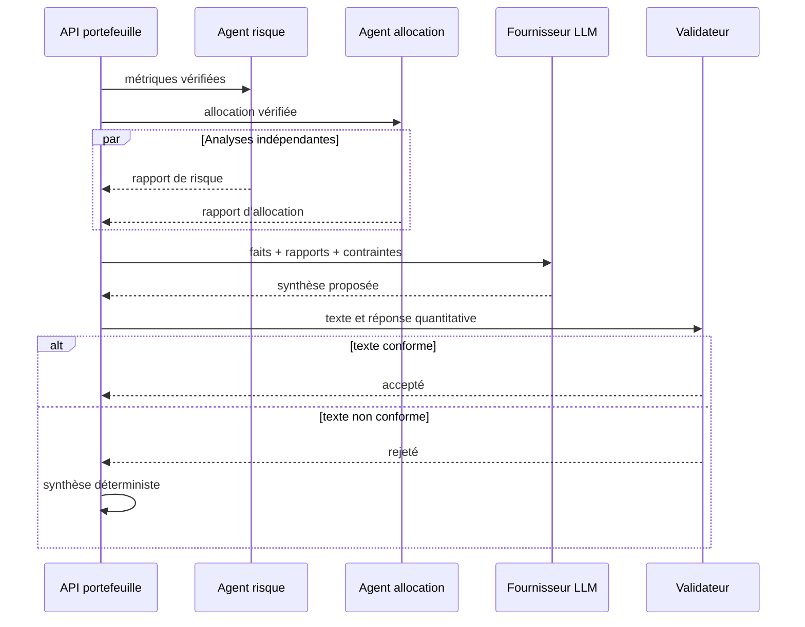
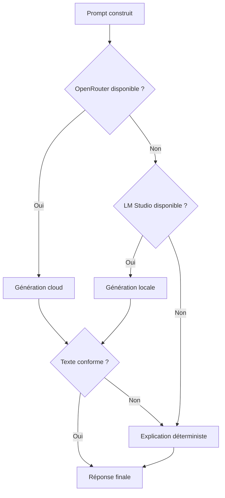

# 10. Module d’intelligence artificielle générative

## 1. Introduction

L’intelligence artificielle générative de FixTrade a pour fonction de rendre les résultats quantitatifs compréhensibles par un utilisateur non spécialiste. Elle intervient après les calculs financiers et transforme des données structurées — pondérations, rendement issu du CAPM, volatilité, bêta et liquidités résiduelles — en une explication rédigée en langage naturel.

Le module ne décide donc ni des titres sélectionnés ni de leur poids. Ces résultats proviennent d’algorithmes déterministes fondés sur les données historiques de la BVMT, le modèle CAPM et l’optimisation de portefeuille. Le modèle de langage joue le rôle d’une couche d’explicabilité. Cette séparation est essentielle dans un domaine financier, car une phrase plausible produite par un LLM ne constitue pas une preuve mathématique ni une recommandation fiable par elle-même.

L’objectif retenu est celui d’une IA générative contrôlée : le système autorise la reformulation linguistique, mais limite les faits utilisables, vérifie la réponse et dispose d’un mode de secours déterministe.

## 2. Problématique

Les sorties d’un optimiseur sont précises, mais peu accessibles sous leur forme brute. Une réponse API peut par exemple contenir :

```json
{
  "expected_return": 0.102319,
  "volatility": 0.055322,
  "beta": 0.9051,
  "cash_remaining": 17.13
}
```

Un utilisateur doit encore comprendre que :

- le rendement de 10,23 % est une estimation théorique issue du CAPM ;
- la volatilité de 5,53 % mesure la dispersion annualisée estimée ;
- un bêta de 0,91 indique une sensibilité proche de celle du marché de référence ;
- les liquidités restantes résultent de l’achat d’un nombre entier d’actions.

Une génération libre serait cependant dangereuse. Un LLM peut inventer un secteur d’activité, attribuer une qualité à une entreprise, confondre une pondération avec un rendement ou présenter une estimation comme une garantie. La problématique devient donc :

> Comment produire une explication naturelle utile sans laisser le modèle modifier, compléter ou contredire les résultats financiers calculés ?

## 3. Positionnement de l’IA générative dans FixTrade

FixTrade sépare trois niveaux de responsabilité :

1. **Le niveau quantitatif** charge les données et calcule les métriques.
2. **Le niveau agentique** produit des rapports spécialisés à partir de faits vérifiés.
3. **Le niveau génératif** synthétise ces rapports en un paragraphe lisible.



Cette architecture applique un principe important : **le LLM est placé en aval de la décision**. Même si le fournisseur externe ou le modèle local est indisponible, le portefeuille et ses métriques restent calculables.

## 4. Architecture multi-agent

L’expression « multi-agent » désigne ici une décomposition fonctionnelle contrôlée. Deux agents spécialisés génèrent en parallèle des rapports déterministes.

### 4.1 Agent risque

L’agent risque interprète :

- la volatilité annualisée ;
- le bêta du portefeuille ;
- le rendement CAPM ;
- l’écart entre ce rendement et le taux sans risque ;
- le compromis rendement-risque associé au profil.

Son rapport est produit par `_risk_agent_report()` dans `app/interfaces/portfolio/service.py`. Il ne fait pas appel au LLM et n’ajoute aucune information extérieure.

### 4.2 Agent allocation

L’agent allocation analyse :

- le nombre de titres ;
- le poids de la première position ;
- le poids cumulé des deux premières positions ;
- la borne maximale imposée par l’optimiseur ;
- les liquidités résiduelles.

Le rapport est construit par `_allocation_agent_report()`. Il distingue explicitement les pondérations des rendements afin d’éviter une confusion fréquente dans les textes générés.

### 4.3 Agent de synthèse

Les deux rapports sont injectés dans un prompt final. Le LLM reçoit l’instruction de produire un paragraphe de 80 à 130 mots et de ne pas ajouter de secteur, pays, perspective, dividende, causalité ou garantie de perte.

Les agents spécialisés ne sont donc pas des entités autonomes capables d’exécuter des transactions. Il s’agit de rôles analytiques délimités, orchestrés par le backend.



## 5. Construction du contexte

Le LLM ne reçoit pas directement des lignes de base de données ni une question libre de l’utilisateur. Une fiche de faits est construite par `_portfolio_fact_sheet()` :

```text
Profil=neutre;
pondérations (ce ne sont pas des rendements)=CEREALIS 35%, ...;
rendement attendu CAPM=10.23%;
volatilité annualisée=5.53%;
bêta portefeuille=0.905;
taux sans risque=7.00%;
prime de risque marché=3.57%;
montant investi=4982.87 TND;
liquidités=17.13 TND.
```

Cette méthode possède trois avantages :

- elle réduit la taille du contexte et donc la latence ;
- elle limite le modèle aux données nécessaires ;
- elle rend le prompt auditable et reproductible.

Le prompt principal rappelle également que les pondérations ne sont pas des rendements et exige une mise en garde finale.

## 6. Fournisseurs et stratégie de disponibilité

Le chemin principal essaie successivement deux fournisseurs.

### 6.1 OpenRouter

OpenRouter est appelé par HTTPS avec une clé configurée dans `OPENROUTER_API_KEY`. Le modèle est sélectionné par `OPENROUTER_MODEL`. Les réglages utilisés pour l’explication de portefeuille sont volontairement conservateurs :

| Paramètre | Valeur | Justification |
|---|---:|---|
| Température | 0,2 | Réduire la variabilité |
| Limite de sortie | 220 tokens | Produire une explication courte |
| Timeout | 30 secondes par défaut | Éviter un blocage prolongé |
| Streaming | Désactivé | Valider le texte complet avant affichage |

Une erreur d’authentification désactive les nouveaux essais OpenRouter jusqu’au redémarrage du processus. Cela évite de répéter inutilement des appels voués à échouer.

### 6.2 LM Studio

Si OpenRouter n’est pas configuré ou indisponible, FixTrade tente un modèle local exposé par l’API compatible OpenAI de LM Studio. Le système recherche en priorité :

1. un modèle Llama déjà chargé ;
2. un modèle Llama installé ;
3. un autre LLM déjà chargé ;
4. un modèle local configuré explicitement.

Cette option améliore la confidentialité et permet une démonstration sans dépendre entièrement d’un service cloud.

### 6.3 Mode déterministe

Si aucun fournisseur ne répond, `_fallback_explanation()` produit une explication à partir de règles et de gabarits Python. Le portefeuille reste donc explicable même hors ligne.



## 7. Contrôle des hallucinations

La sécurité ne repose pas uniquement sur le prompt. Une validation post-génération compare le texte avec les métriques de la réponse.

### 7.1 Concepts obligatoires

Une explication doit contenir les quatre dimensions suivantes :

- rendement attendu ou CAPM ;
- volatilité ou risque ;
- bêta ou sensibilité ;
- prudence, simulation ou absence de conseil financier.

Un texte trop court ou purement promotionnel est rejeté.

### 7.2 Vérification numérique

Le validateur recherche au moins deux métriques vérifiées dans la réponse. Il accepte les séparateurs décimaux français et anglais. Les pourcentages mentionnés sont comparés à une liste blanche calculée à partir :

- du rendement CAPM ;
- de la volatilité ;
- du taux sans risque ;
- de la prime de marché ;
- des pondérations ;
- de la concentration des deux premières positions ;
- du ratio de liquidités.

Une valeur non reconnue provoque l’erreur `invented_percentage`.

### 7.3 Détection d’affirmations non supportées

Certains termes déclenchent un rejet lorsqu’ils introduisent des informations absentes du contexte, par exemple :

- secteur ou pays ;
- perspective d’entreprise ;
- dividende ;
- qualité supposée ;
- garantie ou limitation des pertes.

Cette liste ne remplace pas une vérification sémantique complète, mais elle bloque plusieurs hallucinations typiques observées pendant le développement.

### 7.4 Contrôle éditorial

La synthèse finale doit contenir au moins 55 mots et discuter de diversification, de concentration ou de répartition. Le système évite ainsi d’accepter un texte techniquement exact mais trop pauvre pour être utile.

## 8. Nettoyage de la sortie

Avant validation, `_clean_explanation()` :

- supprime les espaces inutiles ;
- coupe une dernière phrase incomplète lorsque la génération s’arrête brutalement ;
- ajoute une mise en garde si aucune formulation de prudence n’est présente.

Ce traitement répond notamment au risque de troncature causé par la limite de tokens.

## 9. Intégration dans l’interface

L’API renvoie deux champs de traçabilité :

```json
{
  "explanation_source": "multi_agent",
  "warnings": []
}
```

`explanation_source` peut prendre les valeurs :

| Valeur | Signification |
|---|---|
| `openrouter` | Synthèse acceptée produite par OpenRouter |
| `lm_studio` | Synthèse acceptée produite localement |
| `multi_agent` | Synthèse factuelle vérifiée utilisée après rejet ou indisponibilité |
| `fallback` | Mode de secours général |

Le frontend affiche cette provenance dans un badge. L’utilisateur sait ainsi si le texte vient d’un modèle distant, d’un modèle local ou d’un mécanisme déterministe.

## 10. Service GenAI autonome

Le dépôt contient également `services/genai_service/app.py`, un petit service FastAPI exposé sur un port séparé. Il fournit un endpoint de santé et un endpoint d’explication de démonstration.

Ce service matérialise une frontière de microservice possible, mais il ne constitue pas le chemin principal de l’explication de portefeuille. Dans la version actuelle, l’orchestration avancée reste intégrée au backend principal afin d’accéder directement aux objets quantitatifs typés et de limiter la complexité réseau.

## 11. Validation expérimentale

Les tests de `tests/test_portfolio_explanation.py` couvrent notamment :

- l’acceptation d’une explication qui interprète correctement rendement et risque ;
- le rejet d’un texte générique sans métriques ;
- le rejet d’une simple récitation des poids ;
- le rejet de pourcentages inventés ;
- la bonne interprétation d’un bêta proche de 1.

Cette stratégie évalue davantage la fidélité factuelle que la beauté stylistique. Dans un contexte financier, ce choix est pertinent : une explication élégante mais fausse est moins acceptable qu’un texte simple et vérifiable.

## 12. Limites

Le mécanisme actuel présente plusieurs limites :

- la liste noire d’affirmations non supportées reste lexicale ;
- le français peut être reformulé de nombreuses façons difficiles à détecter ;
- aucun score automatique global de factualité n’est encore calculé ;
- la qualité dépend encore du modèle local ou distant sélectionné ;
- la validation contrôle les chiffres cités, mais pas toutes les relations causales possibles ;
- les prompts et règles ne sont pas encore versionnés dans une base d’expérimentation.

Le terme « multi-agent » doit également être interprété avec précision : les agents spécialisés sont des composants d’analyse orchestrés et non des agents autonomes dotés d’une mémoire ou d’un pouvoir de transaction.

## 13. Améliorations futures

Les évolutions envisagées sont :

- versionner les prompts et conserver leur identifiant dans la réponse ;
- mesurer la latence, le taux de rejet et le coût par fournisseur ;
- ajouter des tests de robustesse multilingues ;
- utiliser une sortie JSON contrainte avant la rédaction finale ;
- comparer automatiquement les affirmations générées à la fiche de faits ;
- anonymiser et journaliser les résultats pour constituer un jeu d’évaluation ;
- intégrer une validation humaine pour les scénarios à fort enjeu.

## 14. Conclusion

Le module d’IA générative de FixTrade adopte une architecture hybride : calcul déterministe, analyses spécialisées, synthèse par LLM et validation automatique. Son intérêt ne réside pas simplement dans la production de texte, mais dans la création d’une interface explicative entre des modèles financiers et l’utilisateur.

Le choix central est de ne jamais déléguer la décision financière au modèle de langage. Le LLM reformule des faits déjà calculés, tandis que le backend conserve la responsabilité des données, des métriques, des contraintes et du contrôle qualité. Cette approche rend l’IA générative plus fiable, auditable et adaptée au cadre académique d’un projet de fin d’études.
