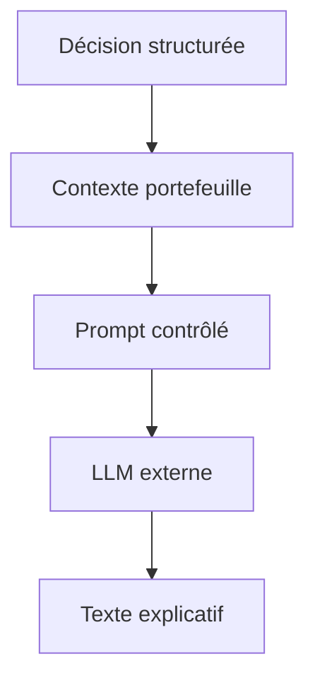
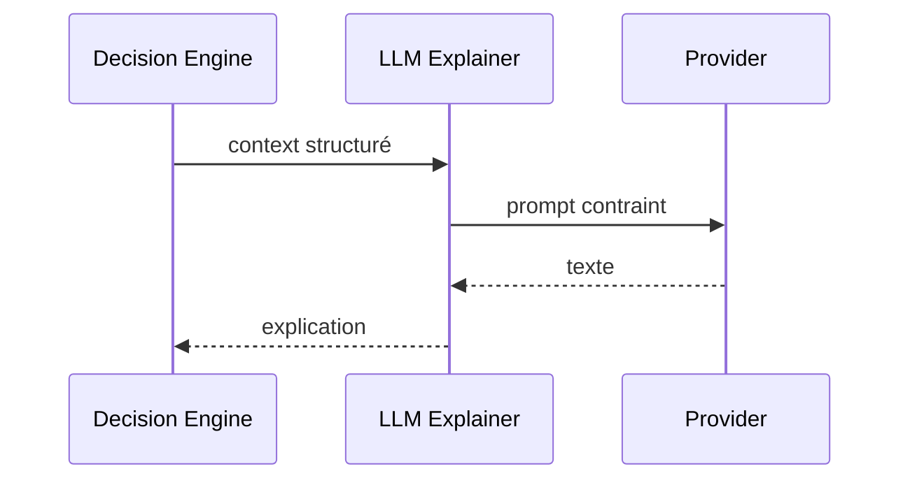

# 10. Module d’IA générative

## 1. Introduction contextuelle

Le module d’IA générative de FixTrade n’est pas un gadget textuel. Il sert à produire des explications, à contextualiser des recommandations et à rendre la sortie du moteur décisionnel plus intelligible. L’intérêt est double: améliorer l’interface cognitive pour l’utilisateur et documenter les justifications internes du système.

## 2. Analyse du problème

Le problème n’est pas seulement “générer du texte”. Il faut produire un texte:

- cohérent avec les données d’entrée;
- contraint par les signaux de portefeuille;
- reproductible à contexte égal;
- compatible avec un modèle de coût et de latence raisonnables.

## 3. Contraintes techniques et métier

Les contraintes sont:

- génération assistée par configuration, pas par magie;
- dépendance optionnelle à un fournisseur LLM;
- besoin de limiter les tokens;
- explication orientée décision et non prose marketing.

## 4. Justification des choix techniques

Le projet a raison de séparer le moteur décisionnel de l’explainer LLM. Le premier produit des décisions structurées et déterministes; le second reformule ces décisions dans un langage lisible.

Cette séparation limite le risque de confondre la recommandation elle-même avec son commentaire linguistique.

## 5. Alternatives possibles et rejetées

Un unique prompt ad hoc injecté dans le backend aurait été fragile. Un agent autonome complet, avec outils multiples et mémoire persistante, aurait été beaucoup plus coûteux à contrôler. L’approche retenue est plus sobre: contextualiser sans déléguer le raisonnement financier principal au LLM.

## 6. Implémentation détaillée

Le module AI de décision contient une couche d’explication:

```python
self.explainer = LLMExplainer(use_llm=use_llm_explanation, llm_config=llm_config)
```

La configuration du modèle est centralisée dans l’environnement:

```python
groq_model: str = "llama-3.3-70b-versatile"
groq_max_tokens: int = 1024
groq_temperature: float = 0.7
```

Le rôle du LLM est d’expliquer, pas de remplacer les règles décisionnelles.

## 7. Exemples de code réels

Description du module:

```python
class DecisionEngine:
    """Generates actionable BUY/SELL/HOLD recommendations."""
```

Contexte d’explication:

```python
explanation = self.explainer.explain(context)
```

## 8. Diagrammes Mermaid obligatoires





## 9. Analyse des risques / échecs

Le risque majeur est l’hallucination: le LLM peut produire des justifications plausibles mais non fondées. Il faut donc imposer un contexte structuré, des données bornées et des sorties vérifiables.

Un autre risque est la latence et le coût d’appel externe. Pour cela, le système doit prévoir un mode de repli sans génération.

## 10. Optimisations possibles

- cache des explications répétées;
- prompts mieux structurés;
- limitation stricte des champs injectés;
- journalisation des raisons et du contexte.

## 11. Conclusion technique

L’IA générative remplit ici un rôle de médiation, non de pilotage. C’est le bon positionnement architecturale­ment, car il maintient la prévisibilité du système tout en améliorant sa lisibilité pour l’utilisateur final.

