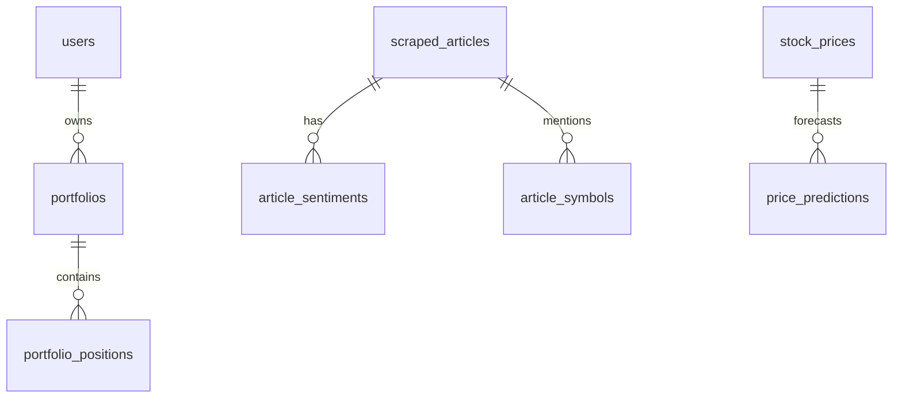
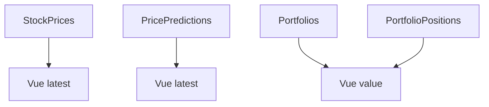

# 11. Base de données

## 1. Introduction contextuelle

La base de données de FixTrade combine des tables transactionnelles, des tables analytiques, des tables de suivi ETL et des vues utiles à la consultation. PostgreSQL est utilisé non seulement pour stocker, mais aussi pour exprimer des contraintes métier, des relations et des agrégats utiles à la décision.

## 2. Analyse du problème

Le schéma doit couvrir:

- les utilisateurs;
- les prix historiques;
- les prédictions;
- les articles et sentiments;
- les anomalies;
- les portefeuilles et positions;
- les modèles entraînés;
- les watermark ETL.

Le défi est de maintenir une structure lisible sans sur-normaliser à l’excès, car certains flux analytiques ont besoin d’accès rapides à des données déjà consolidées.

## 3. Contraintes techniques et métier

Les contraintes observées sont:

- unicité par symbole et date pour les prix;
- unicité des alertes et des sentiments journaliers;
- intégrité référentielle des positions;
- indexation sur les dates et les symboles;
- support des vues pour les agrégats fréquents.

## 4. Justification des choix techniques

L’utilisation de vues comme `v_latest_prices`, `v_latest_predictions` et `v_portfolio_value` est judicieuse parce qu’elle déplace une partie du coût de calcul vers la base, là où l’optimiseur SQL peut faire le travail efficacement.

Le choix de clés uniques empêche les duplications lors d’ingestions répétées et simplifie la logique de réexécution.

## 5. Alternatives possibles et rejetées

Une base NoSQL aurait été plus souple pour certains documents, mais moins appropriée pour les relations fortes entre portefeuilles, positions, anomalies et utilisateurs. Un data warehouse séparé aurait pu être ajouté, mais il aurait complexifié le périmètre sans bénéfice immédiat majeur.

## 6. Implémentation détaillée

Le schéma SQL montre une séparation claire des objets.

```sql
CREATE TABLE IF NOT EXISTS stock_prices (
    symbol VARCHAR(50) NOT NULL,
    seance DATE NOT NULL,
    cloture NUMERIC(12,3) NOT NULL,
    CONSTRAINT uq_stock_prices_symbol_date UNIQUE (symbol, seance)
);
```

Les alertes portent un UUID et un score de sévérité:

```sql
CREATE TABLE IF NOT EXISTS anomaly_alerts (
    id UUID PRIMARY KEY DEFAULT uuid_generate_v4(),
    symbol VARCHAR(20) NOT NULL,
    severity NUMERIC(5,4) NOT NULL
);
```

## 7. Exemples de code réels

Le modèle utilisateur:

```python
class UserModel(Base):
    __tablename__ = "users"
    email = mapped_column(String(254), unique=True, index=True, nullable=False)
```

Chargement DB:

```python
_engine = create_engine(settings.database_url, pool_pre_ping=True)
SessionLocal = sessionmaker(autocommit=False, autoflush=False, bind=_engine)
```

## 8. Diagrammes Mermaid obligatoires





## 9. Analyse des risques / échecs

Le risque principal est la croissance non maîtrisée de l’usage des vues et des index. À mesure que le volume augmente, certains agrégats peuvent devenir coûteux si les requêtes ne sont pas profilées.

Un autre risque est le mélange de données courantes et de données d’apprentissage. Il faut bien distinguer les tables transactionnelles des jeux préparés pour le ML.

## 10. Optimisations possibles

- index composites supplémentaires sur les requêtes les plus fréquentes;
- matérialisation ciblée de certaines vues;
- partitionnement temporel des tables volumineuses;
- archivage des séries anciennes.

## 11. Conclusion technique

Le schéma PostgreSQL est suffisamment riche pour porter le système sans devenir opaque. Il sert à la fois le transactionnel, l’analytique légère et le suivi des expérimentations ML. C’est un compromis cohérent pour FixTrade.

