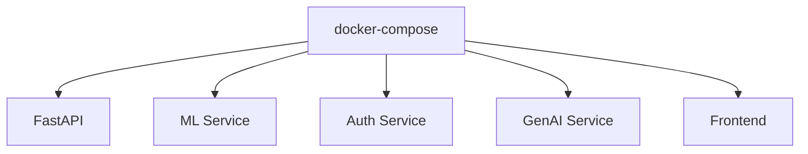
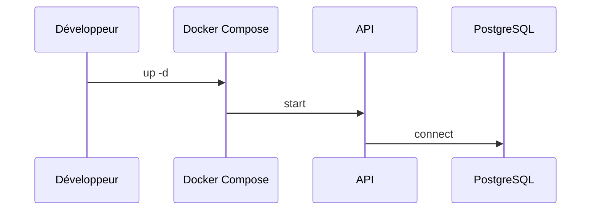

# 12. DevOps et CI/CD

## 1. Introduction contextuelle

Le volet DevOps de FixTrade combine Docker, scripts de démarrage, séparation des services et préparation à une exécution locale reproductible. Le projet ne présente pas un pipeline CI/CD industriel complet, mais il contient les bases d’un déploiement cohérent.

## 2. Analyse du problème

L’enjeu DevOps est de rendre le système réplicable: même code, mêmes services, mêmes dépendances, mêmes ports. Cela est essentiel dans un projet à composants multiples car le moindre décalage de version peut casser le flux complet.

## 3. Contraintes techniques et métier

Les contraintes sont:

- exécution locale avec Docker Compose;
- gestion de plusieurs Dockerfiles spécialisés;
- compatibilité Windows/Linux des scripts;
- possibilité de lancer séparément l’API, le ML service, l’auth et le GenAI service.

## 4. Justification des choix techniques

Docker est un bon choix ici car il standardise l’environnement sans imposer d’orchestration lourde. Les scripts `.sh` et `.ps1` complètent cette approche pour l’usage local.

## 5. Alternatives possibles et rejetées

Kubernetes serait excessif à ce stade, car il introduirait une complexité d’exploitation supérieure au besoin. Un démarrage manuel des processus sans conteneur serait trop fragile et peu reproductible.

## 6. Implémentation détaillée

Le dépôt contient plusieurs Dockerfiles:

- `docker/api.Dockerfile`
- `docker/ml_service.Dockerfile`
- `docker/auth.Dockerfile`
- `docker/genai.Dockerfile`
- `docker/frontend.Dockerfile`

Le `docker-compose.yml` permet l’assemblage global, tandis que `docker-compose.local.yml` cible une exécution plus légère.

```yaml
services:
  api:
    build:
      context: .
      dockerfile: docker/api.Dockerfile
```

Les scripts de démarrage orchestrent ensuite les services selon le contexte de développement.

## 7. Exemples de code réels

Extrait de lancement:

```bash
docker compose up -d
python run_app.py
```

Extrait de configuration d’environnement:

```env
DATABASE_URL=postgresql://...
REDIS_URL=redis://...
```

## 8. Diagrammes Mermaid obligatoires





## 9. Analyse des risques / échecs

Le risque principal est le drift de configuration entre `.env`, compose et code. Un autre risque est l’hétérogénéité des plateformes, surtout sur Windows, où certains scripts et chemins peuvent réagir différemment.

## 10. Optimisations possibles

- healthchecks plus stricts;
- scripts de bootstrap unifiés;
- pipeline de tests automatisé;
- scan de sécurité des images;
- séparation build runtime.

## 11. Conclusion technique

Le socle DevOps de FixTrade est pragmatique et suffisamment complet pour le développement et la démonstration. Il permet de reconstruire la stack sans dépendre d’un environnement manuel trop fragile.

