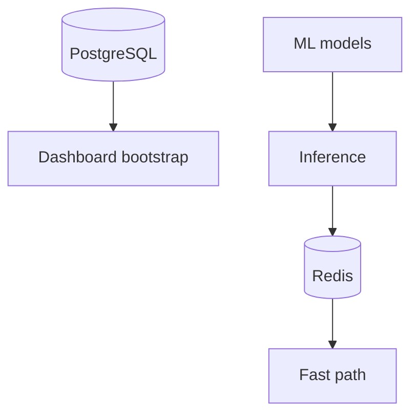
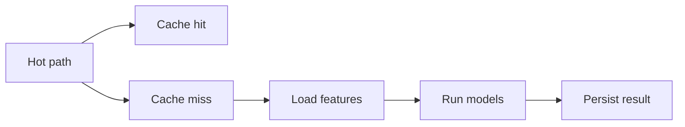

# 13. Performance et scalabilité

## 1. Introduction contextuelle

La performance dans FixTrade ne se mesure pas seulement en temps de réponse HTTP. Elle inclut la latence d’inférence, le coût des transformations de données, la stabilité du bootstrap dashboard et la capacité à absorber des charges de lecture répétées. La scalabilité doit donc être lue dans plusieurs plans: calcul, réseau, stockage et expérience utilisateur.

## 2. Analyse du problème

Le système combine des chemins rapides et lents:

- login et bootstrap;
- chargement modèle et inférence;
- ETL et training;
- appel LLM externe;
- lectures PostgreSQL.

Chaque chemin a un profil différent. Une optimisation générale “pour tout” serait inappropriée; il faut cibler les goulets.

## 3. Contraintes techniques et métier

Les contraintes sont:

- réponse dashboard acceptable;
- inference cacheable;
- ETL plus lourd mais hors chemin interactif;
- absence de fuite mémoire ou de surcharge CPU excessive;
- capacité à dégrader certaines fonctions sans bloquer tout le reste.

## 4. Justification des choix techniques

Redis est utilisé pour amortir les inférences répétées et les features récentes. Les vues PostgreSQL accélèrent certaines lectures fréquentes. L’ensemble pondéré de modèles permet aussi de réduire le coût de dépendance à un seul prédicteur.

## 5. Alternatives possibles et rejetées

Un calcul à la volée pour chaque composant du dashboard serait simple mais coûteux. Une matérialisation totale de toutes les sorties serait plus rapide mais risquerait l’obsolescence des signaux.

## 6. Implémentation détaillée

Le service d’inférence documente explicitement sa SLA:

```python
# SLA: Cache HIT < 50ms, Cache MISS < 2000ms
```

Il s’appuie d’abord sur le cache:

```python
cache_key_data = self._cache.get_prediction(symbol, model)
if cache_key_data and self._is_cache_valid(cache_key_data, horizon_days):
    return self._deserialize_predictions(cache_key_data)
```

Le dashboard agrège les données en une seule requête, limitant les allers-retours réseau.

## 7. Exemples de code réels

Fusion des dates côté front:

```ts
const newChartData: PricePoint[] = [
  ...historicalByDate.values(),
  ...[...forecastByDate.entries()].filter(([dateKey]) => !historicalByDate.has(dateKey)).map(([, point]) => point),
].sort((left, right) => left.date.localeCompare(right.date));
```

Cache local de prédiction:

```python
self._cache.set_prediction(symbol, self._serialize_predictions(results), model)
```

## 8. Diagrammes Mermaid obligatoires





## 9. Analyse des risques / échecs

Le principal goulot d’étranglement est le chemin d’inférence en cache miss: chargement modèle, lecture features, sérialisation. Si les modèles ne sont pas chargés efficacement, les temps de réponse se dégradent.

Le bootstrap peut aussi devenir coûteux si les sources de données se multiplient.

## 10. Optimisations possibles

- cache par symbole et horizon;
- préchargement de modèles;
- séparation lecture analytique / écriture;
- profiling mémoire sur les séries;
- exécution parallèle limitée des sous-prédictions.

## 11. Conclusion technique

La scalabilité de FixTrade repose davantage sur l’architecture des chemins critiques que sur le volume brut. Le système est optimisé là où cela compte: inférence fréquente, bootstrap, et lecture des signaux les plus consultés.

