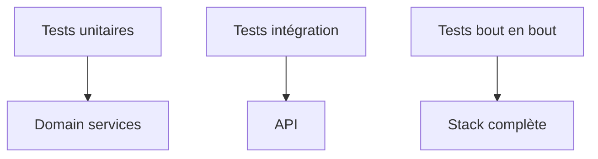

# 14. Stratégie de tests

## 1. Introduction contextuelle

La qualité d’un système comme FixTrade ne peut pas reposer sur des intuitions. Elle nécessite une stratégie de tests répartie entre unités de domaine, intégration des couches, validation API et scénarios bout en bout. Le dépôt montre déjà une densité de tests significative, ce qui est cohérent avec un système à composants multiples.

## 2. Analyse du problème

Tester FixTrade est difficile parce que la plateforme agrège plusieurs sources de variabilité:

- données temporelles;
- dépendances externes;
- cache;
- base de données;
- modèles entraînés;
- états de session.

La stratégie doit donc isoler les dépendances tout en conservant de vrais tests d’intégration sur les chemins critiques.

## 3. Contraintes techniques et métier

Les contraintes de test sont:

- stabilité des fixtures temporelles;
- couverture des chemins d’erreur;
- vérification des contrats de schéma;
- détection des régressions de pipeline;
- exécution reproductible localement.

## 4. Justification des choix techniques

Pytest est adapté parce qu’il facilite l’écriture de tests lisibles et paramétrables. Les tests doivent couvrir autant la logique métier que les intégrations de base, notamment le chargement des données et l’API.

## 5. Alternatives possibles et rejetées

Une stratégie uniquement E2E serait trop lente et fragile. Une stratégie purement unitaire manquerait les problèmes de contrat et d’intégration. Le bon niveau est mixte.

## 6. Implémentation détaillée

Le dépôt contient des tests pour le sentiment, les prédictions, les anomalies, le DB sink, les routes API et des scénarios intégrés.

```bash
pytest tests/test_prediction.py
pytest tests/test_anomaly_detection.py
pytest --cov=app --cov=prediction --cov-report=html
```

Les tests doivent également couvrir les cas d’échec: horizons invalides, symboles absents, données insuffisantes, régression de format.

## 7. Exemples de code réels

Exemple de validation domaine:

```python
if not (1 <= command.horizon_days <= 5):
    raise InvalidHorizonError(command.horizon_days)
```

Exemple de stratégie d’erreur:

```python
except PortfolioNotFoundError:
    warnings.append("Default portfolio not found; recommendation unavailable")
```

## 8. Diagrammes Mermaid obligatoires




## 9. Analyse des risques / échecs

Le risque principal est la fausse confiance: une suite verte peut masquer des cas limites non couverts, notamment si les fixtures sont trop simplistes. Il faut donc varier les échantillons de données et les scénarios de panne.

## 10. Optimisations possibles

- tests de non-régression par symbole;
- snapshots des réponses API;
- tests de performance sur le bootstrap;
- tests de charge sur les endpoints de prédiction.

## 11. Conclusion technique

La stratégie de tests doit refléter la nature hybride du projet: logique pure, orchestration, stockage et API. C’est précisément cette mixité qui rend une couverture diversifiée indispensable.

