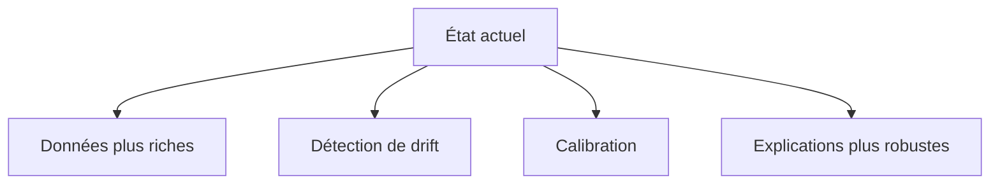
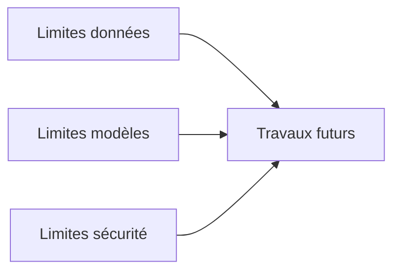

# 15. Limites et travaux futurs

## 1. Introduction contextuelle

Aucun système d’aide à la décision financière ne peut prétendre être exhaustif. FixTrade possède des limites théoriques, empiriques et opérationnelles. Les reconnaître n’est pas un signe de faiblesse, mais une condition de rigueur scientifique.

## 2. Analyse du problème

Les limites principales concernent:

- la qualité et la disponibilité des données;
- la validité temporelle des modèles;
- la simplicité relative de certaines règles d’anomalie;
- la dépendance à des services externes pour l’explication;
- le périmètre BVMT, qui réduit la généralisation.

## 3. Contraintes techniques et métier

Le système est conçu pour un marché spécifique et des horizons courts. Il n’est pas une solution universelle. Les signaux de sentiment, volume et prix peuvent diverger selon les régimes de marché et les titres.

## 4. Justification des choix techniques

Les choix actuels ont favorisé la lisibilité et la démonstration intégrée. Dans une perspective de thèse, cela est pertinent: un système compréhensible et testable vaut mieux qu’un prototype plus vaste mais opaque.

## 5. Alternatives possibles et rejetées

Une généralisation à d’autres places boursières aurait exigé d’autres sources, d’autres formats et probablement d’autres classes de modèles. Elle a donc été volontairement écartée pour conserver la cohérence du corpus.

## 6. Implémentation détaillée

Les travaux futurs les plus pertinents concernent:

- amélioration des labels d’anomalies;
- meilleure calibration des intervalles;
- intégration d’un modèle de drift;
- traçabilité complète des décisions;
- séparation plus nette des environnements de déploiement.

## 7. Exemples de code réels

Le code montre déjà des points de prudence:

```python
if features is None or features.empty:
    return self._fallback_prediction(symbol, horizon_days)
```

```python
if self._scheduler is not None:
    self._scheduler.stop()
```

## 8. Diagrammes Mermaid obligatoires





## 9. Analyse des risques / échecs

Le plus grand risque futur est la dérive silencieuse: les données changent, les modèles restent en place, et la performance se dégrade sans incident visible. Une vraie solution doit donc ajouter du monitoring de drift et de calibration.

## 10. Optimisations possibles

- monitoring statistique;
- apprentissage continu contrôlé;
- validation externe sur des périodes inédites;
- enrichissement sémantique des signaux de news.

## 11. Conclusion technique

Les limites de FixTrade sont clairement identifiables, ce qui est plutôt une force. Elles dessinent un agenda de recherche et d’ingénierie crédible pour les itérations futures.

