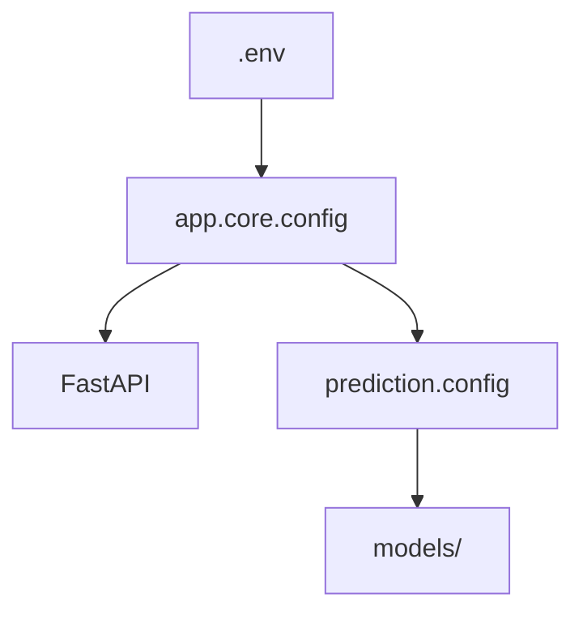
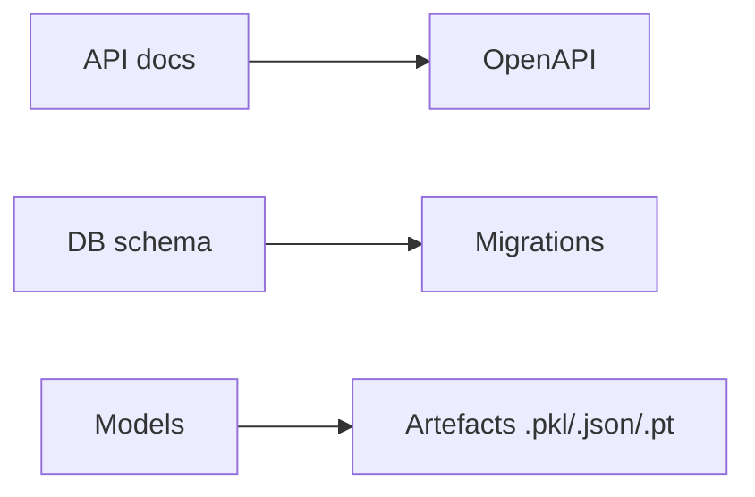

# 16. Annexes techniques

## 1. Introduction contextuelle

Les annexes regroupent les éléments utiles à la lecture technique: conventions de symboles, extraits de configuration, scripts de lancement, et rappels de structure. Elles servent de point d’ancrage pour la maintenance et la vérification.

## 2. Analyse du problème

Le problème des annexes est de fournir des repères sans répéter le corps principal. Elles doivent donc rester compactes mais précises, en couvrant les éléments souvent recherchés pendant le débogage ou l’extension.

## 3. Contraintes techniques et métier

Les annexes doivent refléter:

- les variables d’environnement essentielles;
- les services réseau exposés;
- les structures de fichiers centrales;
- les conventions d’appel des routes;
- les modèles et artefacts ML persistés.

## 4. Justification des choix techniques

Inclure ces informations dans des annexes séparées évite d’alourdir les chapitres principaux et fournit un support de consultation rapide.

## 5. Alternatives possibles et rejetées

Des annexes purement descriptives auraient été insuffisantes. Des annexes trop larges auraient doublonné les chapitres principaux. La bonne taille est celle d’un aide-mémoire technique utile.

## 6. Implémentation détaillée

Les variables importantes sont centralisées dans `app/core/config.py` et `prediction/config.py`.

```python
project_name: str
database_url: str
redis_url: str
model_dir: str
```

Les artefacts modèles sont conservés sous `models/`, par ticker et par famille de modèle.

```text
models/
  ensemble/
  volume/
  liquidity/
```

## 7. Exemples de code réels

Extrait de route API:

```python
app.include_router(auth_router, prefix="/api/v1")
```

Extrait de validation:

```python
symbol: str = Field(..., min_length=2, max_length=10, pattern=r"^[A-Z0-9]+$")
```

## 8. Diagrammes Mermaid obligatoires





## 9. Analyse des risques / échecs

Le risque principal de ces annexes est l’obsolescence si la configuration évolue sans mise à jour documentaire. Elles doivent donc être maintenues comme des artefacts vivants.

## 10. Optimisations possibles

- générer certaines annexes automatiquement;
- indexer les endpoints par domaine;
- produire un tableau de compatibilité des services.

## 11. Conclusion technique

Les annexes jouent un rôle de soutien, pas de redite. Elles complètent le corpus en donnant au lecteur les points de repère nécessaires pour relier code, configuration et exécution.

