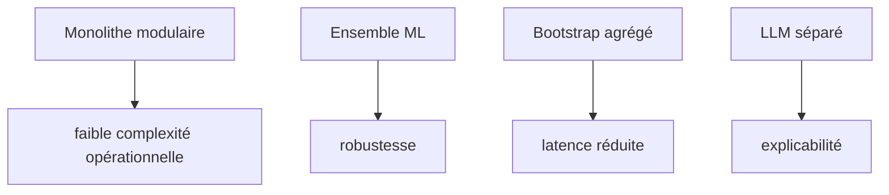
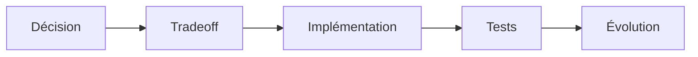

# 17. Décisions architecturales

## 1. Introduction contextuelle

Cette section explicite les décisions qui structurent FixTrade: monolithe modulaire, ETL médallion, ensemble de modèles, bootstrap agrégé, sécurité minimale robuste, et services spécialisés optionnels. Le but est de formaliser le raisonnement de conception, pas seulement d’énumérer les choix.

## 2. Analyse du problème

Chaque décision répond à une tension:

- simplicité vs extensibilité;
- performance vs maintenabilité;
- cohérence vs spécialisation;
- immédiateté produit vs robustesse d’ingénierie.

L’architecture retenue n’est pas optimale dans un sens absolu. Elle est optimisée pour le contexte du projet.

## 3. Contraintes techniques et métier

Les décisions doivent respecter:

- disponibilité locale;
- isolation de la logique métier;
- support de données hétérogènes;
- capacité à expliquer les recommandations;
- coût d’exploitation raisonnable.

## 4. Justification des choix techniques

Les décisions clés sont:

- FastAPI plutôt qu’un framework plus monolithique;
- ports/adapters pour préserver le domaine;
- PostgreSQL + Redis pour la combinaison transaction/cache;
- React + Zustand pour un dashboard simple mais réactif;
- ensemble ML pour couvrir plusieurs régimes;
- LLM séparé pour l’explicabilité.

## 5. Alternatives possibles et rejetées

Les alternatives rejetées l’ont été pour des raisons de cohérence globale. Ce n’est pas parce qu’elles sont mauvaises, mais parce qu’elles augmenteraient la complexité sans résoudre le problème mieux que la solution retenue.

## 6. Implémentation détaillée

La décision la plus visible est l’agrégation partielle des signaux au niveau dashboard:

```python
return DashboardBootstrapResponse(
    historical_prices=[...],
    price_predictions=[...],
    sentiment=...,
    anomalies=[...],
    recommendation=...,
)
```

Autre décision: tolérance aux indisponibilités.

```python
except Exception:
    warnings.append("Sentiment signal temporarily unavailable")
```

## 7. Exemples de code réels

Use case:

```python
if portfolio is None:
    raise PortfolioNotFoundError(str(query.portfolio_id))
```

Middleware:

```python
app.add_middleware(SecurityHeadersMiddleware)
```

## 8. Diagrammes Mermaid obligatoires





## 9. Analyse des risques / échecs

Une architecture bien justifiée peut malgré tout devenir rigide si les décisions ne sont plus revisitées. Il faut donc réévaluer régulièrement les frontières entre services et la pertinence du bootstrap consolidé.

## 10. Optimisations possibles

- externalisation partielle de l’inférence;
- instrumentation par décision architecturale;
- versionnement explicite des choix;
- rationalisation des points de tolérance aux pannes.

## 11. Conclusion technique

Les décisions prises dans FixTrade sont globalement cohérentes. Elles privilégient la robustesse de développement et la clarté des responsabilités sur une sophistication d’architecture qui serait prématurée.

