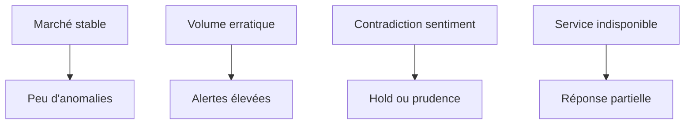
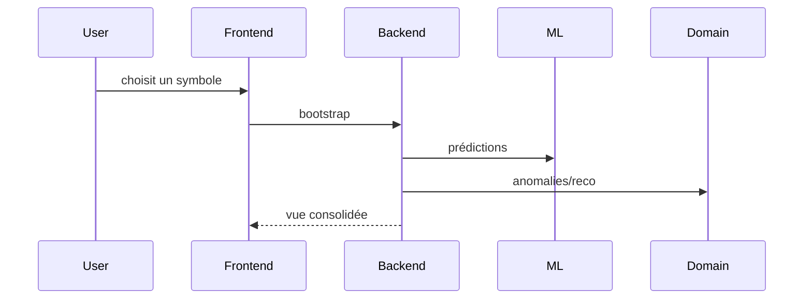

# 18. Scénarios réels et études de cas

## 1. Introduction contextuelle

Les scénarios réels servent à valider le comportement du système au-delà de la simple conformité fonctionnelle. Ils permettent de vérifier si l’architecture répond correctement à des situations plausibles: marché calme, rupture de volume, divergence sentiment/prix, portefeuille absent, ou modèle non disponible.

## 2. Analyse du problème

Un système de décision n’est crédible que s’il peut être décrit dans des cas concrets. Les études de cas montrent comment les couches interagissent, quelles erreurs sont tolérées, et comment les signaux sont hiérarchisés.

## 3. Contraintes techniques et métier

Les cas d’usage doivent tenir compte de:

- la variation de liquidité entre symboles;
- les données manquantes;
- les anomalies historiques;
- les dégradations partielles de service;
- la nécessité d’une réponse lisible.

## 4. Justification des choix techniques

Le bootstrap dashboard est particulièrement bien adapté aux scénarios réels, car il expose en une seule réponse le prix, la prévision, le sentiment, les anomalies et la recommandation. Cela correspond à la manière dont un utilisateur raisonne en pratique.

## 5. Alternatives possibles et rejetées

Des écrans isolés par sous-signal auraient permis plus de granularité, mais auraient imposé davantage de navigation et moins de contexte. Dans une logique de décision, c’est une régression.

## 6. Implémentation détaillée

Cas 1: titre liquide avec tendance nette. Le système doit produire une prévision stable, un sentiment cohérent et peu d’anomalies. La recommandation peut être constructive si le portefeuille est aligné.

Cas 2: titre peu liquide avec volume erratique. Le moteur d’anomalie doit remonter des alertes plus précoces, et la recommandation doit être plus prudente.

Cas 3: contradiction forte. Si la prédiction monte mais que le sentiment est négatif et que l’activité de marché est instable, le moteur décisionnel doit privilégier le risque.

Cas 4: portefeuille absent. Le dashboard doit continuer à fonctionner, mais la recommandation doit être dégradée ou masquée proprement.

## 7. Exemples de code réels

Scenario dashboard:

```python
try:
    recommendation_result = recommendation_use_case.execute(...)
except PortfolioNotFoundError:
    warnings.append("Default portfolio not found; recommendation unavailable")
```

Scenario inference:

```python
except Exception:
    results.append(PredictionResult(..., model_name="fallback"))
```

## 8. Diagrammes Mermaid obligatoires





## 9. Analyse des risques / échecs

Les études de cas montrent que le risque n’est pas toujours l’erreur complète; il s’agit souvent d’une réponse partielle mais trompeusement rassurante. D’où la nécessité de warnings explicites et d’une présentation visuelle rigoureuse.

## 10. Optimisations possibles

- scénarios de backtesting systématiques;
- mesures de stabilité par régime;
- journalisation des divergences de signaux;
- alertes sur la qualité de réponse partielle.

## 11. Conclusion technique

Les scénarios réels démontrent la cohérence de l’architecture dans des conditions plausibles. Ils servent aussi à révéler la limite fondamentale de tout système décisionnel: il produit des signaux, pas des certitudes.

