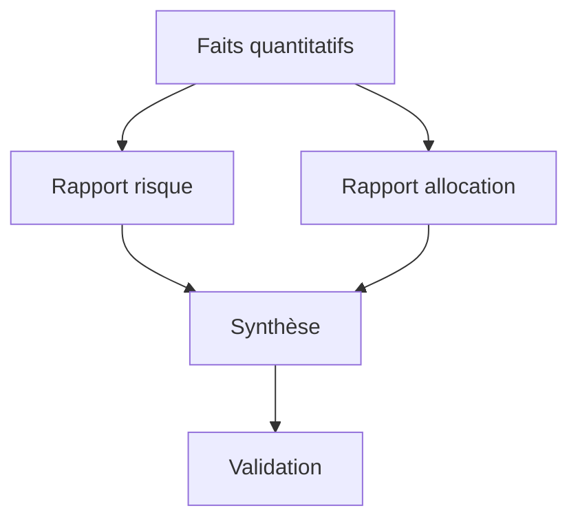
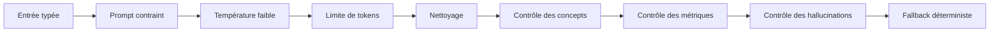

# 19. Prompt engineering et sécurisation de l’IA générative

## 1. Objectif

Cette annexe détaille la méthode utilisée pour concevoir et contrôler les prompts de FixTrade. Dans une application financière, le prompt engineering ne consiste pas à demander au modèle « d’être intelligent ». Il consiste à définir précisément son rôle, ses sources autorisées, les concepts attendus et les affirmations interdites.

## 2. Structure d’un prompt contrôlé

Le prompt de synthèse suit cinq blocs.

| Bloc | Fonction |
|---|---|
| Rôle | Définir le LLM comme rédacteur, pas comme décideur |
| Tâche | Expliquer le rendement, le risque et l’allocation |
| Faits | Fournir uniquement les métriques calculées |
| Contraintes négatives | Interdire les informations absentes |
| Format | Imposer une longueur et une mise en garde |

Extrait simplifié :

```text
RÔLE : rédacteur final d’un comité quantitatif.
TÂCHE : expliquer le portefeuille minimum-variance.
FAITS : rendement CAPM, volatilité, bêta, poids et liquidités.
INTERDICTIONS : aucun secteur, pays, dividende, perspective ou garantie.
FORMAT : un paragraphe de 80 à 130 mots avec mise en garde.
```

Cette structure réduit l’espace de liberté du modèle sans supprimer sa capacité à produire un texte naturel.

## 3. Grounding par fiche de faits

Le grounding consiste à relier la génération à une source contrôlée. FixTrade construit une fiche compacte depuis l’objet `PortfolioOptimizationResponse`. Le texte utilisateur libre n’est pas utilisé comme source financière.

Soit l’ensemble des faits autorisés :

\[
F = \{R_p,\sigma_p,\beta_p,R_f,\pi_m,w_1,\ldots,w_n,C\}
\]

avec :

- \(R_p\) : rendement attendu du portefeuille selon le CAPM ;
- \(\sigma_p\) : volatilité annualisée ;
- \(\beta_p\) : bêta du portefeuille ;
- \(R_f\) : taux sans risque ;
- \(\pi_m\) : prime de risque du marché ;
- \(w_i\) : poids du titre \(i\) ;
- \(C\) : liquidités résiduelles.

Une explication acceptable doit rester une transformation linguistique de \(F\), et non un enrichissement par des connaissances supposées.

## 4. Décomposition multi-agent

La décomposition réduit la charge cognitive du prompt final :



L’agent risque ne traite pas la composition détaillée. L’agent allocation ne réinterprète pas le CAPM. Cette spécialisation diminue les risques de mélange conceptuel.

## 5. Paramètres de génération

Une température faible de 0,2 est utilisée pour favoriser la stabilité. Une température élevée augmenterait la diversité stylistique, mais aussi la probabilité d’ajouter des formulations non supportées.

La sortie est limitée à 220 tokens. Cette limite :

- réduit la latence et le coût ;
- décourage les digressions ;
- facilite la validation ;
- correspond à la taille attendue dans le dashboard.

Le nettoyage post-génération gère le cas où la dernière phrase serait tronquée.

## 6. Validation en défense en profondeur

La sécurité suit plusieurs barrières successives.



### 6.1 Entrée typée

Les données proviennent de schémas Pydantic. Le modèle reçoit des nombres calculés par le backend, pas des valeurs financières inventées par l’utilisateur.

### 6.2 Contrôle des concepts

Le texte doit couvrir le CAPM, le risque ou la volatilité, le bêta et une mise en garde.

### 6.3 Contrôle des valeurs

Les pourcentages sont extraits par expression régulière puis comparés aux valeurs autorisées avec une tolérance de 0,11 point. Cette tolérance absorbe l’arrondi d’affichage sans permettre une nouvelle valeur arbitraire.

### 6.4 Contrôle lexical

Les affirmations relatives à un secteur, une géographie, un dividende ou une garantie sont rejetées lorsqu’aucune donnée correspondante n’a été fournie.

### 6.5 Repli déterministe

Un rejet n’empêche pas la réponse API. Le système utilise une explication calculée par gabarit, ce qui garantit la continuité fonctionnelle.

## 7. Menaces considérées

| Menace | Exemple | Réponse du système |
|---|---|---|
| Hallucination numérique | « rendement de 18,2 % » | Liste blanche des pourcentages |
| Confusion sémantique | poids de 35 % présenté comme rendement | Instruction explicite et validation |
| Affirmation externe | « entreprise leader de son secteur » | Termes non supportés rejetés |
| Réponse creuse | « portefeuille bien diversifié » | Concepts et métriques obligatoires |
| Fournisseur indisponible | timeout ou erreur HTTP | LM Studio puis fallback |
| Clé invalide | HTTP 401/403 | Désactivation temporaire d’OpenRouter |
| Sortie tronquée | phrase interrompue | Nettoyage à la dernière ponctuation |

## 8. Prompt injection

Le risque de prompt injection est réduit parce que le flux de portefeuille n’insère pas de texte utilisateur libre dans le prompt. Les valeurs viennent de champs typés et de données calculées.

Si de futurs modules injectent des actualités ou des documents externes, ceux-ci devront être considérés comme des données non fiables. Il faudra alors :

- délimiter clairement le contenu récupéré ;
- interdire l’exécution d’instructions présentes dans les documents ;
- filtrer les secrets et données personnelles ;
- appliquer une validation de sortie structurée ;
- journaliser la provenance documentaire.

## 9. Confidentialité

Le recours à LM Studio permet d’effectuer la génération sur la machine locale. Aucune clé API n’est alors nécessaire et les métriques ne quittent pas l’environnement d’exécution.

OpenRouter reste utile pour accéder à un modèle plus puissant ou faciliter la démonstration. Les secrets sont lus depuis l’environnement et ne doivent jamais être placés dans le code, les prompts, les logs ou le dépôt Git.

## 10. Évaluation recommandée

Un protocole d’évaluation peut utiliser les indicateurs suivants :

| Indicateur | Définition |
|---|---|
| Taux d’acceptation | réponses LLM validées / réponses générées |
| Fidélité numérique | nombres corrects / nombres cités |
| Couverture conceptuelle | concepts obligatoires présents |
| Taux d’hallucination | réponses contenant une affirmation non supportée |
| Latence P50/P95 | temps médian et percentile 95 |
| Disponibilité | réponses produites malgré une panne fournisseur |
| Préférence humaine | textes jugés plus clairs par un panel |

La disponibilité fonctionnelle attendue reste élevée grâce au fallback, même si la disponibilité du LLM externe est plus faible.

## 11. Limites et perspectives

Le contrôle lexical actuel peut produire des faux positifs et manquer une hallucination formulée indirectement. Une évolution robuste consisterait à demander d’abord une sortie JSON :

```json
{
  "risk_interpretation": "...",
  "return_interpretation": "...",
  "allocation_interpretation": "...",
  "warning": "..."
}
```

Chaque champ pourrait être validé avant une seconde étape de rédaction. Une autre piste serait d’extraire toutes les affirmations du texte et de vérifier automatiquement si chacune est supportée par la fiche de faits.

## 12. Conclusion

Le prompt engineering de FixTrade constitue un mécanisme de contrôle, et non une simple optimisation stylistique. La combinaison d’un contexte fermé, de rôles spécialisés, de paramètres conservateurs, d’une validation post-génération et d’un fallback déterministe réduit fortement la dépendance à la bonne volonté du modèle.

Cette défense en profondeur est particulièrement adaptée à la finance, où la précision et la traçabilité doivent primer sur la créativité.
