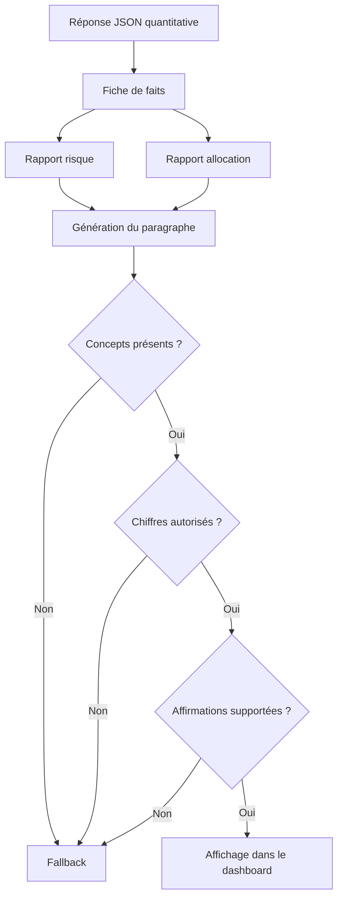

# 20. Étude de cas : génération d’une explication de portefeuille

## 1. Présentation du scénario

Cette étude de cas illustre le fonctionnement du module GenAI sur une optimisation réelle produite par FixTrade le 25 juin 2026.

Les paramètres demandés sont :

| Paramètre | Valeur |
|---|---:|
| Profil | Modéré |
| Nombre de sociétés | 5 |
| Capital | 5 000 TND |
| Méthode | Portefeuille de variance minimale contraint |

Le but de cette section n’est pas d’évaluer la pertinence économique future des titres, mais de montrer comment le système transforme une réponse quantitative en explication contrôlée.

## 2. Résultats quantitatifs

L’optimiseur a produit l’allocation suivante :

| Titre | Poids | Actions | Montant investi | Bêta | Rendement CAPM |
|---|---:|---:|---:|---:|---:|
| CEREALIS | 35,18 % | 132 | 1 755,60 TND | 0,58 | 9,08 % |
| ASS MULTI ITTIHAD | 18,59 % | 491 | 927,99 TND | 0,62 | 9,21 % |
| TUNISIE LEASING | 17,42 % | 44 | 866,80 TND | 1,39 | 11,98 % |
| SOPAT | 15,44 % | 376 | 770,80 TND | 0,66 | 9,34 % |
| BH | 13,37 % | 72 | 661,68 TND | 1,80 | 13,44 % |

Les métriques agrégées sont :

| Métrique | Valeur |
|---|---:|
| Rendement attendu CAPM | 10,23 % |
| Volatilité annualisée estimée | 5,53 % |
| Bêta portefeuille | 0,91 |
| Taux sans risque configuré | 7,00 % |
| Prime de marché estimée | 3,57 % |
| Capital investi | 4 982,87 TND |
| Liquidités restantes | 17,13 TND |

## 3. Fiche de faits transmise

Avant l’appel au modèle, les objets Python sont réduits à une fiche de faits similaire à celle-ci :

```text
Profil=neutre;
pondérations (ce ne sont pas des rendements)=
CEREALIS 35%, ASS MULTI ITTIHAD 19%, TUNISIE LEASING 17%,
SOPAT 15%, BH 13%;
rendement attendu CAPM=10.23%;
volatilité annualisée=5.53%;
bêta portefeuille=0.905;
taux sans risque=7.00%;
prime de risque marché=3.57%;
montant investi=4982.87 TND;
liquidités=17.13 TND.
```

Cette représentation est volontairement compacte. Elle ne contient ni description sectorielle, ni actualité, ni jugement qualitatif sur les entreprises.

## 4. Rapports des agents spécialisés

### 4.1 Rapport de risque

Le rapport déterministe peut être résumé ainsi :

- la volatilité annualisée estimée est de 5,53 % ;
- le bêta de 0,905 traduit une sensibilité proche de celle du marché de référence ;
- le rendement CAPM de 10,23 % dépasse le taux sans risque de 3,23 points ;
- l’objectif du PVM est la réduction de variance, non la maximisation du rendement.

### 4.2 Rapport d’allocation

Le second agent constate :

- cinq titres sont retenus ;
- CEREALIS constitue la première ligne avec 35,18 % ;
- les deux premières lignes représentent environ 53,77 % ;
- aucune position ne dépasse la borne de 45 % ;
- 0,34 % du capital reste sous forme de liquidités après arrondi.

## 5. Texte final produit

L’explication renvoyée est :

> Le PVM correspond au profil neutre : sa volatilité annualisée estimée est de 5,5 % et son bêta de 0,91 le rend presque aussi sensible que le marché de référence ; cela ne supprime pas le risque propre aux titres. Le rendement attendu selon le CAPM est de 10,2 %, soit 3,2 points de pourcentage de plus que le taux sans risque de 7,0 %. La concentration reste maîtrisée sur cinq titres ; CEREALIS est la première ligne avec 35,2 % et les deux principales positions totalisent 53,8 %. Ces poids résultent de l’optimisation conjointe des variances et covariances, pas d’une prévision sur les entreprises. 4 982,87 TND sont investis et 17,13 TND restent disponibles après l’arrondi des quantités. Simulation indicative, pas un conseil financier.

La source associée est `multi_agent`, ce qui indique une synthèse fondée sur les rapports spécialisés et soumise au contrôle qualité.

## 6. Vérification automatique

Le validateur applique les contrôles suivants :

| Contrôle | Observation | Résultat |
|---|---|---|
| Longueur minimale | Plus de 55 mots | Accepté |
| CAPM présent | 10,2 % | Accepté |
| Volatilité présente | 5,5 % | Accepté |
| Bêta présent | 0,91 | Accepté |
| Allocation discutée | Concentration et deux premières lignes | Accepté |
| Mise en garde | « pas un conseil financier » | Accepté |
| Pourcentages inventés | Aucun | Accepté |
| Secteur/pays/dividende inventé | Aucun | Accepté |



## 7. Apport de l’IA générative

La réponse JSON contient davantage de précision, mais l’explication apporte trois éléments utiles :

1. Elle interprète le bêta au lieu de simplement l’afficher.
2. Elle relie le rendement CAPM au taux sans risque.
3. Elle attire l’attention sur la concentration sans prétendre prévoir les entreprises.

L’IA générative agit donc comme un traducteur entre le langage mathématique du moteur et le langage décisionnel de l’utilisateur.

## 8. Analyse critique

L’explication est cohérente avec les données fournies, mais plusieurs précautions sont nécessaires.

Premièrement, le rendement CAPM est une estimation conditionnelle au taux sans risque, au bêta et au rendement du marché utilisés. Il ne s’agit pas d’une prévision garantie.

Deuxièmement, une volatilité estimée faible ne signifie pas absence de risque. Elle dépend de la fenêtre historique, de l’alignement des séances et de l’estimation de covariance.

Troisièmement, qualifier la concentration de « maîtrisée » signifie uniquement que les bornes de l’optimiseur sont respectées. Avec 35,18 % sur un titre et 53,77 % sur les deux premiers, l’utilisateur reste exposé à un risque de concentration significatif.

Cette distinction montre pourquoi le texte généré doit être accompagné des tableaux et métriques sources.

## 9. Comparaison avec une génération non contrôlée

Une génération non contrainte pourrait produire :

> CEREALIS est une société défensive de grande qualité qui protégera le portefeuille en cas de baisse du marché.

Cette phrase serait rejetée pour plusieurs raisons :

- aucune donnée de qualité fondamentale n’est fournie ;
- aucun secteur défensif n’est établi ;
- le bêta inférieur à 1 ne garantit pas une protection ;
- la formulation transforme une estimation statistique en promesse.

La version contrôlée se limite au fait vérifiable : un bêta de 0,58 pour le titre et de 0,91 pour le portefeuille indique une sensibilité historique estimée, sans supprimer le risque de perte.

## 10. Reproductibilité

Pour reproduire le scénario :

1. démarrer PostgreSQL et l’API FixTrade ;
2. vérifier que l’historique BVMT est chargé ;
3. configurer éventuellement OpenRouter ou LM Studio ;
4. appeler `POST /api/v1/portfolio/optimize` avec :

```json
{
  "risk_profile": "moderate",
  "company_count": 5,
  "investment_amount": 5000
}
```

Le résultat exact peut évoluer avec les données de marché, le taux sans risque configuré et la fenêtre historique. La structure du pipeline de génération et les règles de validation restent toutefois identiques.

## 11. Conclusion

Cette étude de cas montre qu’une explication GenAI utile ne doit pas être évaluée uniquement sur sa fluidité. Elle doit être reliée aux données, contrôlée numériquement, accompagnée d’une provenance et remplaçable par un mécanisme déterministe.

Dans FixTrade, la valeur du LLM réside dans la synthèse. La valeur de confiance provient du moteur quantitatif, des règles de validation et de la transparence de l’interface.
