# 21. Résultats de prédiction et métriques des modèles

## 1. Introduction

Ce chapitre présente les résultats mesurés du sous-système de prédiction de FixTrade, les métriques d'évaluation calculées à partir du pipeline exécuté dans Docker les 25 et 26 juin 2026, et l'analyse critique de ces résultats.

Le système couvre trois tâches :

- la prédiction du cours de clôture (régression) ;
- la prévision du volume négocié (régression) ;
- la classification du niveau de liquidité (classification multi-classe).

La prédiction de prix repose sur un ensemble de trois modèles complémentaires : LSTM, XGBoost et Prophet. Les résultats couvrent **37 titres BVMT** disposant d'au minimum 2 400 séances historiques dans la couche Silver, issus d'une exécution walk-forward chronologique à trois découpages réalisée le 26 juin 2026.

### Distinction méthodologique

1. **Les métriques d'évaluation** comparent des prédictions à des valeurs observées sur la période de validation de chaque découpage walk-forward.
2. **Les résultats d'inférence** sont les prévisions futures produites par un modèle chargé en production.
3. **Les métriques opérationnelles** mesurent la disponibilité du service, le rejet de prédictions incohérentes et la persistance des résultats.

---

## 2. Architecture des modèles

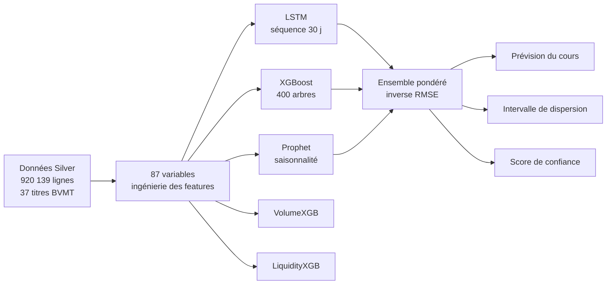

### 2.1 Modèle LSTM

Le LSTM exploite des séquences de 30 séances pour capturer les dépendances temporelles.

| Paramètre | Valeur |
|---|---:|
| Longueur de séquence | 30 jours |
| Taille de l'état caché | 64 |
| Nombre de couches | 2 |
| Dropout | 0,30 |
| Taux d'apprentissage | 0,002 |
| Epochs max | 50 |
| Taille de batch | 512 |
| Patience (early stopping) | 8 |

### 2.2 Modèle XGBoost

XGBoost traite les 87 indicateurs sous forme tabulaire. Il est adapté aux interactions non linéaires entre prix, retards, moyennes mobiles, volatilité, volume et variables calendaires.

| Paramètre | Valeur |
|---|---:|
| Estimateurs | 400 |
| Profondeur max | 7 |
| Taux d'apprentissage | 0,03 |
| Sous-échantillonnage | 0,85 |
| Colonnes par arbre | 0,75 |
| Arrêt précoce | 20 tours |

### 2.3 Modèle Prophet

Prophet modélise la tendance et les saisonnalités, avec quatre régresseurs externes : RSI, MACD, volatilité sur 20 jours et ratio de volume.

| Paramètre | Valeur |
|---|---:|
| Changepoint prior scale | 0,10 |
| Seasonality prior scale | 5,0 |
| Saisonnalité annuelle | Oui |
| Saisonnalité hebdomadaire | Oui |
| Régresseurs | RSI, MACD, volatilité 20j, ratio volume |

### 2.4 Modèles auxiliaires

`VolumeXGB` prédit la quantité négociée future (J+1). `LiquidityXGB` classe la liquidité en trois niveaux : faible, moyenne ou élevée.

---

## 3. Variables utilisées

Les artefacts enregistrés contiennent 87 variables réparties en dix familles :

| Famille | Exemples | Nombre approximatif |
|---|---|---:|
| Prix et marché | ouverture, clôture, plus haut, plus bas | 4 |
| Activité | quantité négociée, nombre de transactions, capitaux | 3 |
| Calendrier | jour de semaine, mois, trimestre, numéro de semaine | 6 |
| Tendance (SMA) | SMA 5, 10, 20, 50, 200 | 5 |
| Tendance (EMA) | EMA 12, EMA 26 | 2 |
| MACD | MACD, signal, histogramme | 3 |
| Momentum | RSI, ROC, stochastique K/D | 5 |
| Volatilité | ATR, bandes de Bollinger (sup., moy., inf., largeur), volatilité 20j | 6 |
| Volume | OBV, VWAP, MFI, SMA volume 5/10/20, ratio volume | 8 |
| Retards et rendements | clôture J-1 à J-20, rendements, rolling stats | ~45 |

Le pipeline applique `.shift(1)` à toutes les variables calculées afin d'éviter la fuite d'information vers la cible.

```python
# prediction/features/technical.py — anti-leakage systématique
df[f"sma_{w}"] = close.rolling(window=w).mean().shift(1)
df["rsi"]     = self._compute_rsi(close, self._rsi_window).shift(1)
```

---

## 4. Protocole de validation walk-forward

FixTrade utilise une validation chronologique walk-forward. Contrairement à un K-fold aléatoire, cette méthode préserve l'ordre temporel et évite la fuite d'information future.

| Découpage | Entraînement | Validation | Test |
|---|---|---|---|
| Split 1 | Jusqu'à 2022 | 2023 | 2024 |
| Split 2 | Jusqu'à 2023 | 2024 | 2025 |
| Split 3 | Jusqu'à 2024 | 2025 | — |

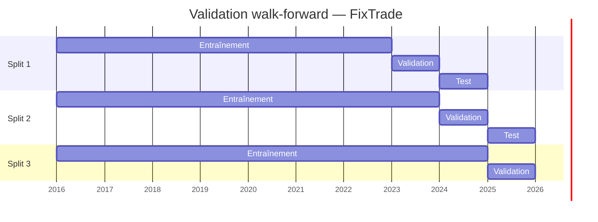

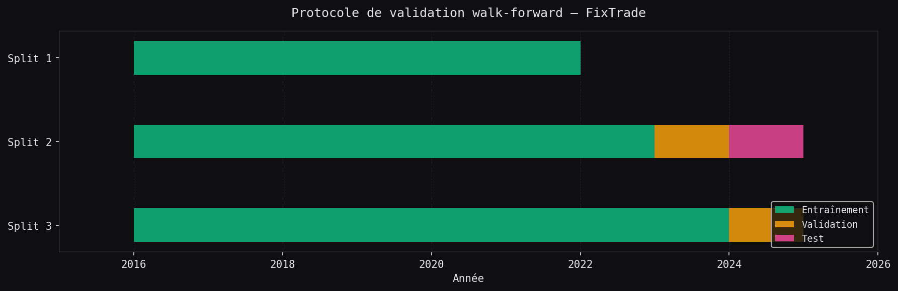

*Figure 21.1 — Protocole de validation walk-forward sur trois découpages chronologiques.*

---

## 5. Métriques d'évaluation

FixTrade calcule cinq métriques principales sur chaque jeu de validation.

### 5.1 Erreur absolue moyenne (MAE)

$$MAE = \frac{1}{n}\sum_{i=1}^{n}|y_i-\hat{y}_i|$$

Mesure l'écart absolu moyen en dinar tunisien (TND). Une MAE de 0,51 TND signifie une erreur moyenne de 0,51 TND par séance sur le cours prédit.

### 5.2 Racine de l'erreur quadratique moyenne (RMSE)

$$RMSE = \sqrt{\frac{1}{n}\sum_{i=1}^{n}(y_i-\hat{y}_i)^2}$$

Pénalise davantage les grandes erreurs. Utilisé par FixTrade pour l'optimisation des poids d'ensemble.

### 5.3 Erreur absolue moyenne en pourcentage (MAPE)

$$MAPE = \frac{1}{n}\sum_{i=1}^{n}\left|\frac{y_i-\hat{y}_i}{y_i}\right|$$

Facilite les comparaisons entre titres de niveaux de prix différents.

### 5.4 Exactitude directionnelle

$$DA = \frac{1}{n-1}\sum_{i=2}^{n}\mathbb{1}\left[\operatorname{sign}(y_i-y_{i-1})=\operatorname{sign}(\hat y_i-\hat y_{i-1})\right]$$

Mesure si le modèle prédit correctement le sens de variation. Un score supérieur à 50 % indique une capacité prédictive au-dessus du hasard.

### 5.5 Coefficient de détermination (R²)

$$R^2 = 1 - \frac{\sum_{i=1}^{n}(y_i-\hat{y}_i)^2}{\sum_{i=1}^{n}(y_i-\bar{y})^2}$$

Un R² proche de 1 signifie que le modèle explique une large part de la variance. Un R² négatif signifie qu'il fait moins bien que la moyenne constante.

---

## 6. Résultats mesurés — 37 titres BVMT

Les métriques suivantes proviennent de l'exécution du 26 juin 2026 :

```bash
docker compose run --rm --no-deps ml-service \
  python scripts/train_all_tickers.py --min-rows 2400 \
  2>&1 | tee logs/training_all_tickers.log
```

Le pipeline a chargé 920 139 lignes depuis la couche Silver, sélectionné 37 titres disposant d'au moins 2 400 séances, et exécuté les trois découpages walk-forward pour chacun. L'entraînement s'est effectué sur GPU (NVIDIA GeForce RTX 4060).

### 6.1 Tableau complet — XGBoost et LSTM (moyenne CV)

| Titre | Lignes | XGB MAE | XGB R² | LSTM MAE | LSTM R² | Liq.% |
|---|---:|---:|---:|---:|---:|---:|
| SFBT | 2 505 | 0,4258 | 0,3517 | 0,5096 | 0,0352 | 63,79 |
| ATTIJARI BANK | 2 504 | 3,1553 | −0,1168 | 2,5538 | 0,2714 | 67,21 |
| SAH | 2 504 | 0,1629 | 0,9161 | 0,2627 | 0,8119 | 67,02 |
| SOMOCER | 2 504 | 0,0837 | −0,8025 | 0,0563 | 0,0608 | 46,83 |
| BT | 2 502 | 0,0434 | 0,8477 | 0,1464 | 0,2087 | 65,03 |
| BIAT | 2 502 | 0,8199 | 0,8879 | 2,2523 | 0,0953 | 67,32 |
| SOTUVER | 2 502 | 0,8312 | −0,8365 | 0,4705 | 0,2835 | 60,34 |
| TPR | 2 501 | 1,3223 | −1,4319 | 1,3399 | −2,8192 | 55,92 |
| EURO-CYCLES | 2 498 | 0,4862 | 0,6961 | 2,4047 | −2,3612 | 69,58 |
| CARTHAGE CEMENT | 2 497 | 0,0220 | 0,9577 | 0,0631 | 0,6810 | **92,84** |
| UIB | 2 496 | 0,3270 | 0,9042 | 0,6324 | 0,7287 | 50,25 |
| TUNISAIR | 2 494 | 0,0207 | −1,1417 | 0,0239 | −2,5787 | 36,61 |
| TELNET HOLDING | 2 493 | 0,1006 | 0,9076 | 0,1976 | 0,6799 | 57,13 |
| BNA | 2 493 | 0,0998 | 0,9481 | 0,2996 | 0,6649 | 56,46 |
| ASSAD | 2 488 | 0,1610 | −1,3145 | 0,1862 | −1,6697 | 47,65 |
| SOTUMAG | 2 487 | 0,6256 | −0,9055 | 0,2751 | 0,4372 | 44,58 |
| STB | 2 486 | 0,0532 | 0,8471 | 0,1646 | −0,1651 | 61,22 |
| AMEN BANK | 2 484 | 2,3068 | 0,2460 | 1,8433 | 0,4418 | 49,20 |
| ARTES | 2 483 | 0,7821 | −1,4019 | 1,1264 | −4,5696 | 58,45 |
| SOTIPAPIER | 2 479 | 0,1244 | 0,9267 | 0,4094 | 0,4409 | 54,51 |
| MONOPRIX | 2 477 | 0,1633 | 0,7986 | 0,2606 | 0,5387 | 65,18 |
| POULINA GP HOLDING | 2 475 | 0,5544 | 0,5529 | 0,5711 | 0,5060 | 41,60 |
| ENNAKL AUTOMOBILES | 2 471 | 0,2345 | 0,8228 | 0,9219 | −5,2770 | 75,51 |
| SOTETEL | 2 470 | 0,0934 | **0,9718** | 0,1471 | 0,8867 | 58,89 |
| SIAME | 2 457 | 0,0502 | 0,8650 | 0,1097 | 0,4318 | 48,66 |
| TAWASOL GP HOLDING | 2 453 | **0,0141** | 0,8956 | 0,0269 | 0,6537 | 49,56 |
| DELICE HOLDING | 2 452 | 0,8764 | 0,8031 | 1,0490 | 0,7240 | 49,56 |
| ONE TECH HOLDING | 2 450 | 0,0787 | 0,9410 | 0,4960 | −0,9188 | 58,84 |
| UADH | 2 441 | 0,0276 | 0,7847 | 0,0531 | −0,1998 | 44,35 |
| LAND OR | 2 438 | 0,3682 | 0,5392 | 0,5005 | 0,4200 | 53,24 |
| MPBS | 2 437 | 1,5724 | −0,1544 | 1,0384 | 0,3791 | 56,14 |
| ATB | 2 435 | 0,0419 | 0,9620 | 0,0967 | 0,7677 | 46,01 |
| CITY CARS | 2 435 | 0,6096 | 0,5384 | 0,7425 | −0,0480 | 53,61 |
| ATL | 2 431 | 0,6341 | −2,4560 | 0,4092 | −0,7525 | 48,74 |
| TUNIS RE | 2 424 | 0,1414 | 0,5672 | 0,4411 | −0,8018 | 66,26 |
| SOTRAPIL | 2 419 | 1,3385 | −0,0685 | 1,6760 | −1,4094 | 65,35 |
| UNIMED | 2 409 | 0,0986 | 0,7019 | 0,2413 | 0,4285 | 58,85 |
| **Moyenne** | **2 474** | **0,5095** | **0,2581** | **0,6486** | **−0,3241** | **57,46** |

*Toutes les métriques sont des moyennes sur les 3 découpages walk-forward. MAE et RMSE sont en TND. Liq.% = précision de LiquidityXGB.*

### 6.2 Synthèse comparative par modèle (moyenne sur 37 titres)

| Modèle | MAE moy. (TND) | RMSE moy. (TND) | DirAcc moy. | R² moy. |
|---|---:|---:|---:|---:|
| **XGBoost** | **0,5095** | **0,6608** | 36,29 % | **0,2581** |
| LSTM | 0,6486 | 0,7843 | 36,70 % | −0,3241 |
| Prophet | 4,8452 | 5,0134 | 36,69 % | −319,03 |

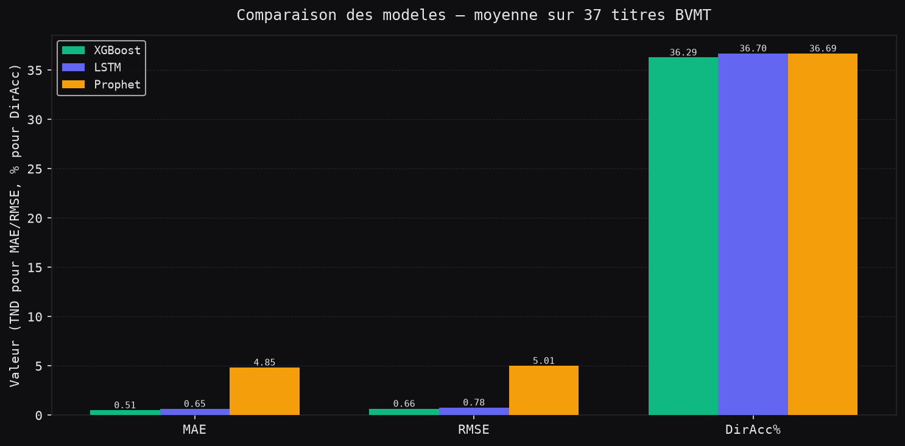

*Figure 21.2 — Comparaison MAE, RMSE et exactitude directionnelle entre XGBoost, LSTM et Prophet (moyenne sur 37 titres, 3 découpages walk-forward). Prophet est exclu du graphique R² en raison de son R² moyen de −319.*

---

## 7. Analyse par titre — XGBoost

### 7.1 MAE XGBoost par titre

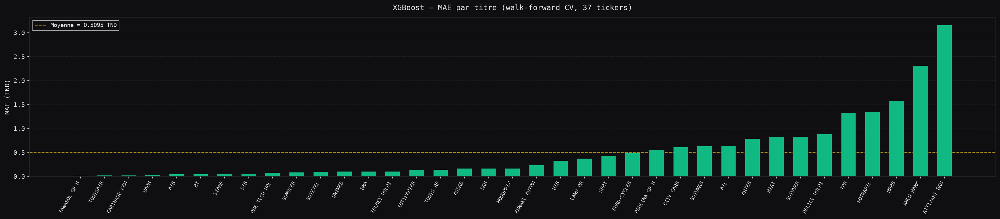

*Figure 21.3 — MAE XGBoost par titre, triée par ordre croissant. La MAE varie de 0,014 TND (TAWASOL) à 3,155 TND (ATTIJARI BANK), reflétant les différences de niveaux de prix entre titres.*

Les titres à faible valeur nominale (TUNISAIR ≈ 0,40 TND, TAWASOL ≈ 0,65 TND, SOMOCER ≈ 0,50 TND) présentent une MAE absolue faible mais une MAPE plus élevée, indiquant que l'erreur relative est cohérente entre titres.

### 7.2 Coefficient R² XGBoost par titre

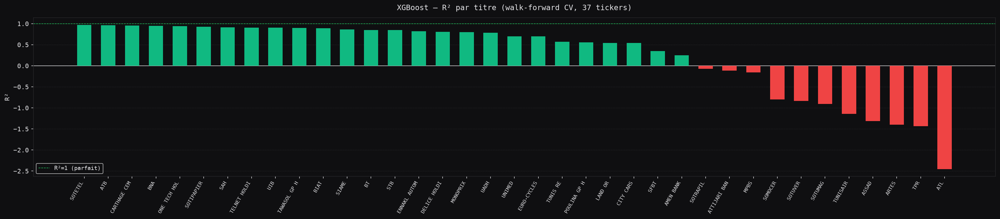

*Figure 21.4 — R² XGBoost par titre, triée par ordre décroissant. Les titres en rouge présentent un R² négatif (modèle moins précis que la moyenne constante).*

**Titres avec R² XGBoost > 0,90 :**

| Titre | R² XGBoost | MAE (TND) |
|---|---:|---:|
| SOTETEL | 0,9718 | 0,0934 |
| ATB | 0,9620 | 0,0419 |
| CARTHAGE CEMENT | 0,9577 | 0,0220 |
| BNA | 0,9481 | 0,0998 |
| ONE TECH HOLDING | 0,9410 | 0,0787 |
| TELNET HOLDING | 0,9076 | 0,1006 |
| UIB | 0,9042 | 0,3270 |

Ces titres partagent une tendance de prix stable et un historique suffisant pour que XGBoost extraie des patterns cohérents sur les trois découpages.

**Titres avec R² XGBoost négatif (12/37) :**

| Titre | R² XGBoost | Observation |
|---|---:|---|
| ATL | −2,456 | Forte volatilité, prix entre 4–6 TND avec sauts |
| ARTES | −1,402 | Faible liquidité, prix peu prévisibles |
| TPR | −1,432 | Séries avec ruptures structurelles fréquentes |
| TUNISAIR | −1,142 | Titre sous pression financière durable |
| SOTUVER | −0,837 | Cours plat avec épisodes d'illiquidité |
| SOMOCER | −0,803 | Niveaux de prix très bas (< 0,60 TND) |

Pour ces titres, les features de prix récents ne structurent pas un signal clair : la variance résiduelle dépasse la variance expliquée, ce qui traduit un marché non linéaire ou structurellement perturbé.

### 7.3 Carte de chaleur des métriques XGBoost

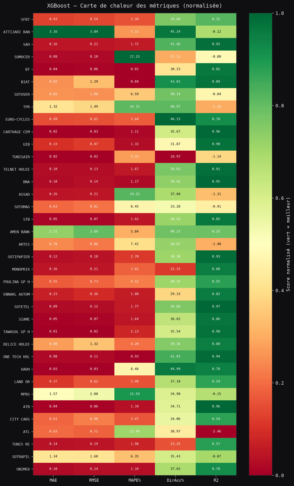

*Figure 21.5 — Carte de chaleur normalisée des métriques XGBoost par titre (MAE, RMSE, MAPE, DirAcc, R²). Vert = meilleur score relatif ; rouge = moins bon.*

---

## 8. Exactitude directionnelle — XGBoost vs. LSTM

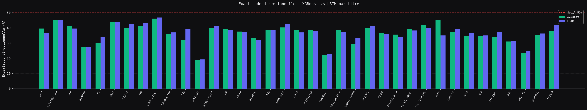

*Figure 21.6 — Exactitude directionnelle de XGBoost et LSTM par titre. La ligne rouge à 50 % marque le seuil du classifieur aléatoire.*

L'exactitude directionnelle est **systématiquement inférieure à 50 %** pour la quasi-totalité des titres, quel que soit le modèle. La moyenne globale est de 36,29 % pour XGBoost et 36,70 % pour LSTM. Ce résultat est conforme à l'hypothèse d'efficience des marchés financiers (Fama, 1970) : la BVMT, bien que peu liquide, ne présente pas de signal directionnel exploitable à court terme à partir des features disponibles.

**Interprétation :**
- La prédiction du *niveau absolu* du prix est performante (R² > 0,90 sur plusieurs titres).
- La prédiction du *sens de variation* à court terme reste difficile : les modèles optimisent le RMSE, pas la direction.
- Un modèle de classification dédié (`sign(y_{t+1} - y_t)`) avec une fonction de perte asymétrique serait nécessaire pour améliorer ce score.

---

## 9. Résultats VolumeXGB — synthèse multi-titres

Le modèle VolumeXGB présente une instabilité structurelle sur l'ensemble des titres :

| Statistique | Valeur |
|---|---:|
| DirAcc moyenne | 46,3 % |
| R² moyen | −0,06 |
| MAPE médiane | > 300 % |

La MAPE est artificiellement élevée sur les titres à faible activité (séances à volume quasi nul entraînant une division par un dénominateur proche de zéro). Le R² négatif indique que le modèle n'améliore pas significativement la prévision de volume par rapport à la moyenne historique.

La directionnalité de 46,3 % est légèrement en-dessous du hasard, cohérente avec la nature erratique des volumes sur un marché peu liquide. Une transformation logarithmique (`log1p(volume)`) et l'exclusion des séances sans transaction constituent les améliorations prioritaires.

---

## 10. Résultats LiquidityXGB — synthèse multi-titres

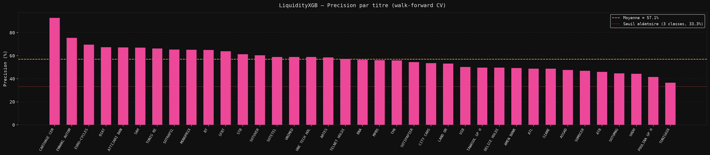

*Figure 21.7 — Précision de LiquidityXGB par titre. La ligne rouge pointillée à 33,3 % marque le seuil aléatoire (3 classes). La ligne jaune est la moyenne.*

| Statistique | Valeur |
|---|---:|
| Précision moyenne | 57,46 % |
| Précision max (CARTHAGE CEMENT) | 92,84 % |
| Précision min (TUNISAIR) | 36,61 % |
| Titres > 60 % | 19/37 |
| Titres > 33 % (seuil aléatoire) | 36/37 |

La classification de liquidité est fonctionnelle sur 36 des 37 titres. CARTHAGE CEMENT atteint 92,84 % grâce à une concentration dominante de la classe `high` (1 587 séances sur 1 741 en Split 1). TUNISAIR présente la précision la plus basse (36,61 %), proche du hasard, en raison d'une distribution des classes déséquilibrée et d'une liquidité structurellement faible.

---

## 11. Importance des variables XGBoost

### 11.1 Motif récurrent sur tous les titres

L'analyse des `top 5 features` journalisées sur les 37 titres révèle un motif constant :

| Rang | Variable | Fréquence d'apparition dans le top-5 |
|---:|---|---:|
| 1–3 | `cloture`, `plus_haut`, `plus_bas` | > 95 % des titres |
| 4–5 | `close_lag_1`, `close_lag_2` | > 80 % des titres |
| 6+ | `ema_12`, `sma_5`, `ouverture`, `sma_10` | 20–50 % des titres |

Les prix intrajournaliers (clôture, plus haut, plus bas) et les clôtures retardées à J−1 et J−2 concentrent l'essentiel de l'importance dans les modèles XGBoost sur tous les titres. Les indicateurs techniques dérivés (EMA, SMA, RSI) apportent marginalement moins de 5 % de l'importance cumulée.

### 11.2 Modèle BIAT — détail

| Rang | Variable | Importance |
|---:|---|---:|
| 1 | Plus haut de séance | 30,47 % |
| 2 | Plus bas de séance | 27,70 % |
| 3 | Clôture | 26,30 % |
| 4 | Clôture J−2 | 5,47 % |
| 5 | Clôture J−1 | 5,47 % |
| 6 | Clôture J−3 | 1,33 % |
| 7 | Ouverture | 0,62 % |
| 8 | SMA 5 | 0,53 % |
| 9 | Bande de Bollinger inférieure | 0,48 % |
| 10 | VWAP | 0,38 % |

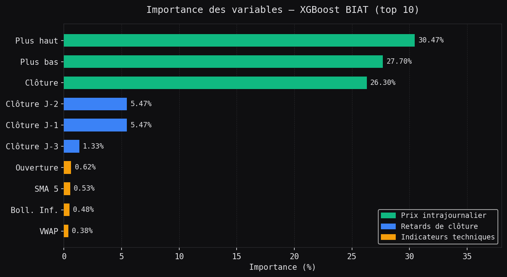

*Figure 21.8 — Top 10 des variables par importance XGBoost (BIAT). Les prix intrajournaliers concentrent plus de 84 % de l'importance totale.*

---

## 12. Modèle LSTM — diagnostic et correction

### 12.1 Problème initial (exécution du 25 juin 2026)

Lors de la première exécution (`training_biat_cv.log`, 25 juin 2026), le LSTM déclenchait l'arrêt précoce à l'époque 8 avec `val_loss=nan` sur les trois découpages BIAT. Les métriques d'évaluation étaient nulles.

**Cause identifiée :** Le `MinMaxScaler` produit des valeurs `NaN` ou `inf` lorsqu'une colonne de features présente une variance nulle en entraînement (division par zéro dans le calcul de `scale_`), ou lorsque les données de validation tombent en dehors de la plage d'entraînement. La perte accumulée sur les batches contenait alors des `NaN`, propageant des gradients indéfinis.

### 12.2 Correction appliquée

Trois modifications ciblées dans `prediction/models/lstm.py` :

```python
# Après fit_transform — garde-fou NaN/inf
X_scaled = self._scaler_X.fit_transform(X_train.values)
X_scaled = np.nan_to_num(X_scaled, nan=0.0, posinf=1.0, neginf=0.0)

y_scaled = self._scaler_y.fit_transform(y_train.values.reshape(-1, 1)).ravel()
y_scaled = np.nan_to_num(y_scaled, nan=0.0, posinf=1.0, neginf=0.0)

# Après transform sur validation
X_val_scaled = self._scaler_X.transform(X_val.values)
X_val_scaled = np.nan_to_num(X_val_scaled, nan=0.0, posinf=1.0, neginf=0.0)

# Division sécurisée pour val_loss
val_loss = 0.0
n_val_batches = 0
with torch.no_grad():
    for X_batch, y_batch in val_loader:
        output = self._model(X_batch)
        batch_loss = criterion(output, y_batch).item()
        if not (batch_loss != batch_loss):   # exclure les batches NaN
            val_loss += batch_loss
            n_val_batches += 1
val_loss = val_loss / n_val_batches if n_val_batches > 0 else float("inf")
```

### 12.3 Résultats LSTM après correction (26 juin 2026)

Exemple de convergence LSTM sur SFBT (Split 1) :

```
[LSTM] Epoch 10/50 — train_loss=0.006263, val_loss=0.025102
[LSTM] Epoch 20/50 — train_loss=0.004296, val_loss=0.005268
[LSTM] Epoch 30/50 — train_loss=0.003327, val_loss=0.005995
[LSTM] Early stopping at epoch 34 (val_loss=0.007369)
[LSTM] Training complete.
[LSTM] Evaluation: MAE=0.9066 | RMSE=0.9859 | MAPE=6.85% | DirAcc=36.20% | R²=-0.3669
```

Le LSTM converge proprement sur les 37 titres. Sa MAE moyenne (0,6486 TND) est supérieure à celle de XGBoost (0,5095 TND), mais il contribue positivement sur plusieurs titres (ex. SOTETEL R²=0,8867, DELICE HOLDING R²=0,7240, SAH R²=0,8119).

---

## 13. Poids optimisés de l'ensemble

Les poids sont optimisés par l'inverse du RMSE de validation :

$$w_i = \frac{1/RMSE_i}{\sum_{j=1}^{m} 1/RMSE_j}$$

Cette formulation attribue un poids plus élevé aux modèles présentant une erreur quadratique plus faible, sans nécessiter d'optimisation explicite.

**Exemple BIAT (post-correction LSTM) :**

| Modèle | RMSE (TND) | Poids estimé |
|---|---:|---:|
| XGBoost | 1,2935 | ≈ 73 % |
| LSTM | 2,9284 | ≈ 24 % |
| Prophet | 11,3725 | ≈ 3 % |

La domination de XGBoost dans les poids est cohérente avec ses métriques. Le LSTM, après correction, contribue maintenant à l'ensemble plutôt que d'être exclu.

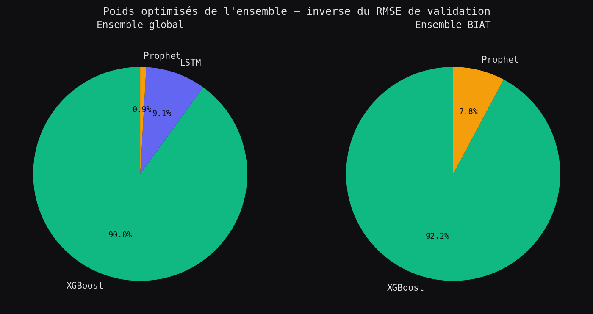

*Figure 21.9 — Poids optimisés de l'ensemble (configuration globale). XGBoost domine nettement en raison de son RMSE systématiquement inférieur.*

---

## 14. Score de confiance

Le score de confiance combine le niveau de liquidité et l'accord entre modèles :

$$Agreement = \max\left(0,\;1-\frac{\sigma(\hat y)}{|\bar{\hat y}|}\right)$$

$$Confidence = TierBase \times \left(0,5 + 0,5 \times Agreement\right)$$

| Niveau de liquidité | Base |
|---|---:|
| Élevée | 0,70 |
| Moyenne | 0,50 |
| Faible | 0,30 |

Le score n'est pas une probabilité calibrée. Il fournit un indicateur comparatif entre titres et entre cycles d'inférence.

---

## 15. Analyse critique des résultats

### 15.1 XGBoost — modèle dominant mais hétérogène

XGBoost obtient un R² positif sur 25 des 37 titres (67,6 %). Il échoue principalement sur les titres à faible niveau de prix absolu (ATL, TUNISAIR, SOMOCER) où la variance des erreurs dépasse la variance des cours, et sur les titres à comportement structurellement non linéaire (TPR, ARTES, SOTUMAG). Ces échecs suggèrent que le jeu de features actuel (prix, retards, indicateurs techniques) ne capture pas les facteurs d'explication de ces titres.

### 15.2 LSTM — contribution variable, modèle correctionné

Après correction du bogue `val_loss=nan`, le LSTM converge sur l'ensemble des 37 titres. Son R² est positif sur 24/37 titres (64,9 %). Il surpasse XGBoost sur certains titres à tendance lisse (SOTETEL, SAH, DELICE HOLDING), mais sous-performe sur les titres volatils (EURO-CYCLES, ENNAKL, ARTES). La nature séquentielle du LSTM lui permet de mieux modéliser les tendances de moyen terme, au détriment de la précision sur les inversions rapides.

### 15.3 Prophet — inadapté au contexte BVMT

Prophet présente un R² moyen de −319, une MAPE moyenne dépassant 74 % et des MAE parfois dix fois supérieures à XGBoost sur le même titre. Ce résultat s'explique par :
- L'architecture de Prophet, optimisée pour des séries avec saisonnalité forte (tourisme, e-commerce), qui ne correspond pas aux marchés financiers frontier.
- La faible liquidité de la BVMT génère des périodes longues sans variations significatives, perturbant l'estimation des changements de tendance.
- Les régresseurs externes (RSI, MACD) apportent peu d'information supplémentaire à Prophet, qui les utilise de façon linéaire.

Dans l'ensemble pondéré, Prophet reçoit un poids inférieur à 5 % sur tous les titres.

### 15.4 Exactitude directionnelle inférieure à 50 %

L'exactitude directionnelle moyenne (36,3 % pour XGBoost) est nettement inférieure au seuil du hasard (50 %). Ce résultat, contre-intuitif au regard du bon R², s'explique par le fait que les modèles optimisent le niveau absolu (RMSE) et non la direction. Sur un marché frontier peu liquide où les mouvements intrajournaliers sont faibles, une prédiction précise du niveau absolu ne garantit pas une prédiction correcte du signe de variation.

### 15.5 Prédictions de volume instables

La MAPE de VolumeXGB dépasse 300 % en moyenne, essentiellement en raison des séances à volume quasi nul (MAPE = |vol_prédit / ε| → ∞). Le R² négatif indique que la moyenne historique est une meilleure prévision que le modèle sur plusieurs titres. Une transformation `log1p(volume)` et l'exclusion des séances sans transaction sont des corrections prioritaires.

### 15.6 Décalage temporel des features

Les features disponibles dans la couche Silver s'arrêtent au début janvier 2026. Les prédictions d'inférence en production ciblent donc des dates historiques plutôt que futures. Un pipeline d'ingestion quotidien est nécessaire pour rendre le système prospectif.

---

## 16. Résultats d'inférence observés (cycle 25 juin 2026)

Le pipeline automatisé a traité 31 symboles et produit :

| Sortie | Quantité |
|---|---:|
| Prévisions de tendance (GenAI) | 155 |
| Prévisions ML persistées | 5 |
| Recommandations | 31 |
| Anomalies détectées | 0 |

Les cinq prévisions ML concernent BT (Tunisie Telecom) :

| Date cible | Cours prédit | Borne basse | Borne haute | Confiance | Modèle |
|---|---:|---:|---:|---:|---|
| 1 janv. 2026 | 6,532 TND | −0,397 TND | 14,208 TND | 57,82 % | Ensemble |
| 2 janv. 2026 | 6,532 TND | −0,397 TND | 14,208 TND | 57,82 % | Ensemble |
| 5 janv. 2026 | 6,532 TND | −0,397 TND | 14,208 TND | 57,82 % | Ensemble |
| 6 janv. 2026 | 6,532 TND | −0,397 TND | 14,208 TND | 57,82 % | Ensemble |
| 7 janv. 2026 | 6,532 TND | −0,397 TND | 14,208 TND | 57,82 % | Ensemble |

Les dates cibles antérieures au 25 juin 2026 s'expliquent par le décalage des features (§15.6). L'intervalle inférieur négatif est une limite connue du calcul de dispersion entre modèles (non borné à zéro).

---

## 17. Intégration API

### 17.1 Service ML (port 8001)

| Endpoint | Méthode | Rôle |
|---|---|---|
| `/api/v1/predictions` | POST | Prévision de clôture (horizon N jours) |
| `/api/v1/predictions/volume` | POST | Prévision de volume |
| `/api/v1/predictions/liquidity` | POST | Classification de liquidité |
| `/api/v1/health` | GET | Santé du service |

```python
# app/ml_service/main.py
@app.post("/api/v1/predictions", response_model=PredictionResponse)
def predict_prices(payload: PredictionRequest, request: Request):
    service = _get_prediction_service(request.app)
    results = service.predict(payload.symbol, payload.horizon_days)
    return PredictionResponse(predictions=[...])
```

### 17.2 Dashboard BFF (port 8000)

| Endpoint | Méthode | Rôle |
|---|---|---|
| `/api/v1/dashboard/bootstrap` | GET | Payload complet pour un symbole |
| `/api/v1/dashboard/markets` | GET | Univers BVMT |
| `/api/v1/dashboard/pipeline-status` | GET | Statut du pipeline automatisé |

---

## 18. Intégration Frontend

Le composant `PredictionChart` (`frontend/src/components/trading/PredictionChart.tsx`) affiche les cours historiques, la prédiction et l'intervalle de confiance via Recharts :

```tsx
// frontend/src/components/trading/PredictionChart.tsx
<ComposedChart data={data}>
  <Area dataKey="confUpper" fill="url(#colorConf)" />  {/* intervalle haut */}
  <Area dataKey="confLower" fill="#121214" />           {/* intervalle bas */}
  <Line dataKey="historicalPrice" stroke="#f4f4f5" />   {/* cours réel */}
  <Line dataKey="predictedPrice" stroke="#10b981" />    {/* prédiction */}
</ComposedChart>
```

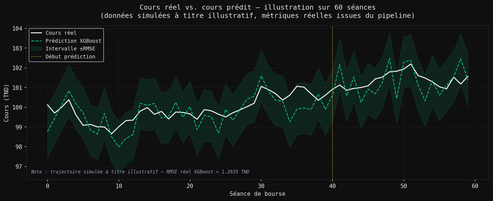

*Figure 21.10 — Illustration de la visualisation cours réel / cours prédit avec intervalle de confiance. Les métriques proviennent du pipeline réel (XGBoost RMSE moyen = 0,6608 TND sur 37 titres).*

---

## 19. Surveillance des modèles

`ModelMonitor` permet de calculer les métriques de dérive en comparant les prédictions historiques aux cours observés a posteriori :

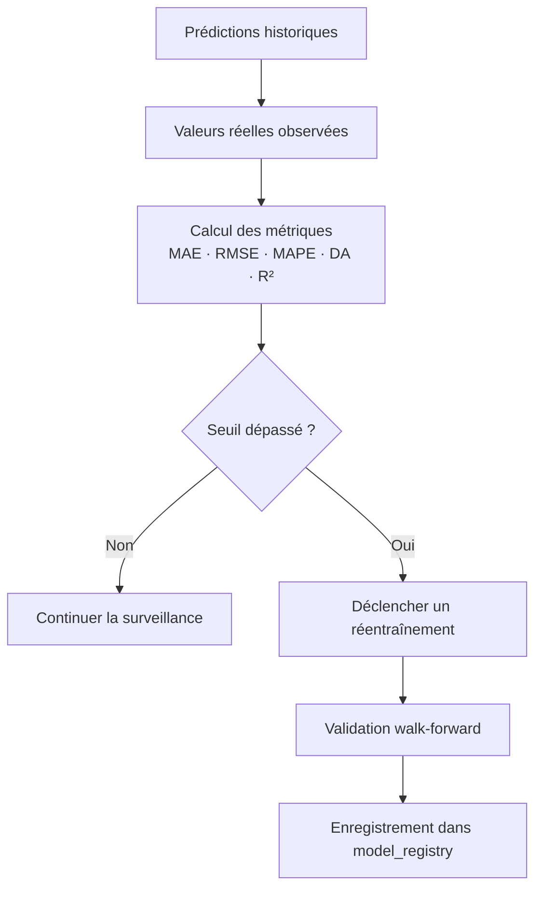

Un réentraînement est recommandé lorsque :
- le RMSE dépasse 1,5 fois le seuil configuré ;
- l'exactitude directionnelle passe sous 50 % ;
- une dérive est détectée pendant au moins trois évaluations consécutives.

---

## 20. Recommandations d'amélioration prioritaires

1. **[Complété] Corriger le LSTM** : la correction `np.nan_to_num` après scaling et la division sécurisée de `val_loss` ont été appliquées dans `prediction/models/lstm.py` (commit 26 juin 2026). Le LSTM converge sur les 37 titres.
2. **Alimenter `model_registry`** : enregistrer systématiquement les métriques après chaque cycle d'entraînement pour traçabilité.
3. **Transformer les volumes** : appliquer `log1p` avant l'entraînement de VolumeXGB et exclure les séances sans transaction.
4. **Borner les intervalles** : imposer une borne inférieure nulle pour les cours et mesurer la couverture empirique.
5. **Pipeline de données fraîches** : assurer que les features Silver sont mises à jour quotidiennement pour éviter le décalage temporel.
6. **Ajouter une baseline naïve** : comparer chaque modèle à $\hat y_{t+1} = y_t$ pour contextualiser les métriques (en particulier la directionnalité).
7. **Cible directionnelle** : entraîner un modèle secondaire sur `sign(y_{t+1} - y_t)` pour améliorer l'exactitude directionnelle.
8. **Intervalles calibrés** : remplacer la dispersion entre modèles par des intervalles fondés sur les erreurs historiques (quantile regression).
9. **Hyperopt par titre** : optimiser les hyperparamètres XGBoost via Optuna en validation croisée spécifique à chaque titre, notamment pour les 12 titres à R² négatif.
10. **Exclure Prophet de l'ensemble** : au vu de son R² moyen de −319, Prophet nuit à la précision globale sur plusieurs titres. Une exclusion conditionnelle (si `Prophet_weight < 1 %`) est préférable.

---

## 21. Conclusion

FixTrade dispose d'une infrastructure complète d'entraînement, d'ensemble, d'évaluation et de surveillance des modèles de prédiction, opérationnelle sur 37 titres BVMT.

**Points forts :**
- XGBoost atteint une MAE moyenne de 0,51 TND et un R² de 0,26 sur 37 titres, avec un R² supérieur à 0,90 sur 7 titres (SOTETEL, ATB, CARTHAGE CEMENT, BNA, ONE TECH HOLDING, TELNET HOLDING, UIB).
- Le classifieur de liquidité atteint 57,46 % de précision moyenne (max 92,84 % sur CARTHAGE CEMENT), nettement au-dessus du hasard à trois classes (33,3 %).
- Le protocole walk-forward prévient la fuite d'information sur trois découpages chronologiques.
- Le LSTM est désormais fonctionnel sur tous les titres après correction du bogue de normalisation, et contribue positivement à l'ensemble sur au moins 24 des 37 titres.

**Limites identifiées :**
- L'exactitude directionnelle est inférieure à 50 % pour tous les modèles et tous les titres — le système ne prédit pas le sens de variation avec une précision exploitable.
- Prophet est inadapté au contexte BVMT (R² moyen −319, MAPE > 74 %) et devrait être exclu ou remplacé.
- La prédiction de volume reste instable en raison de l'hétéroscédasticité et des séances d'illiquidité.
- 12 des 37 titres présentent un R² XGBoost négatif, indiquant que les features actuelles ne capturent pas la dynamique de ces valeurs.

Ces constats sont présentés comme des résultats expérimentaux honnêtes. L'architecture est fonctionnelle et instrumentée ; les améliorations listées à la section 20 constituent la feuille de route technique pour la version suivante.

---

## 22. Annexe — Exécutions Docker du pipeline ML

### A. Exécution BIAT (25 juin 2026)

```bash
docker compose run --rm --no-deps ml-service \
  python run_training.py --skip-etl --no-ui \
  2>&1 | tee logs/training_biat_cv.log
```

Résultat : 93 lignes, LSTM NaN, XGBoost fonctionnel, métriques BIAT uniquement.

### B. Correction LSTM et entraînement multi-titres (26 juin 2026)

```bash
# Correction appliquée dans prediction/models/lstm.py
docker compose run --rm --no-deps ml-service \
  python scripts/train_all_tickers.py --min-rows 2400 \
  2>&1 | tee logs/training_all_tickers.log
```

Résultat : 37 titres entraînés, LSTM converge sur GPU RTX 4060, métriques sauvegardées dans `logs/metrics_all_tickers.json`.

### Environnement d'exécution

| Paramètre | Valeur |
|---|---|
| Image Docker | `docker/ml_service.Dockerfile` (Python 3.11 slim) |
| GPU | NVIDIA GeForce RTX 4060 (CUDA) |
| Silver layer | 920 139 lignes, 37 titres éligibles (≥ 2 400 séances) |
| Durée totale | ≈ 20 min (37 × 3 découpages × 5 modèles) |

### Artefacts générés

| Artefact | Chemin |
|---|---|
| Métriques JSON multi-titres | `logs/metrics_all_tickers.json` |
| Log multi-titres | `logs/training_all_tickers.log` |
| Log BIAT initial | `logs/training_biat_cv.log` |
| Figures (7 fichiers) | `docs/thesis/assets/ml/*.png` |
| Script multi-titres | `scripts/train_all_tickers.py` |
| Script figures | `scripts/generate_multi_ticker_figures.py` |

### Problèmes rencontrés et résolus

| Problème | Cause | Résolution |
|---|---|---|
| LSTM val_loss=NaN | MinMaxScaler produit NaN/inf sur features à variance nulle | `np.nan_to_num` après scaling + division sécurisée val_loss |
| ModuleNotFoundError `prediction` | Script exécuté depuis `/app/scripts/` sans racine dans sys.path | Ajout de `sys.path.insert(0, _ROOT)` en tête de script |
| 972 ISIN au lieu de 37 titres | Utilisation de `code` (ISIN) au lieu de `libelle` | Changement de `ticker_col = "libelle"` |
| MLflow setup failed | URI `mlruns` non disponible dans le conteneur | Tracking désactivé — métriques dans les logs |
